# C++服务器开发

## 1. C

### VS基本操作

创建新项目 → 空项目 → 配置新项目

解决方案可以管理多个项目：
项目1：
	头文件：\*.h
	源文件：\*.c
	资源文件：配置文件，音频，视频，图片，...
项目2：
	头文件：\*.h
	源文件：\*.c
	资源文件：配置文件，音频，视频，图片，...

项目3：
	...

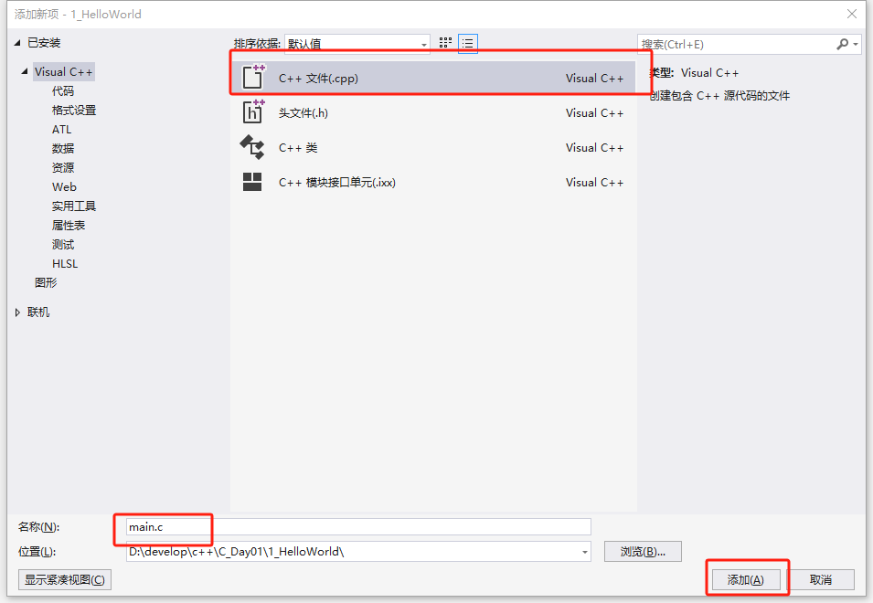

### 第一个程序：HelloWorld

~~~c
#include<stdio.h> // 预处理指令，头文件包含

int main(void) { // main函数程序入口
	printf("Hello World.\n");
	return 0; //返回给操作系统，0表示状态码
    /*0代表正常退出，非0代表异常退出*/
}
~~~

~~~c
#include<stdio.h>
void foo();

int main(void) {

	int i = 1, j = 2;
	foo();
	printf("i/j = %d\n",i/j);
	return 0;
}

void foo() {
	int i, j;
	i = 10;
	j = 20;
	printf("hello ptx.\n");
}
~~~

内存大小单位：
	bit：b
	Byte：8 bit （最小寻址单位）
	KB：$2^{10}$byte
	MB：$2^{10}$byte
	GB：$2^{10}$byte
	TB：$2^{10}$byte

 i=1，int类型一般占用4个字节
内存布局：|01|00|00|00| （地址从左到右是有小变大)
机器码：00 00 00 01
真值：1
小端表示法：低地址存放低有效位，高地址存放高有效位。|01|00|00|00|
大端表示法：低地址存放高有效位，高地址存放低有效位。|00|00|00|01|

调试程序：
	打断点
	F5：开始调试   
	F10：逐过程进行下一步（不会进入函数）
	F11：逐语句进行下一步（会进入函数）
	继续：直接运行到下一个断点，如果之后没有断点则执行完程序 

### 程序是如何生成的

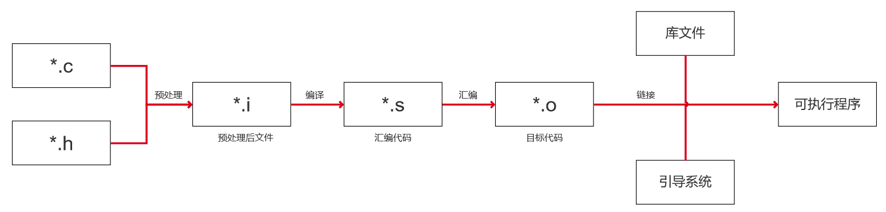

预处理、编译、汇编过程统称为编译过程

1. 预处理阶段
   执行预处理指令：以"#"开头的命令
   #include：头文件包含
   		原理：将对应头文件中的内容copy到对应位置。

   ~~~c
   //c语言文件
   #include<stdio.h>
   
   int main(void) {
   
   	printf("hello world.\n");
   	return 0;
   }
   //对应预处理后的文件
   ...
   #pragma warning(pop) 
   #line 2449 "C:\\Program Files (x86)\\Windows Kits\\10\\Include\\10.0.22621.0\\ucrt\\stdio.h"
   #pragma external_header(pop)
   #line 2 "D:\\develop\\c++\\C_Day01\\1_HelloWorld\\main.c"
   
   
   int main(void) {
   
   	printf("hello world.\n");
   	
   	return 0;
   }
   ~~~

   #define N 5：宏定义
   			 原理：简单的文本替换
   			（生产预处理后文件步骤：项目→属性→c/c++→预处理器→预处理到文件）

   ~~~c
   //c语言文件
   #include<stdio.h>
   #define N 5
   
   int main(void) {
   
   	printf("hello world.\n");
   	printf("N * N = %d.\n", N * N);
   	return 0;
   }
   //对应预处理后的文件
   ...
   #pragma warning(pop) 
   #line 2449 "C:\\Program Files (x86)\\Windows Kits\\10\\Include\\10.0.22621.0\\ucrt\\stdio.h"
   #pragma external_header(pop)
   #line 2 "D:\\develop\\c++\\C_Day01\\1_HelloWorld\\main.c"
   
   
   int main(void) {
   
   	printf("hello world.\n");
   	printf("N * N = %d.\n", 5 * 5);
   	return 0;
   }
   ~~~

   #define FOO(x) 1+x*x   带参数的宏（宏函数）
   	注意事项：1.左括号紧贴宏函数名称
   					   2.把整个宏函数表达式用括号括起来 FOO(x)  1+x+x * x | 3 * FOO(5)
   					   3.为宏函数的参数添加括号 FOO(x)  (1+x+x * x) | 3 * FOO(1+2)
   					   4.警惕宏函数导致的多次副作用 FOO(x) (1 + (x) + (x) * (x)) | FOO(++i)
   					   5.定义完备的多语句宏函数 do...while() FOO() do{printf("hello ");printf("world");}while(0)

2. 编译
   把c语言源代码翻译成汇编代码

3. 汇编和链接

### *进程的虚拟内存空间

正在运行的程序成为进程

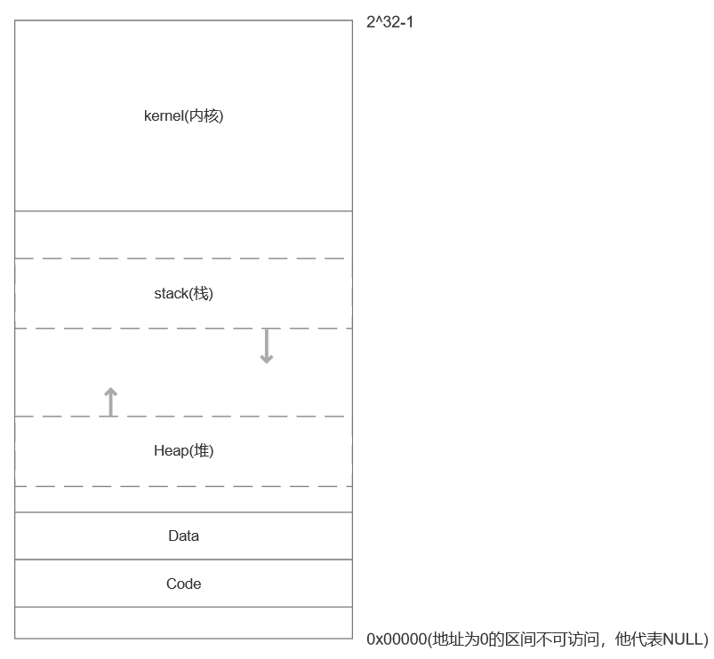

在计算机进程中，**栈（Stack）** 和 **堆（Heap）** 是两种用于存储数据的内存区域，它们有明显的区别，主要体现在分配方式、管理方式、用途和性能等方面。

**栈**

分配方式：由系统自动分配和释放，使用先进后出（LIFO, Last In First Out）的结构。

作用：用于存储函数调用过程中相关的数据，如：

- ​	函数的参数。
- ​	局部变量。
- ​	返回地址。

速度：栈的内存分配效率非常高，因其是由系统管理的，直接通过指针递增或递减实现。

大小限制：通常较小，操作系统为每个线程分配固定大小的栈空间（例如，1MB 或 8MB）。

生命周期：**随函数的调用和返回自动分配和释放。**

线程安全：栈是线程私有的，不需要同步机制。

栈的容量有限，不能动态调整大小。

**堆**

分配方式：由程序员通过动态内存分配函数（如 malloc 或 new）显式分配，释放时需手动调用（如 free 或 delete）。

作用：用于存储动态分配的内存块，适合存储大小不确定或需要长期存在的数据。

速度：分配和释放速度相对较慢，因为涉及复杂的内存管理（如查找空闲内存块）。

大小限制：理论上只受系统内存和虚拟内存大小限制。

生命周期：由程序员控制，直到显式释放。

线程安全：需要同步机制，多个线程可能访问同一块堆内存。

**数据段**

数据段存放全局变量和静态变量以及常量。

~~~c
//已初始化的全局变量和静态变量
int initialized_global = 10;   // 全局变量，存储在 .data 段
static int static_var = 5;     // 静态变量，存储在 .data 段
//未初始化的全局变量和静态变量
int uninitialized_global;     // 全局变量，存储在 .bss 段
static int static_uninit_var; // 静态变量，存储在 .bss 段
//常量
const int const_var = 100;  // 常量数据，存储在只读数据段
char *str = "Hello";        // 字符串字面值，存储在只读数据段
~~~

### 变量和常量

变量：在程序运行期间可以发生改变的量，其本质是一块内存空间。
变量的三要素：变量类型、变量名、值
常量：在程序运行期间不可以发生改变的量
常量表达式：在编译阶段可以直接求值的表达式(constexpr)例如#define N 5，而const int M=5则是常量，不是常量表达式。
常量表达式可以用于指定数组的长度，还可以用于switch语句的标签。

~~~c
#include<stdio.h>
#define N 5
const int M = 10;
int main(void) {

	int arr1[N];
	int arr2[M];// 报错，M不是常量表达式

	int i;
	scanf("%d", &i);
	switch (i)
	{
	case N:
		printf("%d", N);
		break;
	case M:// 报错，M不是常量表达式
		printf("%d", N);
		break;
	default:
		break;
	}
	
	printf("%d", i);

	return 0;
}
~~~

### 标识符和关键字

标识符：为变量、宏、函数起的名字。
规则：1）标识符智能包含数字、字母、下划线
			2）不能以数字开头
			3）标识符区分大小写
			4）标识符不能与关键字冲突
关键字：对c语言有特殊意义的名称
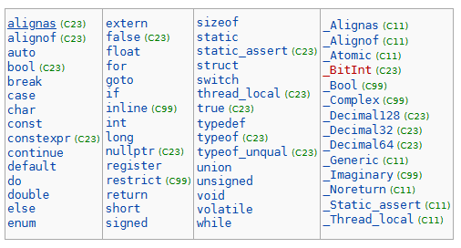

### 格式化输入和输出

1. 输入输出的模型
   cpu、内存、I/O设备在处理数据时存在速度差异。cpu和内存之间用cache做缓存，内存和I/O设备之间用缓冲区(buffer)做缓存。
   

2. 格式化输出(printf)
   函数原型：int printf(格式化字符串, 表达式1, 表达式2,...)
   作用：显示格式化字符串中的内容，并且在该字符串指定的位置插入要显示的值。
   格式化字符串：1)普通字符：直接输出
   							2)转换说明：以%开头，表示一个占位符，我们会以后面表达式的值替换占位符。

   %d：以整数的形式解释这片内存空间，并以十进制的方式输出。
   %f：以浮点数的形式解释这篇内存空间，并输出。
   %m.pX：X是转换说明符，表示以何种方式解释内存空间例如d，f。m.p控制输出格式m表示要显示的最少字符数量，p表示精度其含义依赖转换说明符，如果转换说明符是d则p表示待显示数字的最小个数（必要时会在前面补0），如果转换说明符是f则p表示小数点后数字的个数（默认为6）。	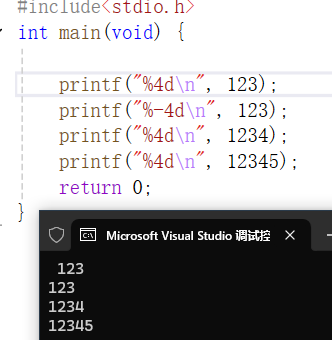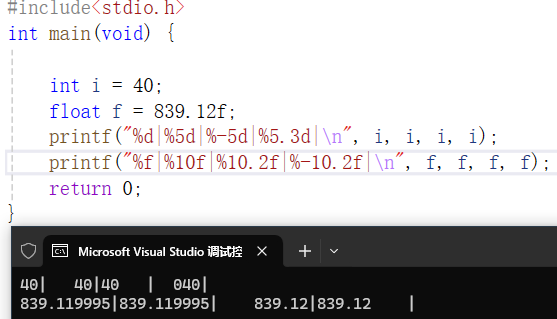

   printf的返回值是显示的字符个数。

3. 格式化输入(scanf)

   函数原型：int scanf(格式串，表达式1，表达式2, ...)
   scanf本质上是一个模式匹配函数，试图把输入的字符与转换说明进行匹配。**从左到右依次处理转化说明，如果成功则继续处理后面的字符串，如果失败则立即返回，返回值表示处理转换说明成功的个数。**
   转换说明：1)表示匹配的规则。2)表示字符数据转换成对应二进制数据
   格式串：普通字符：其他字符(精确匹配)，空白字符空格，\t，\n，\v(匹配任意多个空白字符，包括0个)。进行数值匹配时(%d,%f)会忽略掉前面的空白字符。
   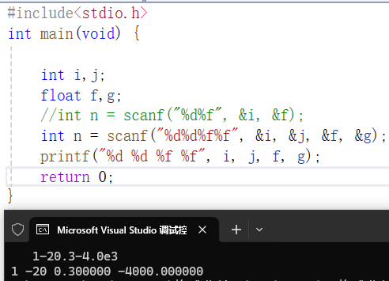

### 整数类型

1. 有符号整数：short，int，long，long long
   无符号整数：unsigned short，unsigned int，unsigned long，unsigned long long
   注意事项:   1)C语言并没有明确夫i的各种整数类型的具体大小，可能随着机器而不同。
   					2)C语言规定哪种类型的最小大小。（int至少占两个字节）
   					3)short<=int<=long<=long long
   模运算：$x=q^N+r(0\leq r\leq N),\ x\ mod\ N=r$
2. 整数类型的常见取值范围：

| 类型               | 字节 | 最小值                         | 最大值                          |
| ------------------ | ---- | ------------------------------ | ------------------------------- |
| short              | 2    | $-2^{15}=-32768$               | $2^{15}-1=32767$                |
| unsigned short     | 2    | 0                              | $2^{16}-1=65535$                |
| int                | 4    | $-2^{31}=-2147483648$          | $2^{31}-1=2147483647$           |
| unsigned           | 4    | 0                              | $2^{32}-1=4294967295$           |
| long               | 4/8  | $-2^{63}或-2^{31}$             | $2^{63}-1或2^{31}-1$            |
| unsigned long      | 4/8  | 0                              | $2^{64}-1或2^{32}-1$            |
| long long          | 8    | $-2^{63}=-9223372036854775808$ | $2^{63}-1=-9223372036854775807$ |
| unsigned long long | 8    | 0                              | $2^{64}-1=18446744073709551615$ |

在大多数64位系统中，`long` 和 `long long` 的表示范围是不一样的，具体情况依赖于编译器和平台的实现。

- **在Linux或其他Unix系的64位系统（如`GCC`编译器的默认实现）**:
  - `long` 类型通常是 **8字节**（64位），其范围与 `long long` 相同，都是 **-9,223,372,036,854,775,808 到 9,223,372,036,854,775,807**。
  - 在这些系统中，`long` 和 `long long` 的存储大小和范围相同。
- **在Windows的64位系统（如`MSVC`编译器的默认实现）**:
  - `long` 类型仍然是 **4字节**（32位），范围为 **-2,147,483,648 到 2,147,483,647**。
  - `long long` 则是 **8字节**（64位），范围是 **-9,223,372,036,854,775,808 到 9,223,372,036,854,775,807**。

3. 整数常量有三种表示形式:
   	十进制：1234，9527
   	八进制：以0开头，01234，0527
   	十六进制：以0x开头，0xABC，0xC13
   可以在整数常量后面添加后缀来指定整数常量的类型：unsigned：43U，long：43L，long long：43LL
4. 读写整数：%u无符号十进制整数，%o：无符号八进制整数，%x：无符号十六进制整数，%d：有符号十进制整数
   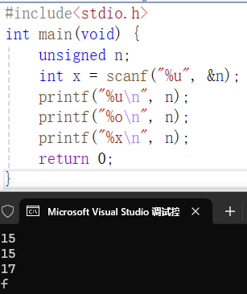
   读写短整数，在u，o，x，d前面加h。
   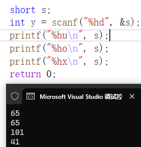
   读写长整数，在u，o，x，d前面加l。
   读写长整数，在u，o，x，d前面加ll。

### 浮点数类型

浮点数类型包括float(4字节)，double(8字节)，long double(不常用)。

1. 编码(IEEE754标准)

   float：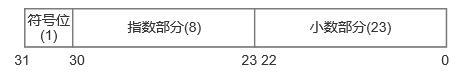
   符号位：1表示负，0表示正
   指数部分：表示范围$2^E-127$(移码表示)，-127~128其中-127(指数部分全为0)和128(指数部分全为1)有特殊用途，实际表示范围为-126~127。
   小数部分：表示小数
   三个特殊值：指数部分全为0且小数部分也全为0，表示$\pm0$
   						指数部分全为1且小数部分全为0，表示$+\infty$
   						指数部分全为1但小数部分不全为0，表示NaN(Not a Namber)
   规约数：指数范围$[00000001,11111110]$。表示方法：$(-1)^S\times1.F\times2^{E-127}$
   非规约数：指数部分全为0，小数部分不全为0，表示十分接近于零的浮点数其绝对值都小于规约数。表示方法$(-1)^S\times0.F\times2^{E-126}$
   所表示的最大的数：|0|11111110|1111...111|=$(-1)^0\times1.111\cdots11\times2^{127}\approx2^{128}$
   最小正数：|0|00000000|000...01|=$(-1)^0\times0.000\cdots01\times2^{-126}=2^{-23}\times2^{-126}=2^{-149}$

   double类型：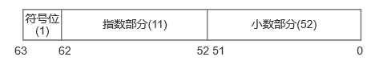

   符号位：1表示负，0表示正
   指数部分：表示范围$2^E-1023$(移码表示)，-1023~1024其中-1023(指数部分全为0)和1024(指数部分全为1)有特殊用途，实际表示范围为-1022~1023。
   小数部分：表示小数
   所表示的最大的数：|0|11111111110|111...111|=$(-1)^0\times1.11\cdots111\times2^{1023}\approx2^{1024}$
   最小正数：|0|00000000000|000...001|=$(-1)^0\times0.00\cdots001\times2^{-1022}=2^{-52}\times2^{-1022}=2^{-1074}$

2. 浮点常量
   浮点数常量有多种表示方法，要么包含小数点，要么包含字母E(e)。浮点数常量默认是double，如果需要表示float，应该在浮点数常量后面添加字母F(f)。

3. 读写浮点数
   %f：float
   %lf：double(l不能大写)
   

### 字符数据类型

char类型大小为1个字节，并且采用ASCII编码表示，ASCII编码用7位表示128各字位(最高位都是0)

| **ASCII值** | **控制字符** | **ASCII值** | **控制字符** | **ASCII值** | **控制字符** | **ASCII值** | **控制字符** |
| ----------- | ------------ | ----------- | ------------ | ----------- | ------------ | ----------- | ------------ |
| **0**       | **NUL**      | **32**      | **(space)**  | 64          | @            | 96          | 、           |
| 1           | SOH          | 33          | ！           | **65**      | **A**        | **97**      | **a**        |
| 2           | STX          | 34          | ”            | 66          | B            | 98          | b            |
| 3           | ETX          | 35          | #            | 67          | C            | 99          | c            |
| 4           | EOT          | 36          | $            | 68          | D            | 100         | d            |
| 5           | ENQ          | 37          | %            | 69          | E            | 101         | e            |
| 6           | ACK          | 38          | &            | 70          | F            | 102         | f            |
| 7           | BEL          | 39          | '            | 71          | G            | 103         | g            |
| 8           | BS           | 40          | (            | 72          | H            | 104         | h            |
| 9           | HT           | 41          | )            | 73          | I            | 105         | i            |
| 10          | LF           | 42          | *            | 74          | J            | 106         | j            |
| 11          | VT           | 43          | +            | 75          | K            | 107         | k            |
| 12          | FF           | 44          | ,            | 76          | L            | 108         | l            |
| 13          | CR           | 45          | -            | 77          | M            | 109         | m            |
| 14          | SO           | 46          | .            | 78          | N            | 110         | n            |
| 15          | SI           | 47          | /            | 79          | O            | 111         | o            |
| 16          | DLE          | **48**      | **0**        | 80          | P            | 112         | p            |
| 17          | DCI          | 49          | 1            | 81          | Q            | 113         | q            |
| 18          | DC2          | 50          | 2            | 82          | R            | 114         | r            |
| 19          | DC3          | 51          | 3            | 83          | X            | 115         | s            |
| 20          | DC4          | 52          | 4            | 84          | T            | 116         | t            |
| 21          | NAK          | 53          | 5            | 85          | U            | 117         | u            |
| 22          | SYN          | 54          | 6            | 86          | V            | 118         | v            |
| 23          | TB           | 55          | 7            | 87          | W            | 119         | w            |
| 24          | CAN          | 56          | 8            | 88          | X            | 120         | x            |
| 25          | EM           | 57          | 9            | 89          | Y            | 121         | y            |
| 26          | SUB          | 58          | :            | 90          | Z            | 122         | z            |
| 27          | ESC          | 59          | ;            | 91          | [            | 123         | {            |
| 28          | FS           | 60          | <            | 92          | \            | 124         | \|           |
| 29          | GS           | 61          | =            | 93          | ]            | 125         | }            |
| 30          | RS           | 62          | >            | 94          | ^            | 126         | ~            |
| 31          | US           | 63          | ?            | 95          | —            | 127         | DEL          |

1. C语言把字符类型当作小的整数类型来使用，因此可以对字符类型执行算术运算和比较运算。
   ~~~c
   int i = 'a';
   char ch = 'A';
   ch = ch + 1;
   ch++;
   
   if (ch >= 'A' && ch <= 'Z') {
       ch = ch + 'a' - 'A';
   }
   return 0;
   ~~~

2. 不能直接输入的字符用转义序列表示
   字符转义序列：\a \b \f \n \r \t \v \\\ \? \\' \\''
   数字转义序列：八进制表示方式，以\开头后面接3个八进制数字。例如：\0=NULL，\101='A'。
                              十六进制表示形式，以\x开头，后面接十六进制数字。例如：\x0=NULL，\x41='A'

3. 字符处理函数
   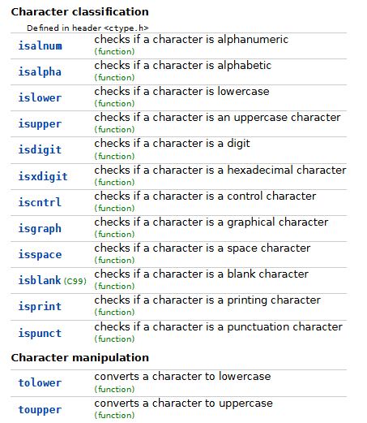
   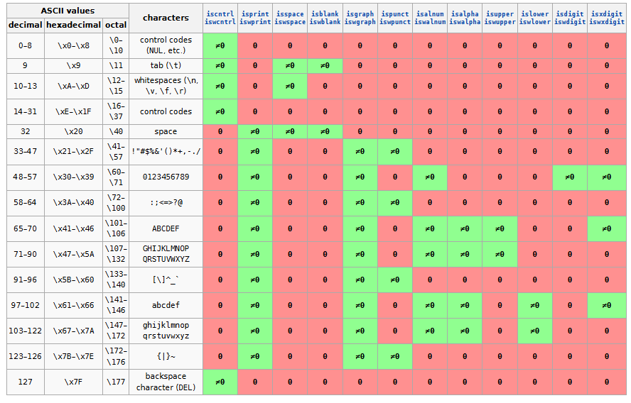

4. 读写字符数据
   (1) scanf和printf配合%c来读写字符。注：%c不会忽略前面的空白字符！

   (2) getchar和putchar，如果只是读取字符数据getchar和putchar的效率高于scanf和printf。
   ~~~c
   char ch;
   ch = getchar();
   putchar(ch);
   ~~~

   (3) 惯用法：
   ~~~c
   while(getchar()!='\n') //读取这一行剩余的字符
       ;
   ~~~

### 布尔数据类型

bool类型本质上是无符号整数类型，true=1，false=0。
~~~c
#include<stdio.h>
#include<stdbool.h>
int main(void){
    bool flag1, flag2;
	flag1 = true;
	flag2 = false;
    return 0
}
~~~

给bool类型的变量赋值时任何非零的值都会得到true，零会得到false。
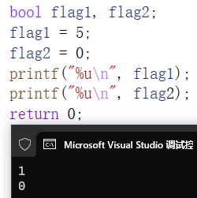

### 类型转换

1. 隐式类型转换

   在不同的数据类型参与运算时会自动转换，规则如下：
   short，char→int → long → long long → float → double。
   无符号数在和有符号数参与运算或比较时有符号数会自动转换无有符号数，因此不要将有符号整数和无符号整数一起运算。
   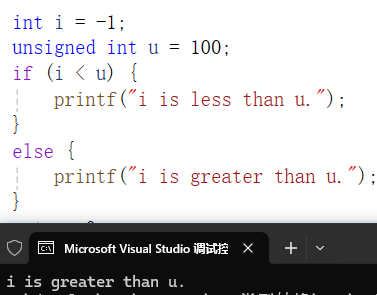

2. 显示类型转换(强制类型转换)
   格式：(type_name) expression

### typedef

可以使用typedef给类型起别名，语法：typedef {起别名的数据类型} {别名}

~~~c
typedef int quantity;
~~~

### sizeof运算符

计算某一类型数据所占用内存空间的大小(以字节为单位)
语法：sizeof(type_name)
sizeof运算符是在编译期进行计算的，因此它是一个常量表达式。

### 运算符优先级

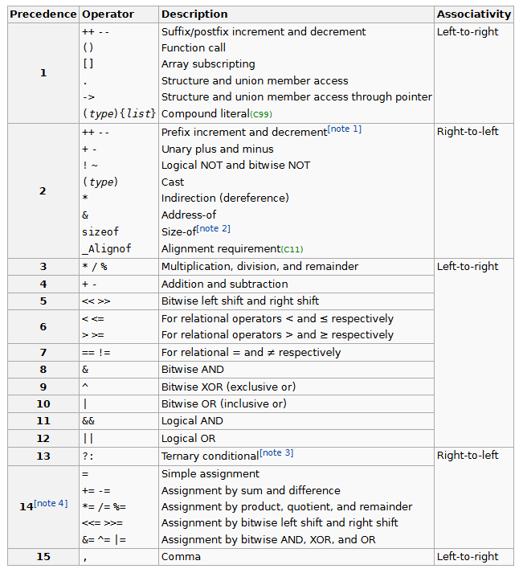

### 算数运算符

加(+)、减(-)、乘($\times$)、除(/)、取余(%)运算符。
注意事项：
1）取余运算符要求两个操作数必须都是整数。
2）两个整数相除其结果还是整数(向零取整)。
3）$i\ \%\ j$的结果可能为负，符号与$i$的符号相同，需要满足$i\ \%\ j=i-(i/j)\times j$

### 赋值运算符

简单赋值：=
v=e，把表达式e的值赋值给变量v，整个表达式的值为赋值后变量v的值。
注意事项：(1) 赋值2过程中可能发生隐式类型转换
                   (2) 赋值运算符是从左向右结合的
复合赋值运算符，+=，-=，*=，/=
           $a\ +=b \rightarrow a=a+b$
           $a\ -=b\rightarrow a=a-b$
           $a\ \times=b\rightarrow a=a\times b$
           $a\ /=b\rightarrow a=a\ /\ b$

### 自增和自减运算符

i++：表达式的值为i，副作用是i自增。
++i：表达式的值为i+1，副作用是i自增。
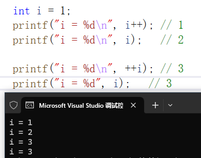

i--：表达式的值为i，副作用是i自减。
--i：表达式的值为i-1，副作用是i自减。
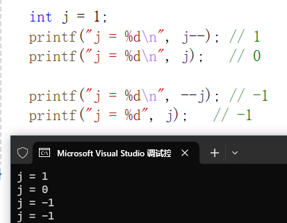

### 关系运算符

<，<=，>，>=，其运算结果要么为0，要么为1，从左向右结合。

### 判等运算符

==，!=，其运算结果要么为0，要么为1。

### 逻辑运算符

&&，||，!
注意事项：&&和||运算符会发生短路现象。
    $e_1\ \&\&\ e_2$：先计算$e_1$表达式，若$e_1$为false，则不会再计算表达式$e_2$。
    $e_1\ ||\ e_2$：先计算表达式$e_1$，若$e_1$为true，则不会再计算表达式$e_2$。

### 位运算符

<<，>>，&，|，^，~

移位运算符
i<<j：将i左移j位，在右边补零。
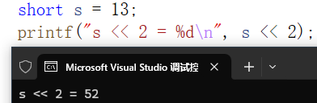

0000 0000 0000 1101$\rightarrow$0000 0000 0011 01**00**  若没发生溢出，右移j位相当于乘以$2^j$
i>>j：将右移j位，若i位无符号数或非负数，则左边补0；若i位负数，则他的行为由事先定义，有的左边补0有的左边补1。
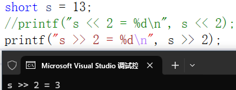

0000 0000 0000 1101$\leftarrow$**00**00 0000 0000 0011
右移j位相当于除以$2^j$(向下取整)

### 按位运算符

假设short i=3,j=4;
按位取反$~i：0000\ 0000\ 0000\ 0011\rightarrow1111\ 1111\ 1111\ 1100=-4$
按位与 $i\ \&\ j=0000\ 0000\ 0000\ 0011$，全为1则为1
                            $0000\ 0000\ 0000\ 0100$
                            $0000\ 0000 \ 0000\ 0000$
按位或 $i\ |\ j=0000\ 0000\ 0000\ 0011$，一个是1则是1
                         $0000\ 0000\ 0000\ 0100$
                         $0000\ 0000\ 0000\ 0111$
按位异或 $i\ \wedge \ j:0000\ 0000\ 0000\ 0011$，相同为0不同为1。$a\ \wedge\ 0=a，a\ \wedge\ a=0$
                               $0000\ 0000\ 0000\ 0100$
                               $0000\ 0000\ 0000\ 0111$

### 选择语句

1. if语句
   格式1：

   ~~~c
   if(exper)
       statement;
   ~~~

   格式2：
   ~~~c
   if(exper){
       statement1;
       statement2;
   }
   ~~~

   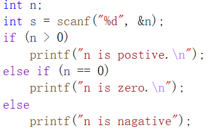

2. switch语句
   格式：

   ~~~c
   switch(exper){
       case const_exper:statements;
       case const_exper:statements;
       case const_exper:statements;
       default:statements;  
   }
   ~~~

   注意：exper的值必须是整数或字符；case后面必须是整数类型的常量表达式或char；不能有重复标签；多个分支标号共用一条语句；如果省略break语句，则可能出现case穿透现象。
   

3. 条件运算符（三目运算符）
   ~~~c
   ?://从右向左结合
   exper1?exper2:exper3
   ~~~

   首先计算exper1的值，若exoer1非零，则计算exper2的值，并把exper2的值当作整个表达式的值，若exper1的值为0，则计算exper3的值，并把exper3的值当作整个表达式的值。

### 循环语句

1. while语句

   ~~~c
   while(exper){
   	statement;   
   }
   ~~~

2. do语句
   ~~~c
   do{
       statement 
   }while(exper);
   ~~~

   当初始条件为假是，do语句的循环体会执行一次，而while语句一次都不会执行。

3. for语句
   ~~~c
   for(exper1;exper2;exper3){
      statement 
   }
   ~~~

   exper1：初始化表达式，只会执行一次。
   exper2：条件控制语句，若exper2非零，则执行循环体。
   exper3：执行完循环体后要执行的步骤。
   注意事项：exper1，exper2，exper3都可以省略，若省略expr2，其默认值为true。
   惯用法：

   ~~~c
   for(;;){//无限循环
       ...
   }
   ~~~

### 跳转语句

1. break语句
   作用：跳出switch，while，do，for语句
   最常见于跳出while(1)这样的无限循环。
   注意事项：当switch，while，do，for语句嵌套时，break智能跳出包含break语句最内层的嵌套。
   使用goto语句在switch语句中跳出while循环。

2. continue语句
   continue语句和break语句的区别：
   (1) break语句可以用于循环语句和switch语句，而continue语句只能用于循环语句
   (2) break语句是跳出整个循环语句，continue语句是**跳转到循环体的末尾**。
   例：对10个非零整数求和

   ~~~c
   int count = 0, sum = 0,n;
   while (count<10) {
   	scanf_s("%d", &n);
   	if (n == 0) {
   		continue;
   	}
   	sum = sum + n;
   	count++;
   }
   printf("sum = %d", sum);
   ~~~

3. goto语句
   goto语句唯一的限制就是只能在同一个函数内进行跳转
   使用场景：1)跳出外层嵌套。 2)错误处理。

### 数组

1. 数组的声明
   element_type arr_name[size]; size必须是整形的常量表达式，在编译期间就可以计算数组的大小。

   ~~~c
   int arr[10]
   ~~~

2. 数组初始化
   ~~~c
   int arr[10]={1,2,3,4,5,6,7,8,9,10};
   int arr[10]={1,2,3};//其余元素初始化为0
   int arr[10]={0};//将数组所有元素初始化为0
   int arr[]={1,2,3,4,5,6,7,8,9,10};//数据的长度由编译器自行推断，这里长度为10
   int arr[9]={1,2,3,4,5,6,7,8,9,10};//初始化长度不能比数组的长度大
   ~~~

3. 对数组使用sizeof运算符
   ~~~c
   #define SIZE(a) (sizeof(a)/sizeof(a[0]))
   ~~~

4. 多维数组（二维数组）
   二维数组类似于数学上的矩阵，比如int matrix\[3][4]
   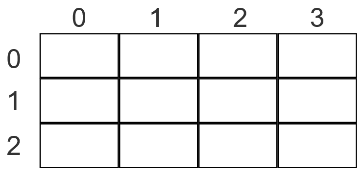

   虽然经常把二维数组看作矩阵，但二维数组是连续存储的（行优先）。
   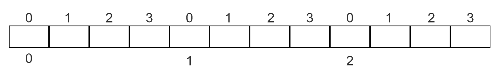

   二维数组初始化。（二维数组：元素是一维数组的数组）
   ~~~c
   int matrix[3][4]={{1,2,3,4},{2,3,4,5},{3,4,5,6}};
   int matrix[3][4]={{1,2,3,4},{2,3,4,5}};//其余元素初始化为0
   int matrix[3][4]={{1,2,3},{2,3,4}};//其余元素初始化为0
   int matrix[3][4]={1,2,3,4,2,3,4,5,3,4,5,6};//不建议省略内存大括号
   int matrix[3][4]={0};//所有元素初始化为0
   int matrix[][4]={{1,2,3,4},{2,3,4,5},{3,4,5,6}};//不指定行的大小由编译器自行推断
   ~~~

   注意：不能省略列的大小！

   常量数组
   ~~~c
   const int att[10]={0,1,2,3,4,5,6,7,8,9};//表面数组的元素不会发生改变
   ~~~

   练习：随机发牌，用户指定发几张牌，程序打印手牌。
   ~~~c
   const char suits[4]={'s','h','c','d'};//花色:黑桃，红桃，梅花，方块
   const char ranks[13]={'3','4','5','6','7','8','9','t','J','Q','K','A','2'}
   //生成随机数
   srand
   ~~~

### 函数

1. 函数的定义

~~~c
return_type func_name(parameter list){  
    statement  
}
~~~

2. 值传递（c语言中只有值传递）
   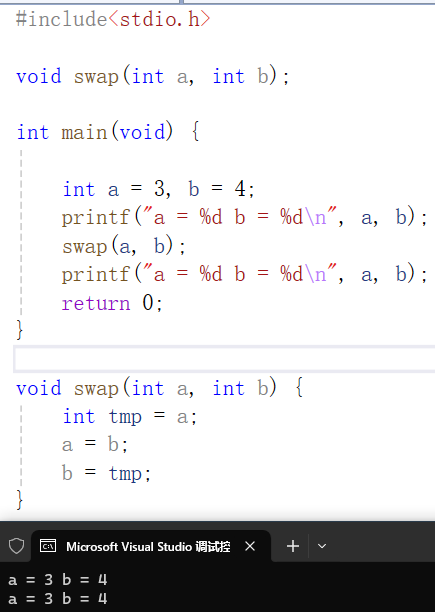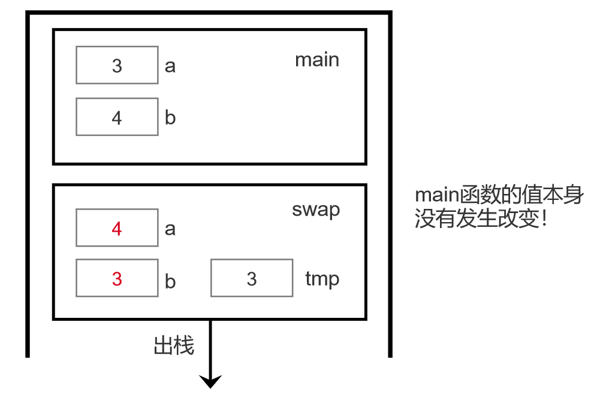

3. 一维数组做参数
   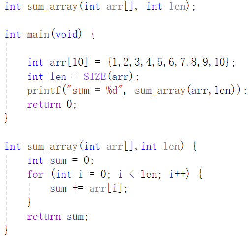

   一维数组做参数传递时，实际上传递的是第一个元素的指针，会丢失掉数组长度信息和数组类型信息。
   一维数组求地址公式：$i\_addr=base\_addr+i*sizeof(element\_type)$

4. 二维数组作为参数传递
   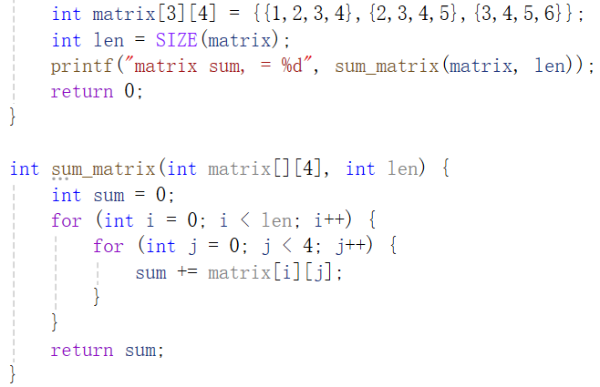

   二维数组作为参数传递时只能省略行信息，不能省略列信息。
   二维数组求地址公式：$i\_j\_addr=base\_addr+i*columns*sizeof(element\_type)\\+j*sizeof(element\_type)$

5. 返回值
   返回值类型不能是数组

6. 程序的终止
   ~~~c
   #include<stdlib.h>
   exit(EXIT_SUCCESS)
   exit(EXIT_FAILURE)
   ~~~

### 局部变量和外部变量

局部变量：定义在函数里面的变量，其作用域从定义开始到对应的块末尾。
全局变量：定义在函数外面的变量，其作用域从变量定义开始到文件的的末尾。
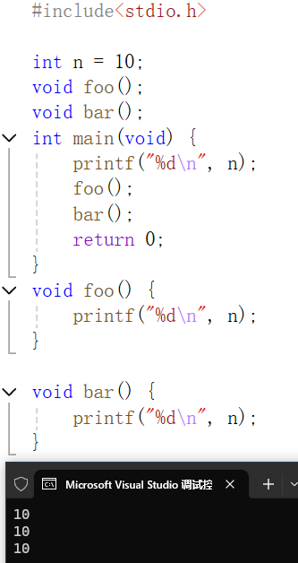

存储期限
自动存储期限：存放在栈里的数据，具有自动的存储期限，变量的生命周期随栈帧的入栈而开始，随着栈帧的出栈而结束。
静态存储期限：拥有永久的存储单元，在程序的整个执行期间都存在。
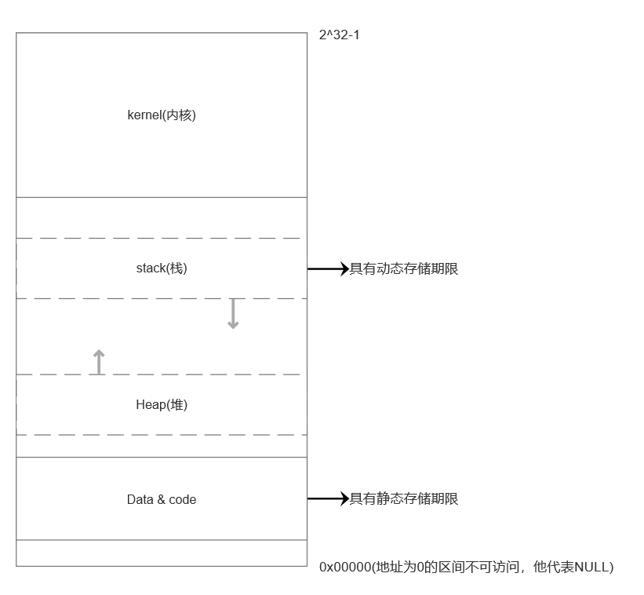
局部变量：默认是自动存储期限，但可以通过static关键字指定为静态存储期限。
外部变量：静态存储期限。
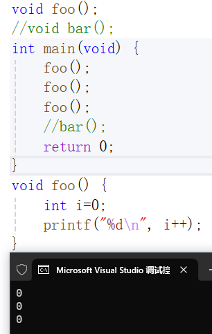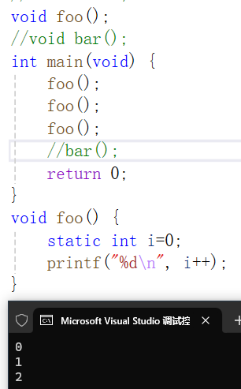

在不指定static关键字时，foo函数连续调用三次每次都会申请新的存储空间来存放变量i，指定static关键字后，使用的是同一片存储空间。

### 递归

1）Fibnacci数列：0，1，1，2，3，5，8，13，...
$$
F_n=
\left\{
	\begin{array}{**lr**}
	F_{n-1}+F_{n-2},&n\geq2\\
	1,&n=1\\
	0,&n=0
	\end{array}
\right.
$$
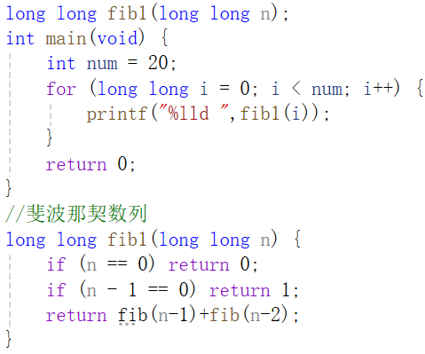

2）汉诺塔
有三根杆子A，B，C。A杆上有N个穿孔圆盘，盘的尺寸由下到上依次变小。要求按下列规则将所有圆盘移至C杆：1.每次只能移动一个圆盘。2.大盘不能不能叠在小盘上面。

~~~
n=1:A->C
n=2:A->B
	A->C
	B->C
n=3:A->C
	A->B
	C->B
	A->C
	B->A
	B->C
	A->C
~~~

1. 先将n-1个盘子从起始杆移动到中间杆
2. 将最大的盘子从起始杆移动到最终杆
3. 将n-1个盘子从中间杆移动到最终杆上

~~~c
void hanoi(int n, char start, char middle, char target) {
	if (n == 1) {
		printf("%c--->%c\n",start,target);
		return;
	}
	hanoi(n - 1, start, target, middle);
	printf("%c--->%c\n", start, target);
	hanoi(n - 1, middle, start, target);
}
~~~

### 指针

1. 指针基础
   指针就是存放地址的变量。
   1）声明指针时，需要指明基础类型。

   ~~~c
   int *p;//变量名是p，变量类型是int*
   int *p,q;//p是int*类型的指针，q只是普通int类型
   int *p,*q;//p和q都是int*类型的指
   ~~~

   2）指针基本操作

   ~~~c
   //取地址运算符&
   int i=1;
   int *p=&i;
   //解引用运算符*
   int i =1;
   int *p=&i;
   *p=2;
   ~~~

   *p相当于i的别名，修改\*p相当于修改i。使用变量名i属于直接访问，使用\*p属于间接访问，先得到i的地址，再访问地址得到i访问两次内存。

   3）野指针：未初始化的指针或是指向未知区域的指针。

   ~~~c
   int *p;
   int *q=0x7F;
   ~~~

   对野指针进行解引用运算会导致未定义的行为。

   4）指针变量的赋值
   使用取地址运算符

   ~~~c
   p=&i
   ~~~

   通过另一个指针变量q赋值
   ~~~c
   p=q
   ~~~

   注意事项：p=q和\*p=*q的区别
   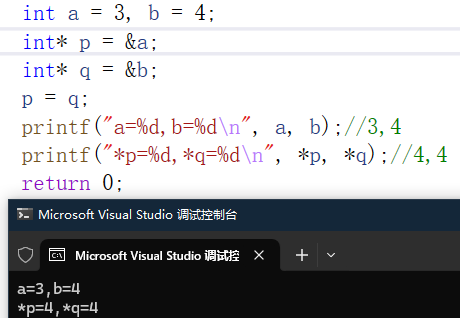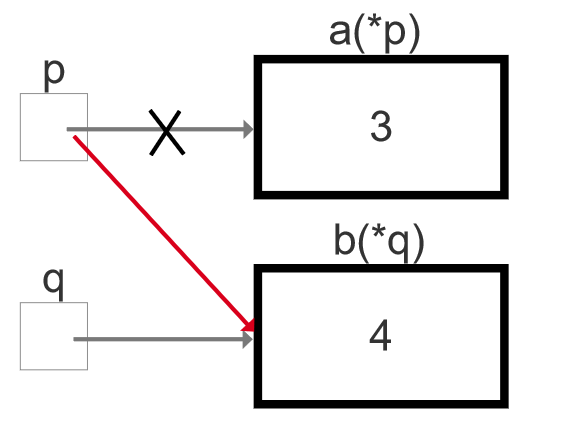
   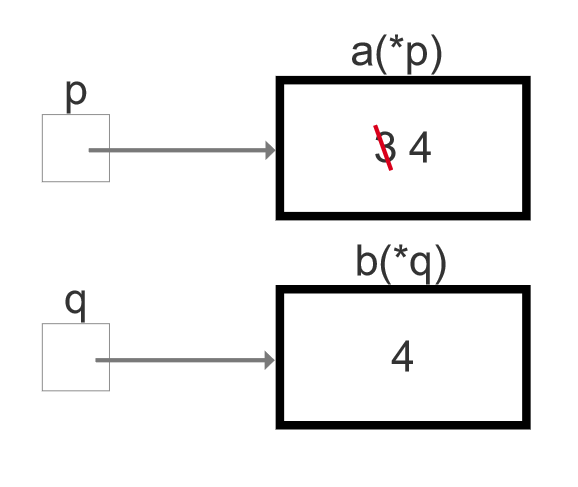

   5）指针作为参数
   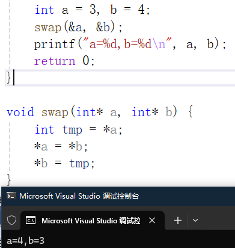

   值传递不能够改变实参的值，而通过传递实参的地址我们可以通过指针改变实参的值。

2. 指针和数组
   1）指针的算术运算
   当指针指向数组元素时，可以通过指针的算是运算访问数组的其他元素。
   指针加上一个整数
   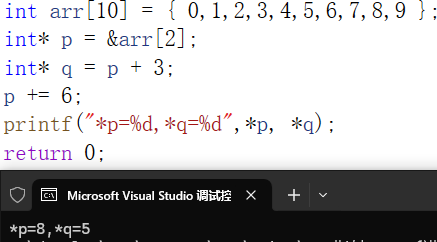

   指针减去一个整数
   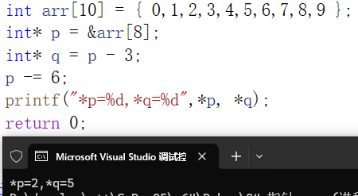
   **指针的算数运算是以元素大小为单位的，而不是字节大小。**

   两个指针相减
   两个指针相减的结果是它们之间元素的数量。如果两个指针指向同一数组的不同元素，结果是指针之间的距离（以数组元素为单位），即返回一个整数值，表示有多少个元素在它们之间。如果指针不指向同一数组，结果是未定义的。
   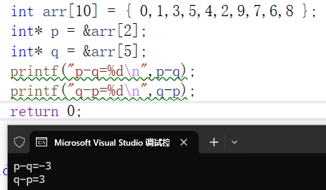
   指针相减可以用于指针的比较：p-q>0=>p>q，p-q=0=>p=q，p-q<0=>p<q

   2）用指针处理数组
   
   *和++的组合

   ~~~c
   *p++ = *(p++)//++优先级高所以两者等价，表达式的值为*p，副作用是p自增
   (*p)++//表达式的值为*p，副作用是*p自增
   *++p = *(++p)//表达式的值为*(p+1)，副作用p自增
   ++*p = ++(*p)//表达式的值是*(p+1)，副作用*p自增
   ~~~

3. 数组名可以作为指针
   数组名可以作为指向索引为0元素的指针，数组名作为指针时是一个指针常量是不能修改的。

总结：指针和数组之间的关系

- 可以利用指针处理数组。
- 数组名可以作为指向该数组索引为0元素的指针
- 指针也可以作为数组名

### 字符串

1. 字符串字面量
   用双引号括起来的字符序列就是字符串字面量
   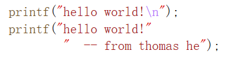
   编译器会把两个相邻的字符串字面量合并成一个字符串字面量，当两个字符串字面量仅以空白字符分割时，我们就认为他们是相邻的。
   c语言会用字符数组来存储字符串字面量。
   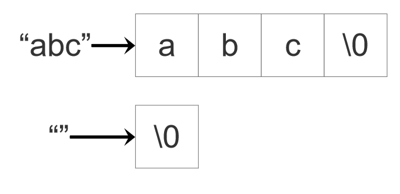

   ~~~c
   printf("hello world.\n")//这里传递的是一个字符指针char*
   ~~~

2. 字符串变量
   c语言没有专门的字符串类型，c语言的字符串依赖字符数组存在。
   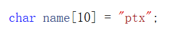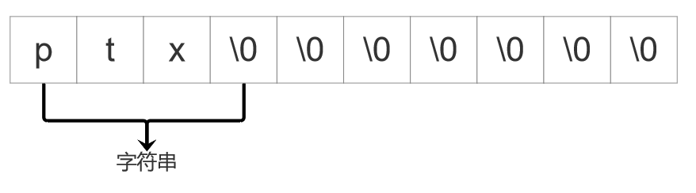
   ptx不是字符串字面量，本质是一个初始化{'p','t','x'}的简单形式。

   1）字符串初始化

   ~~~c
   char name[10]="ptx";
   char name[3]="ptx";
   ~~~

   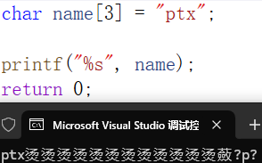
   注意：只有遇到空字符才会认为是字符串结束！

   ~~~c
   char name[]="ptx";//推荐写法，编译器会自动在后面补充空字符"\0"
   ~~~

   2）字符串的初始化和字符指针的初始化

     ~~~c
     char name[];//数组的初始化格式
     ~~~

   ~~~c
   char* name = 'ptx';//这里的ptx就是字符串字面量，为常量值不能修改
   ~~~

   
   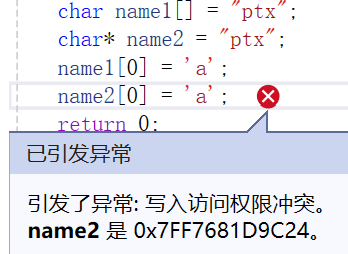

3. 读写字符串
   输出字符串：printf+%s，puts
   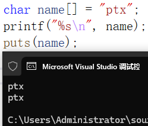
   puts写完字符串后，会在后面添加额外的换行符。
   输入字符串：scanf+%s，gets
   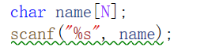
   scanf：会跳过前面的空白字符，读取字符存入到数组，直到遇到空白字符为止，然后后面添加'\0'。注意事项：永远不会包含空白字符，scanf不会检查数组是否越界。
   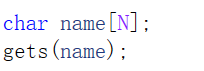
   gets：不会跳过前面的空白字符，读取字符存入到数组，直到遇到换行符为止，然后在后面添加'\0'，同样的gets也不会检查是否越界。

   ~~~c
   char *gets_s(char *str,rsize_t n);//n表示数组的长度，所以最多能够读入n-1个字符
   ~~~

4. 字符串的库函数
   ~~~c
   size_t strlen(const char *s);//指明在strlen中不会修改s指向的内容，传入参数
   ~~~

   计算字符串的长度，不包括'\0'
   ~~~c
   int strcmp(const char *s1,const char *s2);
   ~~~

   按字典顺序比较s1和s2
   如果s1>s2，则返回正整数
   如果s1=s2，则返回零
   如果s1<s2，则返回负整数

   ~~~c
   char *strcpy(char *s1,const char*s2);
   ~~~

   把s2指向的字符串复制到s1指向的数组中
   ~~~c
   char s1[4];
   strcpy(s1,"hello");
   ~~~

   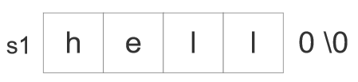

   ~~~c
   char *strncpy(char *dest,const char *src,size_t count);
   ~~~

   功能与strcpy类似但会指定复制的长度。
   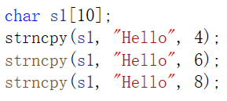
   

   ~~~c
   char * strcat(char *dest,const char *src);
   ~~~

   把字符串src的内容追加到字符串dest的末尾，并返回dest（不会检查数组越界）。
   ~~~c
   char * strncat(char *dest,const char *src,size_t count);
   ~~~

   
   strncat总会写入'\0'，所以我们一般这样调用：

   ~~~c
   strncat(s1,s2,sizeof(s1)_strlen(s1)-1)
   ~~~

### 字符串数组

二维数组
~~~c
char plants[][8]={"Mecury","Venus","Earth","Mars","Jupitor","Saturn","Uranus","Neptune","Pluto"};
~~~


字符指针数组

~~~c
char* planets[]={"Mecury","Venus","Earth","Mars","Jupitor","Saturn","Uranus","Neptune","Pluto"};
~~~


### 命令行参数


### 结构体

c语言的结构体相当于其他高级语言中的类，c语言智能在结构体中定义数据。

~~~c
//表示一个学生对象
struct student_s{
    int number;
    char name[25];
    bool gender;
    int chinese;
    int math;
    int english;
}
~~~

内存布局：

填充的目的是为了对齐。

1）结构体对象的初始化

~~~c
struct student_s s1 = {1,"刘亦菲",false,100,100,100};
struct student_s s2 = {1,"周杰伦",true};//未初始化的成员会赋值为0
~~~

2）对结构体进行操作

1. 获取成员：s1.name
2. 赋值：s3=s1

注意：当结构体作为参数或者返回值时，会拷贝整个结构体中的数据。
为了避免拷贝数据，我们往往会传递一个指向结构体的指针。


可以使用typedef为结构体取别名
~~~c
typedef struct student_s {
    int number;
    char name[25];
    bool gender;
    int chinese;
    int math;
    int english;
}Student;
~~~

### 枚举

在程序中有一些变量只能取一些离散的值，如扑克牌的花色。


枚举类型的值本质上都是一些整数值。


我们也可以指定枚举常量的值。


### 动态内存分配

动态内存分配在c语言中有着举足轻重的地位，因为它是链式结构的基础。
在头文件<stdlib.h>定义了三个动态内存分配的函数**（在堆上分配内存空间）**。

~~~c
void* malloc(size_t size);
~~~

分配size个字节的内存，不会对内存块清零，若分配不成功，返回空指针。

~~~c
void* calloc(size_t num,size_t size);
~~~

为num分配内存空间，每个元素的大小为size个字节，并对内存块清零，若分配不成功返回空指针。

~~~c
void* realloc(void* ptr,size_t new_size);
~~~

调整先前分配内存块大小，如果分配成功没返回指向新内存的指针，否则返回空指针。ptr因该是指向先前使用动态内存分配函数分配的内存块。

如果申请内存空间没有释放就有可能造成内存泄漏现象。
~~~c
void free(void* ptr);
~~~

ptr必须是先前调用malloc，calloc，realloc返回的指针。

### 链表

将所有结点串起来就组成链表，结点包括数据域和指针域，其中数据域存放所需要的数据，指针域存放下一个结点的地址。


链表的分类：
单向循环链表：

双向链表：

双向循环链表：


~~~c
#include<stdio.h>
#include<stdlib.h>

typedef struct node_s {
	int val;
	struct node_s* next;
}Node;

Node* add_to_list(Node* list, int val);

int main(void)
{
	Node* list = NULL;
	list = add_to_list(list,1);
	list = add_to_list(list,2);
	list = add_to_list(list,3);
	list = add_to_list(list,4);

	return 0;
}
//头插法添加节点
Node* add_to_list(Node* list,int val) {
	Node* newNode = (Node *)malloc(sizeof(Node));
	if (newNode == NULL) {
		printf("Error:malloc failed in add_to_list.\n");
		exit(1);
	}
	// 初始化
	newNode->val = val;
	newNode->next = list;
	return newNode;
}
~~~

### 二级指针

~~~c
#include<stdio.h>
#include<stdlib.h>

typedef struct node_s {
	int val;
	struct node_s* next;
}Node;

void add_to_list2(Node** ptr_list, int val);
int main(void)
{
	Node* list = NULL;
	add_to_list2(&list, 1);
	add_to_list2(&list, 2);
	add_to_list2(&list, 3);
	add_to_list2(&list, 4);
	return 0;
}
void add_to_list2(Node** ptr_list, int val) {
	Node* newNode = (Node*)malloc(sizeof(Node));
	if (newNode == NULL) {
		printf("Error:malloc failed in add_to_list.\n");
		exit(1);
	}
	// 初始化
	newNode->val = val;
	newNode->next = *ptr_list;
	*ptr_list = newNode;
}
~~~

注意：
~~~c
list=NULL;
ptr_list=&list;
*ptr_list=list=NULL;
~~~

### 函数指针

指向函数的指针，函数也有地址。

示例：对任意一个函数返回值为double，参数类型double，给定两点a,b，求$f(\frac{a+b}{2})$
~~~c
#include<stdio.h>
#include<math.h>
#define PI 3.1415926


double average(double f(double), double a, double b);
int main(void) {
	double avg = average(sin, 0, PI);
	printf("%lf", avg);
	return 0;
}

//double average(double (*f)(double), double a, double  b) {
//	return (*f)((a + b) / 2);
//}

//简便写法
double average(double f(double), double a, double  b) {
	return f((a + b) / 2);
}
~~~

qsort()：可以对任意类型数组进行排序，不管元素类型是什么

ptr：指向要排序的数组
count：数组中元素的个数
size：元素大小
comp：比较函数如果第一个参数大于第二个参数返回正值，如果第一个参数等于第二个参数返回零，如果第一个参数小于第二个参数返回负值。

练习：比较成绩规则如下，总分，语文成绩，数学成绩，英语成绩，从高到低依次排序，如果全都相同，按字典顺序从小到大比较。
~~~c
#include<stdio.h>
#include<string.h>
#define SIZE(a)(sizeof(a)/sizeof(a[0]))

typedef struct student_s {
	int number;
	char name[25];
	int chinese;
	int math;
	int english;
}Student;
int compare(const void* p1, const void* p2);

int main(void) {
	Student students[5] = { {1,"ming",100,100,100},{2,"hong",99,100,100},
		{3,"gang",100,99,100},{4,"lin",100,100,99},{5,"lan",100,100,99} };
	qsort(students, SIZE(students), sizeof(Student),compare);
	return 0;
}
//比较规则：总分，语文成绩，数学成绩，英语成绩，从高到低依次比较，如果全都相同，按字典顺序从小到大比较
int compare(const void* p1,const void* p2) {
	Student* s1 = (Student*)p1;
	Student* s2 = (Student*)p2;
	int total1 = s1->chinese + s1->english + s1->math;
	int total2 = s2->chinese + s2->english + s2->math;
	if (total1 != total2) {
		return total2 - total1;
	}
	if (s1->chinese != s2->chinese) {
		return s2->chinese - s1->chinese;
	}
	if (s1->math != s2->math) {
		return s2->math - s1->math;
	}
	if (s1->english != s2->english) {
		return s2->english - s1->english;
	}
	return strcmp(s1->name, s2->name);
}
~~~

### 链表的基本操作

单链表：
增（在某个节点后面添加）
删（删除某个节点后面的节点）
查：1.根据索引查找值O(n)
		2.查找与特定值相等的结点
			a.大小有序O(n)
			b.大小无序O(n)

双向链表：
除了单链表基础操作外，还有一些额外的基本操作
增（在某个结点前添加）（O(1)，单链表：O(n)）
删（删除某个结点）		（O(1)，单链表：O(n)）
查：1.查找前驱结点		 （O(1)，单链表：O(n)）
		2.根据索引查找值	 （O(n)，平均遍历$\frac{n}{4}$，单链表平均遍历$\frac{n}{2}$）
		3.查找与特定值相等的结点
			a.大小有序			 （O(n)，记录上次查找结点，平均遍历$\frac{n}{4}$，单链表平均遍历$\frac{n}{2}$）

|  |
| ------------------------------------------------------------ |

​			b.大小无序			 （O(n)）
总结：虽然双向链表占用更多内存空间，但是在很多操作上都优于单链表，所以在实际生产中更倾向于使用双向链表。用空间换时间。

~~~c
//linklist.h
//链表的接口
#include<stdbool.h>
typedef struct node_s {
	int val;
	struct node_s* next;
}Node;

typedef struct linkedlist_s {
	Node* head;
	Node* tail;
	int size;
}LinkedList;

// 构造方法：创建一个空链表
LinkedList* create_list();

// 析构方法：释放堆内存空间
void destroy_list(LinkedList* list);

// 头插法
void add_before_head(LinkedList* list, int val);

// 尾插法
void add_behind_tail(LinkedList* list, int val);

// 任意位置插入
void add_node(LinkedList* list, int index, int val);

// 删除第一个与val相等的结点
bool remove_node(LinkedList* list, int val);

// 查找与val相等结点的索引
int indexOf(LinkedList* list, int val);
~~~

~~~c
//linklist.c
//链表实现
#include "linkedlist.h"
#include<stdlib.h>
#include<stdio.h>

//创建空链表
LinkedList* create_list() {
	return (LinkedList*)calloc(1,sizeof(LinkedList));
}

// 析构方法：释放堆内存空间
void destroy_list(LinkedList* list) {
	//释放结点空间
	Node* curr = list->head;
	while (curr != NULL) {
		Node* next = curr->next;
		free(curr);
		curr = next;
	}
	//释放LinkedList结构体
	free(list);
}

// 头插法
void add_before_head(LinkedList* list, int val) {
	//创建新节点
	Node* newNode = (Node*)malloc(sizeof(Node));
	if (newNode == NULL) {
		printf("Error:malloc filed in add_before_head.\n");
		exit(0);
	}
	//初始化节点
	newNode->val = val;
	newNode->next = list->head;
	list->head = newNode;
	//判断链表是否为空
	if (list->size == 0) {
		list -> tail = newNode;
	}
	list->size++;
}

// 尾插法
void add_behind_tail(LinkedList* list, int val) {
	Node* newNode = (Node*)malloc(sizeof(Node));
	if (newNode == NULL) {
		printf("Error:malloc filed in add_before_head.\n");
		exit(0);
	}
	//初始化节点
	newNode->val = val;
	newNode->next = NULL;
	//判断链表是否为空
	if (list->size == 0) {
		list->head = newNode;
	}
	else {
		list->tail->next = newNode;
	}
	list->tail = newNode;
	list->size++;
}

// 任意位置插入
void add_node(LinkedList* list, int index, int val) {
	if (index<0 || index>list->size) {
		printf("Error:illegal index.\n");
		exit(1);
	}
	Node* newNode = (Node*)malloc(sizeof(Node));
	if (newNode == NULL) {
		printf("Error:malloc filed in add_before_head.\n");
		exit(0);
	}
	//初始化节点
	newNode->val = val;
	if (index == 0) {
		newNode->next = list->head;
		list->head = newNode;
	}else{
		Node* p = list->head;
		for (int i = 0; i < index - 1; i++) {
			p = p->next;
		}
		newNode->next = p->next;
		p->next = newNode;
		if (index == list->size)
			list->tail = newNode;
	}
	list->size++;
}

//删除第一个与val相等的结点
bool remove_node(LinkedList* list, int val) {
	Node* pre = NULL;
	Node* curr = list->head;
	while (curr != NULL && curr->val != val) {
		pre = curr;
		curr = curr->next;
	}
	if (curr == NULL)return false;
	if (pre == NULL) {
		if (list->size == 1) {
			list->head = list->tail = NULL;
		}
		else {
			list->head = curr->next;
		}
		free(curr);
	}
	else {
		pre->next = curr->next;
		if (pre->next == NULL) {
			list->tail = pre;
		}
		free(curr);
	}
	list->size--;
	return true;
}

//查找与val相等结点的索引
int indexOf(LinkedList* list, int val) {
	Node* curr = list->head;
	for (int i = 0; i < list->size;i++,curr = curr->next) {
		if (curr->val == val) {
			return i;
		}
	}
	return -1;
}
~~~

### 栈

一种操作受限的线性表：只能在栈顶添加和删除元素。LIFO(Last In First Out)

作用：

1. 函数调用
2. 深度优先遍历
3. 浏览器前近后退
4. 括号匹配
5. 后缀表达式求值

栈的基本操作：push、pop、isEmpty、peek（查看栈顶元素）

### 队列

队列是一种操作受限的线性表：只能从一端插入，从另一端删除。

插入端：队尾(rear)。删除端：队头(front)。

特性：FIFO(First In First Out)

作用：

1. 广度优先遍历
2. 缓存

基本操作：enqueue、dequeue、peek、isEmpty、isFull

入队列：elements[rear]=val;rear=(rear+1)%N

出队列：front=(front+1)%N

判空：front==rear

判满：front==(rear+1)%N

### 哈希表

哈希表的两个问题：

1. 哈希函数：让键值对尽量平均分布。
2. 解决冲突：拉链法。

哈希表的基本操作:

~~~
v get(k key):
	int idx = hash(key);//获取索引
	遍历索引下的链表;
		key存在,返回key对应的value;
		key不存在,返回特殊值.
v put(k key,v value):
	int idx = hash(key);//获取索引
	遍历索引下的链表;
		key存在,返回key对应的value，并返回原来的value;
		key不存在,添加键值对,返回特殊值
v remove(k key):
	int idx = hash(key);//获取索引
	遍历索引下的链表;
		key存在,删除键值对，并返回删除的value;
		key不存在,返回特殊值
~~~

### 二叉搜索树（BST）

二叉树：每个节点最多有两个孩子。

二叉树的性质：二叉树第n层有$2^{n-1}$个结点，如果一棵树有n层，则它最多有$2^n-1$个结点。

特殊的二叉树：
满二叉树：


完全二叉树：


~~~
//完全二叉树性质
leftChild(i) = 2i
rightChild(i)=2i+1
parent(i)=i/2
~~~

二叉树可以用数组的方式表示，按照完全二叉树的方式对结点进行编号。

二叉树的遍历


深度优先遍历：

- 先序遍历（DLR）：ABDCEF
- 中序遍历（LDR）：BDAEFC
- 后序遍历（LRD）：DBFECA

广度优先遍历（层级变量）：ABCDEF

二叉树的建树：只有先序遍历和中序遍历或者后序遍历和中序遍历可以构建一个唯一的树。

二叉查找树（Binary Search Tree）：

1. 二叉树
2. 左子树所有结点的key值都小于根结点的key值。
   右子树所有节点的key值都大于根结点的key值。
   并且左、右子树都是二叉查找树。

如何判断一个属是不是二叉查找树？中序遍历看key值是否是按从小到大的顺序排列。

二叉查找树的好处？效率高，查找、插入和删除的时间复杂度都是O(h)，h为树的高度。

如果一颗BST有n个结点，那么它最小的高度是多少？恰好为完全二叉树高度为$logn$。

一颗高度为h的完全二叉树，它的结点数目n的范围是多少？$2^{h-1}\le n\le2^{h}-1$。

普通的二叉查找树的高度不一定是$O(logn)$这个级别，例如所有节点只有左或右子节点。

平衡二叉查找树：
AVL树：对任意一个节点，其左子树的高度和右子树的高度相差不超过1。
红黑树：保证树的高度是$O(logn)$级别。

### 红黑树

红黑树的本质是用二叉搜索树来表示2-3-4树。

一颗红黑树是满足下面红黑性质的二叉搜索树：

1. 每个结点或者是红色或者是黑色。
2. 根结点是黑色的。
3. 叶结点是黑色的。
4. 如果一个节点是红色的，那它的两个子结点都是黑色的。
5. 对每个结点，从该结点到其所有后代叶结点的简单路径上，均包含相同数目的黑色结点。

### 二分查找

~~~c
int search(int arr[], int left, int right, int key) {
	//边界条件
	if (left > right) return -1;
	// int mid = (left + right) / 2;
	int mid = left + (right - left >> 1);
	if (key < arr[mid])
		return search(arr, left, mid - 1, key);
	else if (key > arr[mid])
		return search(arr, mid + 1, right, key);
}
//递归思想
int binary_search(int arr[], int n, int key) {
	//边界条件
	return search(arr, 0, n-1, key);
}

//循环方法
int binary_search(int arr[], int n, int key) {
	int left = 0, right = n - 1;
	while (left <= right) {
		int mid = left + (right - left >> 1);
		if (key < arr[mid]) {
			right = mid - 1;
		}
		else if (key > arr[mid]) {
			left = mid + 1;
		}
		else {
			return mid;
		}
	}
	return -1;
}
~~~

### 文件

**文本文件和二进制文件**

文本文件有两个特殊的性质：

​	文本文件有行的概念。文本文件可能包含一个特殊的文件末尾EOF。

文本文件存储数据方便人类阅读和编辑，缺点是占用空间高。

二进制文件存储数据占用空间高，但人类看不懂。

**fopen/fclose**

~~~c
#include <stdio.h>
FILE* fopen(const char* filename,const char* mode);
//filename:文件路径
//mode：打开文件的方式
~~~

文件路径：

绝对路径：从根目录开始，一直到文件所在位置。

相对路径：从当前工作目录开始，直到文件所在位置。

模式：

~~~
"r": 打开一个已有文件，用于只读。文件必须存在，否则返回 NULL。文件指针从文件开头开始。
"w": 打开文件，进行只写。如果文件已存在，会清空文件内容。如果文件不存在，会创建一个新文件。
"a": 打开文件，进行只写，并将文件指针移到文件末尾（用于追加内容）。如果文件不存在，会创建一个新文件。无法修改已有内容，只能在末尾追加。

//下面几种方式都是以读写方式打开文件
"r+": 打开一个已有文件，用于读写。文件必须存在，否则返回 NULL。文件指针从文件开头开始，读写均可。
"w+": 打开文件，进行读写。如果文件已存在，会清空文件内容。如果文件不存在，会创建一个新文件。
"a+": 打开文件，进行读写，文件指针移到文件末尾。如果文件不存在，会创建一个新文件。读取可以从文件开头开始，但写入只能在文件末尾追加。

//读写二进制文件，功能和上述一致
"rb"
"wb"
"ab"
"rb+"
"wb+"
"ab+"
~~~

~~~c
int fclose( FILE *stream );//如果关闭成功则返回零，否则返回EOF
~~~

**文件的读和写**

文本文件：fgetc/fputc，fgets/fputs，fscanf/fprintf

~~~c
#include <stdio.h>
int fgetc( FILE* stream );
/*
功能：
	从指定的文件流 stream 中读取一个字符，返回该字符（类型为 int）。
参数：
	stream 是一个指向打开的文件流的指针。
返回值：
	成功：返回读取的字符（作为无符号字符扩展到 int）。
	失败或到达文件末尾：返回特殊值 EOF。
*/
int fputc( int ch, FILE* stream );
/*
功能：
	向指定的文件流 stream 中写入一个字符 ch。
参数：
	ch 是要写入的字符（类型为 int，将截断为无符号字符）。
	stream 是一个指向打开的文件流的指针。
返回值：
	成功：返回写入的字符（类型为 int）。
	失败：返回 EOF，并设置错误标志。
*/
~~~

~~~c
#include <stdio.h>
char* fgets( char* str, int count, FILE* stream );
/*
功能：
	从指定的文件流 stream 中读取最多 count-1 个字符（包括换行符），并将其存储到缓冲区 str 中，最后在结尾添加一个空字符 \0。
参数：
	str：指向存储读取字符串的缓冲区。
	count：要读取的最大字符数，包括 \0。
	stream：文件流指针。
返回值：
	成功：返回 str。
	失败或到达文件末尾：返回 NULL。
*/
int fputs( const char* str, FILE* stream );
/*
功能：
	将字符串 str 写入到指定的文件流 stream，不添加换行符。
参数：
	str：要写入的字符串（必须是以 \0 结尾）。
	stream：文件流指针。
返回值：
	成功：返回非负值。
	失败：返回 EOF。
*/
~~~

~~~c
#include <stdio.h>
int fscanf( FILE *stream, const char *format, ... );
/*
功能：
	从指定文件流 stream 中读取数据，根据 format 格式字符串解析输入并存储到变量中。
参数：
	stream：指向已打开文件的指针。
	format：格式字符串，指定如何解析输入。
	...：传入变量的地址，用于存储解析后的数据。
返回值：
	成功：返回成功匹配并赋值的字段数量。
	失败或到达文件末尾：返回 EOF。
注意：
	格式化字符串的用法与 scanf 相同（如 %d，%s，%f 等）。
	遇到格式不匹配时，解析会停止，且 fscanf 不会清除缓冲区。
*/
int fprintf( FILE* stream, const char* format, ... );
/*
功能：
	将格式化的字符串写入指定文件流 stream。
参数：
	stream：指向已打开文件的指针。
	format：格式字符串，指定如何格式化输出。
	...：可变参数，用于提供格式化输出的内容。
返回值：
	成功：返回写入的字符数量（不包括终止符）。
	失败：返回负值。
*/
~~~

二进制文件：fread\fwrite

~~~c
#include <stdio.h>
size_t fread( void *buffer, size_t size, size_t count,FILE *stream );
/*
功能：
	从文件流 stream 中读取 count 个大小为 size 的块到缓冲区 buffer 中。
参数：
	buffer：指向存储读取数据的内存缓冲区。
	size：每个元素的大小（单位：字节）。
	count：读取的元素数量。
	stream：文件流指针。
返回值：
	成功：返回成功读取的元素数量。
	失败或到达文件末尾：返回小于 count 的值。
*/
size_t fwrite( const void* buffer, size_t size, size_t count,FILE* stream );
/*
功能：
	将缓冲区 buffer 中的 count 个大小为 size 的块写入到文件流 stream 中。
参数：
	buffer：指向要写入的数据缓冲区。
	size：每个元素的大小（单位：字节）。
	count：写入的元素数量。
	stream：文件流指针。
返回值：
	成功：返回成功写入的元素数量。
	失败：返回小于 count 的值。
*/
~~~

**文件定位**

~~~c
#include <stdio.h>
int fseek( FILE* stream, long offset, int origin );
long ftell( FILE *stream );
void rewind( FILE *stream );
~~~

~~~c
//移动到文件的开始
fseek(stream,0l,SEEK_SET)等价于rewind(stream);
//往回移动10个字节
fseek(stream,-10l,SEEK_CUR);
//移动到文件末尾
fseek(stream,0l,SEEK_END);
~~~

ftell返回当前文件的位置（相对SEEK_SET而言）

**文件删除**

~~~c
#include <stdio.h>

int remove(const char *pathname);
/*
参数
	pathname：要删除的文件或目录的路径。
返回值
	成功：返回 0。
	失败：返回非零值，并设置 errno。
注意：
    当 pathname 是文件时，直接删除文件。
    当 pathname 是空目录时，删除目录。
    如果 pathname 是非空目录，则会失败（错误代码 EPERM 或 EISDIR）。
*/
~~~

### 错误处理

~~~c
#include<stdio.h>
#include<errno.h>
#include<math.h>

int main(void){
    perror("Error");
    log(0.0);
    perror("Error");
    return 0;
}
~~~

### 排序算法

如何评价一个排序算法？

1. 时间复杂度

   - 最好情况
   - 最坏情况
   - 平均情况
   - 系数和低阶项

2. 空间复杂度

3. 稳定性

   数据集中相等的元素如果排序前和排序后相对次序不变，那么排序就是稳定的。

### 冒泡排序

~~~c
void bubble_sort(int arr[], int n) {
	// i表示冒泡的次数
	for (int i = 1; i < n; i++) {
		bool isSorted = true;
		for (int j = 0; j < n - i; j++) {
			if (arr[j] > arr[j + 1]) {
				//交换位置
				arr[j] = arr[j] + arr[j + 1];
				arr[j + 1] = arr[j] - arr[j + 1];
				arr[j] = arr[j] - arr[j + 1];
				isSorted = false;
			}
		}
		if (isSorted) return;
		print_arr(arr, n);
		printf("\n");
	}
}
~~~

时间复杂度：

- 最好情况：原数组有序，比较次数为$n-1$，交换次数为$0$，时间复杂度为$O(n)$。
- 最坏情况：原数组逆序，比较次数为$\frac{n(n-1)}{2}$，j交换次数为$\frac{n(n-1)}{2}$，时间复杂度为$O(n^2)$。
- 平均情况：时间复杂度为$O(n^2)$。

空间复杂度：$O(1)$，原地排序。

稳定性：稳定

### 选择排序

~~~c
void selection_sort(int arr[], int n) {
	for (int i = 1; i < n; i++) {
		int minIndex = i - 1;
		for (int j = i; j < n; j++) {
			if (arr[j] < arr[minIndex]) {
				minIndex = j;
			}
		}
		//交换i-1和minIndex所在位置的元素
		swap(arr, i - 1, minIndex);
		print_arr(arr, n);
	}
}
~~~

时间复杂度：任何情况的时间复杂度都是相同的，比较次数为$\frac{n(n-1)}{2}$，交换次数为$n-1$，时间复杂度为$O(n^2)$。

空间复杂度：$O(1)$，原地排序。

稳定性：不稳定。

### 插入排序

~~~c
void insertion_sort(int arr[], int n) {
	//i表示无序区的第一个元素
	for (int i = 1; i < n; i++) {
		int val = arr[i];
		int valIndex = i;
		for (int j = i - 1; j >= 0; j--) {
			if (val < arr[j]) {
				swap(arr, valIndex, j);
				valIndex--;
			}
			else break;
		}
		print_arr(arr, n);
	}
}
~~~

时间复杂度：

- 最好情况：原数组有序，比较次数为$n-1$，交换次数为$0$，时间复杂度为$O(n)$。
- 最坏情况：原数组逆序，比较次数为$\frac{n(n-1)}{2}$，交换次数为$\frac{n(n-1)}{2}$，时间复杂度为$O(n^2)$。
- 平均情况：时间复杂度为$O(n^2)$。

空间复杂度：$O(1)$，原地排序。

稳定性：稳定。

### 希尔排序

~~~c
void shell_sort(int arr[], int n) {
	int gap = n / 2;
	while (gap != 0) {
		for (int i = gap; i < n; i++) {
			int val = arr[i];
			int valIndex = i;
			for (int j = valIndex - gap; j >= 0; j-=gap) {
				if (val < arr[j]) {
					swap(arr, valIndex, j);
					valIndex-=gap;
				}
				else break;
			}
		}
		gap /= 2;
		print_arr(arr, n);
	}
}
~~~

时间复杂度：比$O(n^2)$小，和具体的gap序列有关

空间复杂度：$O(1)$，原地排序。

稳定性：不稳定。

### 主定理(Master Theorem)

主定理（Master Theorem） 是一种用来分析递归式时间复杂度的数学工具，特别适用于分治算法。以下是主定理的公式推导和使用。其一般形式为：
$$
T(n)=aT(\frac{n}{b})+O(n^d)
$$
其中$a$表示每层递归产生的子问题数，b表示每个子问题规模缩小的比例，$O(n^d)$表示合并子问题所需要的额外工作。

主定理结论：

当$d<log_ba$时，$T(n)=O(n^{log_ba})$

当$d=log_ba$时，$T(n)=O(n^dlogn)$

当$d>log_ba$时，$T(n)=O(n^d)$

### 归并排序

~~~c
void merge(int arr[], int left, int mid, int right) {
	int len = right - left + 1;
	int* temp = (int*)malloc(len * sizeof(int));
	if (temp == NULL) {
		printf("Error:malloc failed in merge.\n");
		exit(1);
	}
	int i = left, j = mid + 1, k = 0;
	while (i <= mid && j <= right) {
		if (arr[i] <= arr[j]) {//不能写成<
			temp[k++] = arr[i++];
		}
		else {
			temp[k++] = arr[j++];
		}
	}
	while (i <= mid) {
		temp[k++] = arr[i++];
	}
	while (j <= right) {
		temp[k++] = arr[j++];
	}
	for (int i = 0; i < len; i++) {
		arr[left + i] = temp[i];
	}
}
void merge_sort(int arr[], int left, int right) {
	if (left >= right) return;
	int mid = left + (right - left >> 1);
	merge_sort(arr, left, mid);
	merge_sort(arr, mid+1, right);
	merge(arr, left, mid, right);
	print_arr(arr, N);
}
~~~

时间复杂度：归并排序每次将数据分成两部分，分解操作需要$logn$次（递归深度）,每一层需要$O(n)$的时间来合并分解后的数据。总时间复杂度为$O(nlogn)$。

时间复杂度：归并排序需要额外的数组来存储合并结果，因此需要$O(n)$的辅助空间。

稳定性：稳定。

### 快速排序

~~~c
void quick_sort(int arr[], int left, int right) {
	if (left >= right)return;
	int i = left;
	int j = right;
	int pivot = arr[i];
	while (i != j) {
		if (arr[j] < pivot) {
			swap(arr, i, j);
			i++;
		}
		else if (arr[i] > pivot) {
			swap(arr, i, j);
			j--;
		}
		else if (arr[i] == pivot) {
			j--;
		}
		else if (arr[j] == pivot) {
			i++;
		}
	}
	int pivotIndex = i;
	print_arr(arr, N);
	quick_sort(arr, left, pivotIndex-1);
	quick_sort(arr, pivotIndex + 1, right);
}
~~~

时间复杂度：

- 最好情况：每次分区后，主元将数组几乎分为两部分。分区操作需要$O(n)$的比较，将数组递归分为两半的操作需要$logn$层。总时间复杂为$T(n)=2 T(\frac{n}{2})+n=O(nlogn)$
- 最坏情况：当主元选择非常不理想（如总是选择最大或最小元素时），每次分区只减少一个元素。此时递归深度为n总时间复杂度为$T(n)=T(n-1)+n=O(n^2)$
- 平均情况：$T(n)=O(nlogn)$

空间复杂度：$O(logn)$

稳定性：不稳定。

### 堆排序

~~~c
void heapify(int arr[], int i, int len) {
	// i表示可能违反大顶堆规则结点的索引，len表示包换大顶堆包含元素的个数
	while (i < len) {
		int leftChild = 2 * i + 1;
		int rightChild = 2 * i + 2;
		int maxIdx = i;
		if (leftChild<len && arr[leftChild]>arr[maxIdx]) {
			maxIdx = leftChild;
		}
		if (rightChild<len && arr[rightChild]>arr[maxIdx]) {
			maxIdx = rightChild;
		}
		if (maxIdx == i) {
			break;
		}
		swap(arr, i, maxIdx);
		i = maxIdx;
	}
}
void build_heap(int arr[], int n) {
	//从最后一个非叶子结点开始(n-2)/2
	for (int i = (n - 2) / 2; i >= 0; i--) {
		heapify(arr, i, n);
	}
}
void heap_sort(int arr[], int n) {
	//构建大顶堆
	build_heap(arr, n);
	print_arr(arr, n);
	//无序区长度
	int len = n;
	while (len > 1) {
		swap(arr, 0, len - 1);
		len--;
		print_arr(arr, n);
		//把无序区重新调整为大顶堆
		heapify(arr, 0, len);
	}
}
~~~

时间复杂度：$T(n)=O(n)+O(nlogn)=O(nlogn)$

空间复杂度：$O(1)$

稳定性：不稳定。

## Linux

### 网络设置

桥接模式：


NAT模式：


远程连接

~~~sh
sudo apt install ssh #安装ssh
ps -elf|grep sshd
~~~

### Linux架构图


内核（kernel）：管理硬件资源：CPU、内存、外部设备。在文件管理、内存管理、进程调度、网络通信、硬件驱动时使用。为上层应用软件提供应用环境。

系统调用（system calls）：内核对上层应用提供的接口。

库函数（library routines）：对系统调用进行包装，方便程序使用。

shell：命令解析器，其本质上是一个程序，他可以解析和执行命令或脚本。

### Linux的发行版本

Linux发行版本=Linux内核+其他的支撑软件

|                | 收费版 |      免费版      |  包管理器   |
| :------------: | :----: | :--------------: | :---------: |
|     Debian     | debian |  ubuntu（学生）  | dpkg -> apt |
|     Redhat     | redhat | centos（小公司） | yum -> yum  |
| Opensuse(德国) |  ...   |       ...        |     ...     |

### man命令

~~~sh
man man #参考手册
~~~


~~~sh
d(down)#向下移动半页
u(up)#向上移动半页
f(forward)#向下移动一整页
p(previous)#向上移动一整页,回到第一页
q(quit)#退出
~~~


1号手册为shell命令

2号手册为系统调用

3号手册为库函数

### 查看内核信息

~~~sh
man uname
~~~


~~~sh
uname -a
~~~


~~~
Linux:kernel name #内核名字
ubuntu:network node hostname #网络结点名字
kernel-release:5.0.0-150-generic
kernel-version:#167~18.04.1-Ubuntu SMp Wed May 24 00:51:42 UTC 2023
machine:x86_64
processor:x86_64
hardware platform:x86_64
operating system:GNU/Linux
~~~


~~~
mainline:正在开发的版本
stable:稳定版本
longterm:长期支持版本
~~~

查看发行版本

~~~sh
cat /etc/issue
~~~


~~~
LTS:long time support长期支持版本
~~~

### 用户子系统

用户分类：

- 特权用户
  - 超级用户
  - root用户: 拥有最高权限
- 普通用户
  - sudoers: 临时拥有特权用户权限
  - 其他用户

查看所有用户

~~~sh
cat /etc/passwd
~~~


~~~
用户名:ptx
密码（已废弃）:x
用户id:1000
组id:1000
备注信息:yolov5_caffe
家目录:/home/ptx
默认shell程序:bash shell
~~~

添加用户

~~~sh
sudo useradd username #默认的添加用户方式创建的用户默认的shell程序是sh而不是bash shell且不会创建家目录。
~~~


~~~sh
sudo useradd -m -s /bin/bash username # -m表示创建家目录,-s /bin/bash表示指定bash为默认的shell
~~~

删除用户

~~~sh
sudo userdel username # 删除用户及其相关文件
sudo userdel -r username # 删除家目录和邮箱
~~~


切换用户

~~~sh
su username
~~~


退出切换

~~~sh
exit
~~~

更改设置密码

~~~sh
sudo passwd username
~~~

查看历史命令

~~~sh
history
~~~

### 文件子系统

显示当前工作目录

~~~sh
pwd
~~~

切换当前工作目录

~~~sh
cd
cd / #切换到根目录
cd ~ #切换到家目录
cd ..#切换到上级目录
cd . #切换到当前目录
cd - #切换到上一次工作目录
~~~

查看环境变量

~~~sh
env
~~~

查看目录下文件

~~~sh
ls
~~~


~~~sh
ls -l #等价于ll，罗列详细信息
~~~


`drwxr-xr-x`: 表示文件类型和权限

- d（directory）：目录文件

  -：file普通文件

  l（symbolic link）：符号链接，软链接。

  c：字符设备（键盘）

  b：块设备（硬盘）

  p：管道文件（进程间通信）

  s：套接字文件（网络通信）

- r：read读权限

  w：写权限

  x：执行权限

  -：没有对应权限

  第一组rwx：表示用户拥有读写执行权限。

  第二组r-x：同组其他成员拥有读和执行的权限。

  第三组r-x：其他用户拥有读和执行的权限。

`2`：表示硬链接的个数

`ptx`：用户名称

`ptx`：用户所属的组名

`4096`：文件的大小

`Jun 17 00:42`：上一次修改的时间

`Desktop/`：文件名


~~~
bin(binary):可执行程序
dec(device):设备文件
home:普通用户家目录的根目录
root:root用户的家目录
sbin(system binary):系统相关的可执行程序
var(variable):一般放经常发生变化的文件，例如日志文件。
etc:配置文件
lib(library):库文件
proc(process):进程映射文件
~~~

创建文件夹

~~~sh
mkdir
~~~

删除文件夹

~~~sh
rmdir #只能删除空目录
~~~

通配符（wildcard）

~~~
*：可以匹配任意多个字符（包括0个字符）

?：可以匹配任意一个字符

[characters]：匹配集合内的任意字符

[!characters]：匹配集合外的任意字符

类：[0-9]数字，[a-z]小写字母，[A-Za-z]字母
~~~

拷贝文件

~~~bash
cp
~~~

移动或重命名文件

~~~bash
mv
~~~

删除文件

~~~bash
rm
~~~

链接

~~~bash
ln # 创建硬链接
ln -s # 创建软链接
~~~

目录的本质其实也是文件，其中的每个文件称为一个目录项，每个目录项串成一个链表。


硬链接相当于给目标文件又起了一个别名，软链接则是给目标文件创建了一个快捷方式。

为`1.txt`文件创建一个硬链接`link_hard_1.txt`


使用`ls -i`命令可以看到硬链接和原文件的索引号是相同的


为`1.txt`文件创建一个软链接


查找文件

~~~bash
locate # 通过文件名查找文件
~~~

~~~bash
which # 查找一个可执行程序
~~~

~~~bash
find 起始目录 查找条件 操作 # 可以根据查找条件在起始目录下查找文件然后再执行指定的操作
find / -name "stdio.h" #在根目录下查找所有名字为stdio.h的文件
~~~

### 命令的组合

方式一

~~~bash
mkdir dir;cd dir #使用分号按先后顺序执行命令
~~~

方式二

~~~sh
find /usr/include -name "stdio.h" -exec ls -l {} \; # 将两个命令组合在一起使用，第一个命令执行的结果以行为单位作为第二个命令的参数
~~~

方式三

管道 (`|`)：将前一个命令的输出作为后一个命令的输入。

xargs：将标准输入转换为命令行参数，传递给后续命令。

~~~bash
find . -name "*.tmp" | xargs rm -f # 删除某种类型的文件
find /path/to/dir -type f -mtime +30 | xargs tar -czf old_files.tar.gz # 查找 30 天前的文件并压缩成一个 .tar.gz 文件。
ls *.txt | xargs wc -l # 统计多个文件的行数
~~~

### 权限

~~~bash
chmod #更改文件权限
# 字母设定法
chmod [ugoa] [+-=] [rwx]
chmod u+w 1.txt #给用户添加写权限
chmod u=rw,g=rw,o=r a.txt #为用户和用户组设置读写权限，为其他用户设置读权限
# 数字设定法
chmod 664 a.txt # 为用户和用户组设置读写权限，为其他用户设置读权限
~~~

### 查看文件内容

~~~bash
cat # 把标准输入中的内容输出到标准输出中去
# 如果后天添加文件名，则是把文件中的内容输出到标准输出中
~~~

|        | 类型         | 目标   | 文件描述符 |
| ------ | ------------ | ------ | ---------- |
| stdin  | 标准输入     | 键盘   | 0          |
| stdout | 标准输出     | 显示器 | 1          |
| stderr | 标准错误输出 | 显示器 | 2          |

~~~
>: 标准输出定向
<: 标准输入重定向
2>: 标准错误重定向
>>: 标准输出重定向（追加）
~~~

默认标准输出到屏幕


也可以指定到文件


~~~bash
echo
echo "hello world" > 1.txt
~~~

~~~bash
head # 显示文件的头几行信息
head -n 10 #指定打印前10行
~~~

~~~bash
tail # 显示文件的后几行
tail -n 10 #指定打印后10行
~~~

~~~bash
more # 单页浏览文件
less # 与more功能相同
~~~

### 文件的其他操作

~~~bash
sort #读取文件内容，并在内存中对文件内容进行排序，并把排序后的结果输出到stdout中去
~~~


~~~bash
uniq #读取文件内容，并对连续的行去重，并把去重后的结果输出到stdout中去
~~~


~~~bash
file #给出文件更多信息
file -i filename #查看文件编码
~~~


~~~bash
wc #word count统计命令
wc -c #统计文件中有多少字节
wc -l #统计文件有多少行
wc -w #统计文件有多少单词
~~~


~~~bash
iconv #修改文件编码字符集
iconv -f 原编码 -t 目标编码 filename
~~~


~~~bash
grep -E#使用正则表达式匹配搜索文件内容
#格式：
#    grep [选项] pattern [file]...常见选项
#    -E, --extended-regexp使用扩展的正则表达式
#    -i, --ignore-case忽略大小写
#    -v, --invert-match显示不匹配正则表达式的行
#    -n, --line-number显示行号
#    -c, --count不显示匹配的行，显示匹配行的个数
#示例
grep -nE "firmament" The_Holy_Bible.txt
~~~

正则表达式是一种用来匹配字符串的强大工具，广泛应用于文本搜索、字符串处理和数据验证等领域。

| 元字符  | 描述                                              |
| ------- | ------------------------------------------------- |
| `.`     | 匹配任意单个字符（除换行符 `\n`）                 |
| `^`     | 匹配字符串的开始                                  |
| `$`     | 匹配字符串的结束                                  |
| `*`     | 匹配前面的字符 0 次或多次                         |
| `+`     | 匹配前面的字符 1 次或多次                         |
| `?`     | 匹配前面的字符 0 次或 1 次                        |
| `{n}`   | 匹配前面的字符恰好 `n` 次                         |
| `{n,}`  | 匹配前面的字符至少 `n` 次                         |
| `{n,m}` | 匹配前面的字符至少 `n` 次，至多 `m` 次            |
| `[]`    | 匹配括号内的任意一个字符                          |
| `[^]`   | 匹配括号内没有的任意一个字符                      |
| `()`    | 分组，常用于提取子串或限制范围                    |
| `\`     | 转义字符，匹配特殊字符本身，如 `\.` 匹配 `.` 字符 |
| `\<`    | 匹配词首                                          |
| `\>`    | 匹配词尾                                          |

常用字符集

| 字符集 | 描述                                          |
| ------ | --------------------------------------------- |
| `\d`   | 匹配任意数字，等价于 `[0-9]`                  |
| `\D`   | 匹配任意非数字，等价于 `[^0-9]`               |
| `\w`   | 匹配字母、数字或下划线，等价于 `[A-Za-z0-9_]` |
| `\W`   | 匹配任意非字母、数字或下划线                  |
| `\s`   | 匹配空白字符，包括空格、制表符和换行符        |
| `\S`   | 匹配非空白字符                                |

例子：

~~~bash
[a-zA-Z0-9._%+-]+@[a-zA-Z0-9.-]+\.[a-zA-Z]{2,} #匹配邮箱
# [a-zA-Z0-9._%+-]+ 匹配邮箱名。
# @ 固定的分隔符。
# [a-zA-Z0-9.-]+ 匹配域名。
# \.[a-zA-Z]{2,} 匹配域名后缀。
~~~

~~~bash
^1[3-9]\d{9}$ # 匹配国内手机号
# ^1 手机号码以 1 开头。
# [3-9] 第二位是 3-9 的数字。
# \d{9} 后面跟 9 个数字
# $ 表示字符串结束。
~~~

~~~bash
alias #用于为复杂或频繁使用的命令创建简短的别名。通过别名，可以提高命令行操作的效率，简化输入。
~~~

示例：

~~~bash
alias rmf='rm -rf'
~~~

查看所有起别名的命令


注意：起别名只是临时生效，断开用户后就失效！

~~~bash
tar # 打包和解压缩文件
tar [主选项 辅选项] 目标文件 源文件或目录
主选项（只能选择一个）：
	-c 创造
	-r 追加
	-x 释放（解压）
辅选项：
	-f 指定文件名称
	-v （berbose）显示详细信息
	-z 不添加-z时，tar仅进行打包归档操作，而不进行压缩。
~~~

~~~bash
tar -cvf tarball 1.txt 2.txt 3.txt #打包压缩文件
tar -xvf tarball #解压缩文件
~~~

### 磁盘相关命令

~~~bash
df -h # 查看磁盘整体状况
~~~


~~~bash
du -h dir# 查看目录使用情况
du -h -d 0 # -d 0 表示当前目录占用磁盘大小
du -h -d 1 # -d 0 表示当前目录的下一级目录占用磁盘大小
~~~


### 远程拷贝

~~~bash
scp # 远程上传或下载，使用ssh协议
scp [选项] 用户名@远程主机:远程文件路径 本地目标路径
本地路径：有绝对路径和相对路径两种写法。
远程路径：用户名@ip:文件路径
-r：递归复制目录及其内容。
-P：指定远程主机的端口（非默认的 22 端口）。
-C：压缩数据传输。
-q：禁止进度显示。
-v：显示详细调试信息。
~~~

上传文件：


接收文件：


生成密钥：

~~~bash
ssh-keygen
~~~


将生成的公钥文件`id_rsa.pub`上传至服务器


将上传后的文件放入用户家目录下的`.ssh`（没有则新建）下，在`authorized_keys`文件内追加入`id_rsa.pub`的内容


完成之后上传和接收文件就不用再输入密码！


可以给多个客户端分发公钥。

### git的常规用法


### vim编辑器

**插入模式**

`i`：在光标前插入。
`I`：在行首插入。
`a`：在光标后插入。
`A`：在行尾插入。
`o`：在当前行下方新建一行并插入。
`O`：在当前行上方新建一行并插入。

**命令模式**

`:wq` :保存退出

`:q`: 退出

`:q!`: 强制退出

`dd`: 删除行

`u`: 撤销操作

`yy`: 复制当前行

`p`: 粘贴

`set number`: 显示行号

`gg=G`: 格式化代码

分屏：`:vsp filename`

~~~
#安装
vimplus
1、sudo apt install vim-youcomplete //使用包管理器安装ycm
      rm -rf ~/.vim ~/.vimplus //删除本地之前已下载内容
2、解压
将vim.tar.gz  解压到自己家目录
将vimplus.tar.gz  解压到自己家目录
3、去安装
然后再次进去.vimplus执行 ./install.sh即可
4、做链接
然后新建软连接   
ln -s ~/.vimplus/.vimrc  ~/.vimrc
~~~

修改默认模板

~~~bash
[ptx@ubuntu ~/Test/dir2]$ locate snippet.c
/home/ptx/.vim/plugged/prepare-code/snippet/snippet.c
/home/ptx/.vim/plugged/prepare-code/snippet/snippet.cpp
/home/ptx/.vim_bak_20241126211928/plugged/prepare-code/snippet/snippet.c
/home/ptx/.vim_bak_20241126211928/plugged/prepare-code/snippet/snippet.cpp
/usr/lib/x86_64-linux-gnu/gedit/plugins/snippets/__pycache__/snippet.cpython-36.pyc
[ptx@ubuntu ~/Test/dir2]$ vim /home/ptx/.vim/plugged/prepare-code/snippet/snippet.c
~~~

### 编译工具链

SDK（Software Development Kit）：编译工具链


预处理、编译、汇编过程统称为编译过程。

### 预处理

执行预处理指令：

1. #includ文件包含
2. #define M 5宏定义
3. #define SIZE(a) (sizeof(a)/sizeof(a[0]))

宏开关：

~~~c
#if 
#else
#endif
~~~

预处理操作：`gcc -E hello.c -o hello.i`

源代码`hello.c`：																					预处理后`hello.i`:


~~~c
#ifdef 
#else
#endif
~~~

预处理操作：`gcc -E hello.c -o hello.i -D N`创建一个宏定义`N`

源代码`hello.c`：																					预处理后`hello.i`:


~~~c
#ifndef 
#else
#endif
~~~

预处理操作：`gcc -E hello.c -o hello.i`

源代码`hello.c`：																					预处理后`hello.i`:


根据是否定义宏定义`N`来输出不同内容。这种操作称为条件编译，可以为不同的客户或者不同的目标平台生成不同的代码。多次包含同一个头文件，可能会导致编译错误(比如，头文件中包含类型的定义)。因 此，我们应该避免重复包含头文件。使用 #ifndef 和 #define 可以轻松实现这一点：

~~~c
#ifndef __WD_FOO_H
 #define __WD_FOO_H
 typedef struct {
    int id;
    char name[25];
    char gender;
    int chinese;
    int math;
    int english;
 } Student;
 #endif
~~~

### 调试代码

在需要对代码进行调试时需要加上`-g`选项：

~~~bash
gcc main.c -o main -g 
~~~

进入调试界面：

~~~bash
gdb main #不设置命令行参数
gdb --args main hello world c c++ linux #添加命令行参数
# 也可以进入调试界面后设置命令行参数
$ gdb foo
 (gdb) set args arg1 arg2 arg3   
~~~

查看源代码：

~~~bash
# 格式
list/l [文件名:][行号|函数名]
# 常用方法
(gdb) list                              # 下翻源代码
(gdb) list -                            # 上翻源代码
(gdb) list 20                           # 查看20行附近的源代码
(gdb) list main                         # 查看main函数附近的源代码
(gdb) list scanner.c:20                 # 查看scanner.c文件第20行附近的源代码
(gdb) list scanner.c:scanToken          # 查看scanner.c文件scanToken函数附近的源代码
~~~

设置断点：

~~~bash
#格式
break/b [文件名:][行号|函数名]
# 常用方法
(gdb) break 20                          # 在第20行设置断点
(gdb) break main                        # 在main函数的开头设置断点
(gdb) break scanner.c:20                # 在scanner.c文件的第20行设置断点
(gdb) break scanner.c:scanToken         # 在scanner.c文件的scanToken函数开头设置断点
~~~

查看断点：

~~~bash
#格式
info break/i b
# 常用方法
(gdb) info break
 Num     Type           Disp Enb Address            What
 1       breakpoint     keep y   0x0000555555554e1d in main at main.c:79
 2       breakpoint     keep y   0x0000555555555a99 in scanToken at scanner.c:282
 #其中 Num 为断点的编号，Enb(enable)表示断点是否有效，What表示断点在源代码的哪个位置。
~~~

删除断点：
~~~bash
#格式
delete/d [n] #删除所有断点或n号断点
# 常用方法
(gdb) delete 2          # 删除2号断点
(gdb) d                 # 删除所有断点
~~~

启用调试：

~~~bash
run/r #可以用 run/r 命令启动调试
~~~

继续：

~~~bash
continue/c #continue/c 命令可以运行到逻辑上的下一个断点处
~~~

忽略断点n次（适用于调试循环结构）

~~~bash
#格式
ignore N COUNT
# 常用方法
(gdb) ignore 1 10    # 忽略1号断点10次
~~~

单步调试：

~~~bash
(gdb) step/s #用来进行单步调试，即遇到函数调用会进入函数
~~~

跳出函数：

~~~bash
(gdb) finish #使用 finish 命令执行完整个函数
~~~

逐过程：

~~~bash
(gdb) n/next #遇到函数调用，它不会进入函数，而是把函数调用看作一条语句。
~~~

监视：

~~~bash
#格式
print/p EXP #打印表达式的值
# 常用方法
(gdb) print PI*r*r
print/p EXP=VAL #可以改变变量的值
(gdb) print r=2.0
#display 命令自动展示表达式的值
display EXP  #自动展示EXP           
info display  #显示所有自动展示的表达式信息     
undisplay [n] #删除所有或[n]号自动展示的表达式

(gdb) info args  # 查看函数的参数
(gdb) info locals # 查看函数所有局部变量的值
~~~

退出GDB调试：

~~~bash
(gdb) q/quit
~~~

### 静态库和动态库

库有两种：静态库和动态库。在类 Unix 系统上，静态库一般是以 .a 结尾，Windows  上一般是以 .lib 结尾；在类 Unix 系统上，动态库一般是以 .so 结尾，Windows 上一 般是以 .dll 结尾。

静态库之所以称为静态，是因为它会在链接阶段打包到可执行程序中。静态库有如下 特点：

1. 静态库对函数的链接是在链接阶段完成的。 
2. 程序在运行时，与静态库再无瓜葛。移植方便。 
3. 浪费空间，每一个进程中都有静态库的一个副本。
4.  对程序的更新，部署，发布不友好 ( 需要所有用户重新下载安装新的可执行程序 ) 。

动态库之所以称为动态，是因为它在链接阶段并不会打包到可执行程序中，而是在程 序运行的时候才加载的。动态库有如下特点：

1.  动态库对函数的链接是在运行时完成的。 
2. 动态库可以在进程之间共享 ( 所以，动态库又被称为共享库 ) 。
3.  对程序的更新，部署，发布友好 ( 因为，我们只要更新动态库就好了 ) 。 
4.  程序在运行时，依赖动态库。不方便移植。

示例：

~~~c
// algs.h 包含加减乘除操作的函数声明
#ifndef __WD_ALGS_H                                                     
#define __WD_ALGS_H
int add(int a, int b);
int sub(int a, int b);
int mul(int a, int b);
int div(int a, int b);
 
#endif
~~~

~~~c
// add.c
#include "algs.h"
int add(int a, int b) {
   return a + b;
}
~~~

~~~c
// sub.c
#include "algs.h"
int sub(int a, int b) {
   return a - b;
}
~~~

~~~c
// mul.c
#include "algs.h"
int mul(int a, int b) {
   return a * b;
}
~~~

~~~c
 // div.c
#include "algs.h"
int div(int a, int b) {
   return a / b;
}
~~~

~~~c
//main.c
#include <stdio.h>
#include "algs.h"
int main(void) {
    printf("add(7, 3)=%d\n", add(7,3));
    printf("sub(7, 3)=%d\n", sub(7,3));
    printf("mul(7, 3)=%d\n", mul(7,3));
    printf("div(7, 3)=%d\n", div(7,3));
    return 0;
}
~~~

~~~bash
#生成静态库
#1.生成目标文件
gcc -c add.c sub.c mul.c div.c
#2.生成静态库
ar crsv libalgs.a *.o
#3.静态库移动到/usr/lib目录下
sudo mv libalgs.a /usr/lib
#4.编译链接项目
gcc main.c -o main -lalgs
#5.运行项目
./main
~~~


~~~bash
#此时如果删除库文件
sudo rm /usr/lib/libalgs.a
#再次运行
./main
~~~


依然能够执行，因为静态库是在链接阶段和可执行程序打包在一起的所以即使删除静态库文件依然能够运行。

~~~bash
#生成动态库
#1.生成目标库文件需要添加-fpic选项
gcc -c add.c sub.c mul.c div.c -fpic
#2.把目标文件打包成动态库
gcc -shared add.o sub.o mul.o div.o -o libalgs.so
#3.将生成的动态库移动到/usr/lib目录下
mv libalgs.so /usr/lib
#4.编译链接项目
gcc main.c -o main -lalgs
#5.执行项目
./main
~~~


~~~bash
#此时如果删除库文件
sudo rm /usr/lib/libalgs.so
#再次运行
./main
~~~


程序不能运行，因为程序是在运行时和动态库链接的。使用动态库，更新是非常容易的。我们只需要更新动态库即可，而不需要重新生成可执行程序。

~~~bash
#如果我们需要更新项目
#原项目动态库为libalgs.so.1.0.0
#更新后项目动态库为libalgs.so.2.0.0
#创建符号链接，将其指向新的动态库
sudo ln -s libalgs.so.2.0.0 libalgs.so
#这样就不用覆盖旧库，方便版本回退和测试
~~~

### Makefile

~~~makefile
Srcs := $(wildcard *.c) #所有以.c结尾的文件赋值给Srcs变量
Exes := $(patsubst %.c, %, $(Srcs)) #将Srcs中的所有.c文件名去除.c后缀作为可执行文件的文件名

CC := gcc
CFLAGS := -Wall -g

.PHONY: Out clean rebuild

Out: $(Exes)

%: %.c
	$(CC) $^ -o $@ $(CFLAGS) # "$^"表示所有依赖文件也就是"%.o","$@"表示"%"

clean:
	$(RM) $(Exes)

rebuild: clean Out

~~~

该`Makefile`实现的功能是对目录下所有`.c`文件生成对应名称的可执行文件。

### Linux目录文件

~~~c
//func.h, 将func.h移动到/usr/include目录下
#ifndef __WD_FUNC_H
#define __WD_FUNC_H
#include <stdio.h>
#include <stdlib.h>
#include <string.h>
#include <unistd.h>
#define ARGS_CHECK(argc, n) {               \
   if (argc != n) {                        \
       fprintf(stderr, "ERROR: expected %d arguments.\n", n);      \
       exit(1);                            \
   }                                       \
}
#define ERROR_CHECK(retval, val, msg)   {   \
   if (retval == val) {                    \
       perror(msg);                        \
       exit(1);                            \
   }                                       \
}
#define SIZE(a) (sizeof(a)/sizeof(a[0]))
#endif
~~~

**获取当前文件目录**

~~~c
#include <unistd.h>
char *getcwd(char *buf, size_t size);
/*
参数
    buf: 指向存放当放当前目录的数组
    size: 数组的大小
返回值
	成功：返回包含当前工作目录的字符串。如果buf不为NULL，即返回buf。   
	失败：返回NULL，并设置errno。
说明
	如果传入的buf为 NULL，且size为0，则getcwd会调用malloc申请合适大小的内存空间，填入当前工作目录的绝对路径，然后返回 malloc申请的空间的地址。注意：getcwd不负责free申请的空间，free是调用者的职责。
*/
~~~

~~~c
//getcwd.c
#include <func.h>
int main(void) {
    // char buf[10];
    // 由系统调用malloc，动态申请内存空间
    char* cwd = getcwd(NULL, 0);
    ERROR_CHECK(cwd, NULL, "getcwd");
    
    puts(cwd);
    // 由调用者负责释放申请的内存空间
    free(cwd);
    return 0;
}
~~~

**改变当前工作目录**

~~~c
#include <unistd.h>
int chdir(const char *path);
/*
参数
    path: 改变后的路径。
返回值
    成功：返回0。
    失败：返回-1，并设置errno。
注意：当前工作目录是进程的属性，也就是说每一个进程都有自己的当前工作目录。且父进程创建(fork)子进程的时候，子进程会继承父进程的当前工作目录。
*/
~~~

~~~c
//chdir.c
#include <func.h>
int main(int argc, char* argv[]) {
   // ./chdir dir
   ARGS_CHECK(argc, 2);
   
   char buf[256];
   getcwd(buf, SIZE(buf)); // 获取当前工作目录
   puts(buf);              // 打印当前工作目录
   
   int ret = chdir(argv[1]);   // 改变当前工作目录
   ERROR_CHECK(ret, -1, "chdir");
   getcwd(buf, SIZE(buf));
   puts(buf);
   
   return 0;
}
~~~

**创建目录文件**

~~~c
 #include <sys/stat.h>
 #include <sys/types.h>
 int mkdir(const char *pathname, mode_t mode);
/*
参数
    pathname: 要创建目录的路径
    mode: 目录的权限位，会受文件创建掩码umask的影响，实际的权限为(mode & ~umask & 0777)
返回值
    成功：返回0
    失败：返回-1，并设置errno
*/
~~~

~~~c
#include<func.h>
int main(int argc,char* argv[]){
        ARGS_CHECK(argc,3);
        mode_t mode;
        sscanf(argv[2],"%o",&mode); //将argv[2]中的值转换为%o，表示八进制数字，放入到mode中去
        int ret = mkdir(argv[1],mode);
        ERROR_CHECK(ret,-1,"makedir");
        return 0;
}
~~~

**改变目录权限**

~~~c
#include <sys/stat.h>
int chmod(const char *pathname, mode_t mode);
/*
参数
    pathname: 要改变权限的文件的路径
    mode: 修改后的权限位
返回值
    成功：返回0
    失败：返回-1，并设置errno
*/
~~~

~~~c
#include<func.h>
int main(int argc,char* argv[]){
        //./chmod file mode
        ARGS_CHECK(argc,3);
        mode_t mode;
        sscanf(argv[2],"%o",&mode);
        int ret = chmod(argv[1],mode);
        ERROR_CHECK(ret,"-1","chmod");
        return 0;
}
~~~

**删除目录**

~~~c
#include <unistd.h>
int rmdir(const char *pathname);
/*
参数
    pathname: 要删除的目录
返回值
    成功：返回0
    失败：返回-1，并设置errno
注意：只能删除空目录！
*/    
~~~

~~~c
#include<func.h>
int main(int argc,char* argv[]){
        // ./rmdir dirname
        ARGS_CHECK(argc,2);
        int ret = rmdir(argv[1]);
        ERROR_CHECK(ret,-1,"rmdir");
        return 0;
}
~~~

### 目录流

**打开目录流**

~~~c
#include <sys/types.h>
#include <dirent.h>
DIR *opendir(const char *name);
/*
参数
    name: 目录路径
返回值
    成功：返回指向目录流的指针。
    失败：返回NULL，并设置errno。
*/
~~~

**关闭目录流**

~~~c
#include <sys/types.h>
#include <dirent.h>
int closedir(DIR *dirp);
/*
参数
    dirp: 指向目录流的指针
返回值
    成功：返回0
    失败：返回-1，并设置errno
*/
~~~

**读目录流**

~~~c
#include <dirent.h>
struct dirent *readdir(DIR *dirp);
/*
参数
    dirp: 指向目录流的指针
返回值
    成功：返回指向结构体dirent的指针；如果读到流的末尾，返回NULL, 不改变errno的值。
    失败：返回NULL，并设置errno
*/
struct dirent {
    ino_t   d_ino;              /* inode编号*/
    off_t   d_off;       
    unsigned short d_reclen;    /* 结构体的长度(d_name在有些实现上是一个可变长数组) */ 
    unsigned char  d_type;      /* 文件的类型 */
    char           d_name[256]; /* 文件名 */
};
/*
d_type的可选值如下：
    DT_BLK      This is a block device.
    DT_CHR      This is a character device.
    DT_DIR      This is a directory.
    DT_FIFO     This is a named pipe (FIFO).
    DT_LNK      This is a symbolic link.
    DT_REG      This is a regular file.
    DT_SOCK     This is a UNIX domain socket.
    DT_UNKNOWN  The file type could not be determined.
*/
~~~

**移动目录流中的位置**

~~~c
 #include <dirent.h>
void seekdir(DIR *dirp, long loc);
/*
参数
    dirp: 目录流
    loc:  位置，是前面调用telldir函数的返回值。
返回值
    void
*/
~~~

**返回目录流当前的位置**

~~~c
 #include <dirent.h>
long telldir(DIR *dirp);
/*
参数
    dirp: 目录流
返回值
    成功：返回目录流中现在的位置。
    失败：返回-，并设置errno。
*/
~~~

**移动到目录流的起始位置**

~~~c
#include <sys/types.h>
#include <dirent.h>
void rewinddir(DIR *dirp);
/*
参数
    dirp: 目录流
返回值
    void
*/
~~~

示例：

~~~c
#include <func.h>
int main(int argc, char *argv[])
{
    DIR* pdir = opendir(".");
    ERROR_CHECK(pdir, NULL, "opendir");
    long loc = telldir(pdir);
    struct dirent* pdirent;
    errno = 0;
    while(1) {
        // 事先记录目录流的位置
        long tmploc = telldir(pdir);
        pdirent = readdir(pdir);
        if (pdirent == NULL) {
        	break;
        }
        printf("%s ", pdirent->d_name);
        if (strcmp(pdirent->d_name, "Makefile") == 0) {
        	loc = tmploc;
        }
    }
    printf("\n");
    // 判断是否发生了错误
    if (errno != 0) {
    	perror("readdir");
    exit(1);
    }
    printf("-------------------------\n");
    seekdir(pdir, loc);
    pdirent = readdir(pdir);
    puts(pdirent->d_name);
    printf("--------------------------\n");
    rewinddir(pdir);
    pdirent = readdir(pdir);
    puts(pdirent->d_name);
    // 关闭目录流
    closedir(pdir);
    return 0;
}
~~~

练习：实现tree程序

~~~c
#include<func.h>
int directories=0,files=0;
void dfs_print(const char* path,int width);
int main(int argc,char *argv[]){

        //.tree dir
        ARGS_CHECK(argc,2);
        puts(argv[1]);
        dfs_print(argv[1],4);
        printf("\n%d directories,%d files\n",directories,files);
        return 0;

}
void dfs_print(const char* path,int width){
        DIR* pdir = opendir(path);
        ERROR_CHECK(pdir,NULL,"opendir");
        struct dirent* pdirent;
        errno = 0;
        while((pdirent = readdir(pdir))!=NULL){
                const char* name = pdirent->d_name;
                if(name[0] == '.'){
                        continue;
                }
                for(int i=0;i<width;i++){
                        printf(" ");
                }
                puts(name);
                if(pdirent->d_type == DT_DIR){
                        directories++;
                        char subpath[256];
                        sprintf(subpath,"%s/%s",path,name);
                        dfs_print(subpath,width+4);
                }else{
                        files++;
                }
        }
        if(errno){
                perror("readdir");
                exit(1);
        }
        closedir(pdir);
}
~~~

练习：递归复制文件夹

~~~c
#include<func.h>
void copy_file(const char *src_file,const char *dst_files);
void copy_dir(const char *src_dir,const char *dst_dir);
int main(int argc,char* argv[]){
	//./cp_dir src_dir dst_dir
	ARGS_CHECK(argc,3);
	copy_dir(argv[1],argv[2]);
	return 0;
}
void copy_file(const char *src_file, const char *dst_file) {
    FILE *src = fopen(src_file, "rb");
    ERROR_CHECK(src,NULL,"fopen");
    FILE *dst = fopen(dst_file, "wb");
    ERROR_CHECK(dst,NULL,"fopen");
    char buffer[4096];
    size_t bytes;
    while ((bytes = fread(buffer, 1, sizeof(buffer), src)) > 0) {
        fwrite(buffer, 1, bytes, dst);
    }

    fclose(src);
    fclose(dst);
}

void copy_dir(const char *src_dir, const char *dst_dir) {
    DIR *dir = opendir(src_dir);
    ERROR_CHECK(dir,NULL,"opendir");
    int ret = mkdir(dst_dir, 0777);
    ERROR_CHECK(ret,-1,"mkdir");
    struct dirent *entry;
    char src_path[1024], dst_path[1024];
    errno = 0;	
    while ((entry = readdir(dir)) != NULL) {
        if (strcmp(entry->d_name, ".") == 0 || strcmp(entry->d_name, "..") == 0) {
            continue;
        }

        sprintf(src_path, "%s/%s", src_dir, entry->d_name);
        sprintf(dst_path, "%s/%s", dst_dir, entry->d_name);

        if (entry->d_type == DT_DIR) {
            copy_dir(src_path, dst_path);
        } else {
            copy_file(src_path, dst_path);
        }
    }
    if(errno!=0){
    	perror("readdir");
	exit(1);
    }
    closedir(dir);
}
~~~

练习：递归删除文件夹

~~~c
#include<func.h>
void rm_file(char* dsr_file);
void rm_dir(char* path);
int main(int argc,char* argv[]){
        //./cp_dir path
        ARGS_CHECK(argc,2);
        rm_dir(argv[1]);
        int ret = remove(argv[1]);
        ERROR_CHECK(ret,-1,"remove");
        return 0;
}
void rm_file(char* dst_file){
        int ret = remove(dst_file);
        ERROR_CHECK(ret,-1,"remove");
}
void rm_dir(char* path){
        DIR* pdir = opendir(path);
        ERROR_CHECK(pdir,-1,"opendir");
        errno = 0;
        struct dirent* pdirent;
        while((pdirent = readdir(pdir))!=NULL){
                const char* name = pdirent->d_name;
                if (strcmp(pdirent->d_name, ".") == 0 || strcmp(pdirent->d_name, "..") == 0)
                        continue;
                char dst_path[256];
                sprintf(dst_path,"%s/%s",path,name);
                if(pdirent->d_type == DT_DIR){
                        rm_dir(dst_path);
                        int ret = remove(dst_path);
                        ERROR_CHECK(ret,-1,"remove");
                }
                else{
                        rm_file(dst_path);
                }

        }
        if(errno!=0){
                perror("readdir");
                exit(1);
        }
        closedir(pdir);
}

~~~

### 无缓冲IO

之前所讨论的文件操作都是利用了数据结构FILE。FILE就是文件流，也称为用户态文件缓冲区，所以与FILE类型相关的文件操作（比如fopen，fread等等）称为带缓冲的 IO，它们是ISO C的组成部分。 POSIX标准支持另一类无缓冲的 IO。在这里，无缓冲是没有分配 用户态文件缓冲区 的意思。在操作文件时，进程会在内存空间的内核区部分里面会维护一个数据结构来管理和文件相关的所有操作，这个数据结构称为打开文件或者是 文件对象 （file struct），除此以外，内核区里面还会维护一个索引数组来管理所有的文件对象，该数组的下标就被称为文件描 述符 (file descriptor)。 从类型来说，文件描述符是一个非负整数，它可以传递给用户。用户在获得文件描述符之后可以定位到相关联的文件对象，从而可以执行各种IO操作。

无缓冲 I/O 是一种直接与操作系统交互的输入输出方式，数据在传输过程中不经过用户空间的缓冲区。它与标准库的缓冲 I/O（如 `fopen` 和 `fwrite` 提供的接口）有显著区别。无缓冲 I/O 直接使用系统调用（如 `read` 和 `write`），绕过了标准库的缓冲机制。


**open和close函数**

~~~c
#include <sys/types.h>  //头文件
#include <sys/stat.h>
#include <fcntl.h>
#include <unistd.h>
int open(const char *pathname, int flags);   //文件名 打开方式
int open(const char *pathname, int flags, mode_t mode);//文件名 打开方式 权限
int close(int fd);
~~~

open函数的`flags`参数的数据类型是int，但是在这里并非当作一个普通整数来使用，用户需要把这个int看成是32个bit的集合，不同的位用来描述不同的信息。比如最低位的两个bit就用来描述读写权限。

~~~c
#define O_RDONLY      00   
#define O_WRONLY      01   
#define O_RDWR        02
~~~

常见的打开文件方式：

| 选项                     | 含义                                                         |
| ------------------------ | ------------------------------------------------------------ |
| O_RDONLY                 | 以只读的方式打开                                             |
| O_WRONLY                 | 以只写的方式打开                                             |
| O_RDWR                   | 以读写的方式打开                                             |
| O_CREAT                  | 如果文件不存在，则创建文件                                   |
| O_EXCL                   | 仅与O_CREAT连用，如果文件已存在，则open失败                  |
| O_TRUNC                  | 如果文件存在，将文件的长度截至0                              |
| O_APPEND                 | 已追加的方式打开文件，每次调用write时，文件指针自动先移到文件 尾，用于多进程写同一个文件的情况。 |
| O_NONBLOCK<br />O_NDELAY | 对管道、设备文件和socket使用，以非阻塞方式打开文件，无论有无数据读取或等待，都会立即返回进程之中 |

`fopen`函数的底层使用了`open`函数


使用完文件以后，要记得使用`close`来关闭文件。一旦调用`close`，会使文件的打开引用计 数减1，只有文件的打开引用计数变为0以后，文件才会被真正的关闭。

示例：

~~~c
int main(int argc, char *argv[])
 {
    ARGS_CHECKargc,2);
    int fd = open(argv[1],O_RDONLY);//只读打开文件
    //如果flags中存在O_CREAT，必须选择三参数的open函数指定文件权限
    //只读方式打开文件，如果文件不存在则创造文件并指定权限为0777，如果文件存在则失败
    //int fd = open(argv[1],O_RDONLY|O_CREAT|O_EXCL,0777);
    ERROR_CHECK(fd,-1,"open");
    printf("fd = %d\n", fd);
    close(fd);
    return 0;
 }
~~~

在使用open系统调用的时候，内核会按照最小可用的原则分配一个文件描述符。一般情况 下， 进程一经启动就会打开3个文件对象，占用了0、1和2文件描述符，分别关联了标准输 入、标准输出和标准错误输出，所以此时再打开的文件占用的文件描述符就是3。

**read和write函数**

使用`read`和`write`系统调用可以读写文件，它们统称为不带缓冲的IO。`read`的原理是将数 据从文件对象内部的内核文件缓冲区拷贝出来（这部分的数据最初是在外部设备中，通过硬件的IO操作拷贝到内存之上）到用户态的buf之中。而`write`就相反，它将数据从用户态的 buf当中拷贝到内核区的文件对象的内核文件缓冲区，并最终会写入到设备中。类似于FILE当中的读写行为，每次调用`read`或者`write`会影响其下次读写位置，值得注意的是，这个读写位置信息是保存在内核文件对象当中的。

~~~c
#include <unistd.h>
ssize_t read(int fd, void *buf, size_t count);//文件描述符 缓冲区 长度
/*
参数：
	fd:open函数返回的文件描述符。
	buf:缓冲区。
	count:读取的长度上限.
返回值：
	成功:返回读取的字节数如果到文件末尾则返回0，ssize_t的大小可能小于count，这表示读到了文件末尾。
	失败:返回-1。
*/
ssize_t write(int fd, const void *buf, size_t count);
/*
参数：
	fd:open函数返回的文件描述符。
	buf:缓冲区。
	count:写入的长度
返回值：
	成功:返回写入的字节数如果什么都没写入则返回0，ssize_t的大小可能小于count，这表示要写入的磁盘空间满了不能去不写入。
	失败:返回-1。
*/
~~~

示例：

~~~c
//读取文件内容
#include <func.h>
int main(int argc, char *argv[])
{
    ARGS_CHECK(argc,2);
    int fd = open(argv[1],O_RDWR);
    ERROR_CHECK(fd,-1,"open");
    printf("fd = %d\n",fd);
    char buf[128] = {0};
    //在读取时一般采用sizeof()这表示计算buf的大小，读取buf个大小的数据
    int ret = read(fd, buf, sizeof(buf));
    printf("buf = %s, ret = %d\n", buf, ret);
    close(fd);
    return 0;
}
~~~

~~~c
//写入文件描述符
#include <func.h>
int main(int argc, char *argv[])
{ 
    ARGS_CHECK(argc,2);
    int fd = open(argv[1],O_RDWR);
    ERROR_CHECK(fd,-1,"open");
    printf("fd = %d\n",fd);
    //在写入时采用strlen()表示计算写入的字符数组长度，如果写入的是二进制数据则还是用sizeof()
    int ret = write(fd, &fd, sizeof(fd));
    printf("ret = %d\n",ret);
    close(fd);
    return 0;
} 
//如果希望查看文件的2进制信息，在vim中输入命令:%!xxd
//使用od -h 命令也可查看文件的16进制形式
~~~

~~~c
#include <func.h>

int main(int argc,char*argv[])
{
    // ./cp file1 file2
    ARGS_CHECK(argc,3);
    int fdr = open(argv[1],O_RDONLY);
    ERROR_CHECK(fdr,-1,"fdr open");
    int fdw = open(argv[2],O_WRONLY|O_TRUNC|O_CREAT,0777);
    ERROR_CHECK(fdw,-1,"fdw open");
    char buf[4096]={0};
    ssize_t sret;
    while((sret = read(fdr,buf,sizeof(buf)))!=0){
        write(fdw,buf,sret);
    }
    close(fdr);
    close(fdw);
    return 0;
}
~~~

`sizeof()`和`strlen()`的区别：

`sizeof()`用于计算数据类型或对象所占的内存字节数编译时计算，不需要运行程序。可以用于任何数据类型，包括基本类型（如 `int`、`char`）、数组、结构体、指针等。对于数组，`sizeof` 计算的是整个数组所占的字节数。返回以字节（`byte`）为单位的大小。

`strlen` 是标准库函数，定义在 `<string.h>` 中，用于计算以 `\0` 结尾的字符串的长度。只能用于字符串（即字符数组或指向字符串的指针）。运行时计算，通过遍历字符串找到 `\0` 位置。计算结果不包括字符串末尾的 `\0`。返回字符串的实际字符数，不包括 `\0`。

**`fread()`,`fwrite()`和`read()`,`write()`的区别**


`fread`和`fwrite`是通过读取文件流，之后由文件流统一操作文件对象。`read`和`write`是直接对文件对象进行操作。

**ftruncate函数**

~~~c
#include <unistd.h>
#include <sys/types.h>
int truncate(const char *path, off_t length);
/*
参数：
	path:文件路径
	length:截取长度
返回值：
	成功:返回0.
	失败:返回-1.
*/
int ftruncate(int fd, off_t length);
/*
参数：
	fd:文件描述符
	lenght:截取长度
返回值：
	成功:返回0.
	失败:返回-1.
*/
~~~

示例：

~~~c
#include <func.h>

int main(int argc,char*argv[])
{
    //./ftruncate file
    ARGS_CHECK(argc,2);
    int fd = open(argv[1],O_RDWR);
    ERROR_CHECK(fd,-1,"open");
    int ret = ftruncate(fd,5);
    ERROR_CHECK(ret,-1,"ftruncate");
    close(fd);
    return 0;
}
~~~

使用stat命令可以查看文件详细信息：


一个Block大小为512B，一个文件默认占4096B也就是8个Block。可以使用`ftruncate`函数进行扩大`ftruncate(fd,40960)`。


扩大后未使用的空间成为文件空洞，相当于提前占用。


**mmap函数**

使用mmap接口可以实现直接将一个磁盘文件映射到存储空间的一个缓冲区上面。

~~~c
#include <sys/mman.h>
void *mmap(void *addr, size_t length, int prot, int flags,int fd, off_t offset);
/*
参数：
	addr:NULL。
	length:文件长度。
	prot:内存保护映射，不能和文件的打开方式冲突PROT_READ|PROT_WRITE。
	fd:文件描述符。
	offset:偏移量，一般为0.
返回值：
	成功：返回指向该内存空间的指针。
	失败：返回MAP_FAILED。
*/
int munmap(void *addr, size_t length);
/*
参数：
	addr:mmap得到的指针。
	length:文件长度。
返回值：
	成功：返回0。
	失败：返回-1。
*/
~~~

示例：

~~~c
#include <func.h>

int main(int argc,char*argv[])
{
    //./mmap file1
    ARGS_CHECK(argc,2);
    int fd = open(argv[1],O_RDWR);
    ERROR_CHECK(fd,-1,"open");
    char* p = (char*)mmap(NULL,5,PROT_READ|PROT_WRITE,MAP_SHARED,fd,0);
    ERROR_CHECK(p,MAP_FAILED,"mmap");
    for(int i=0;i<5;i++){
        printf("%c",*(p+i));
    }
    printf("\n");
    munmap(p,5);
    close(fd);
    return 0;
}
~~~

**lseek函数**

~~~c
#include <sys/types.h>
#include <unistd.h>

off_t lseek(int fd, off_t offset, int whence);
/*
参数：
	fd:文件描述符
	offset:偏移量
	whence:从哪开始偏移有三个可选值SEEK_SET(从文件开头),SEEK_CUR(从当前位置),SEEK_END(从文件结尾)
返回值：
	成功：返回偏移位置，以字节为单位。
	失败；返回-1
*/
~~~

示例：

~~~c
#include <func.h>

int main(int argc,char*argv[])
{
    // ./lseek file1
    ARGS_CHECK(argc,2);
    int fd = open(argv[1],O_RDWR);
    ERROR_CHECK(fd,-1,"open");
    write(fd,"hello",5);
    lseek(fd,-1,SEEK_CUR);
    write(fd,"O",1);
    close(fd);
    return 0;
}
~~~

**fileno**

任何程序的启动都会创建三个文件流`stdin`，`stdout`，`stderror`，他们的`fileno`分别是0,1,2。

~~~c
#include <func.h>

int main(int argc,char*argv[])
{
    printf("%d\n",fileno(stdin));
    printf("%d\n",fileno(stdout));
    printf("%d\n",fileno(stderr));
    return 0;
}
~~~


如果关闭一个文件对象，那么他的fileno就会空出再打开新的文件就会占用空出的。

~~~c
#include <func.h>

int main(int argc,char*argv[])
{
    // ./redirect file1
    ARGS_CHECK(argc,2);
    printf("hello world\n");//输出到stdout
    close(STDOUT_FILENO);//关闭stdout
    int fd = open(argv[1],O_RDWR);//打开文件，会占用stdout的fileno
    ERROR_CHECK(fd,-1,"open");
    printf("fd=%d\n",fd);
    printf("hello linux\n");
    close(fd);
    return 0;
}
~~~


**dup函数**

~~~c
#include <unistd.h>
int dup(int oldfd);
/*
参数：
	oldfd:原文件描述符fd。
返回值：
	成功：返回新的文件描述符。
	失败：返回-1。
*/
int dup2(int oldfd, int newfd);
/*
参数：
	oldfd:原文件描述符fd。
	newfd:指定的文件描述符。
返回值：
	成功：返回新的文件描述符。
	失败：返回-1。
*/
~~~

示例：

~~~c
//dup.c
#include <func.h>

int main(int argc,char*argv[])
{
    // ./dup file1
    ARGS_CHECK(argc,2);
    int fd = open(argv[1],O_RDWR);
    printf("%d\n",fd);
    int newfd = dup(fd);
    printf("%d\n",newfd);
    write(fd,"hello ",6);
    write(newfd,"world",5);
    close(newfd);
    close(fd);
    return 0;
}
~~~


新的文件描述符和旧的文件描述符所指的是相同的文件对象，因此他们的文件偏移量相同。

~~~c
//dup2.c
#include <func.h>

int main(int argc,char*argv[])
{
    // ./dup file1
    ARGS_CHECK(argc,2);
    int fd = open(argv[1],O_RDWR);
    printf("%d\n",fd);
    int newfd = dup2(fd,10);
    printf("%d\n",newfd);
    close(fd);
    return 0;
}
~~~


### 有名管道

（有名）管道文件是用来数据通信的一种文件，它是半双工通信，它在ls -l命令中 显示为p，它不能存储数据。

| 传输方式 | 含义                                                         |
| -------- | ------------------------------------------------------------ |
| 全双工   | 双方可以同时向另一方发送数据                                 |
| 半双工   | 某个时刻只能有一方向另一方发送数据，其他时刻的传输方向可以相反 |
| 单工     | 永远只能由一方向另一方发送数据                               |

~~~bash
$ mkfifo [管道名字] #创建管道文件
使用cat打开管道可以打开管道的读端
$ cat [管道名字]
打开另一个终端，向管道当中输入内容可以实现写入内容
$ echo “string” > [管道名字]
此时读端也会显示内容
~~~

示例：

~~~c
//read_pipe.c
#include <func.h>

int main(int argc,char*argv[])
{
    // ./readpipe 1.pipe
    ARGS_CHECK(argc,2);
    int fdr = open(argv[1],O_RDONLY);
    ERROR_CHECK(fdr,-1,"open");
    char buffer[256];
    read(fdr,buffer,sizeof(buffer));
    printf("%s\n",buffer);
    close(fdr);
    return 0;
}
~~~

~~~c
//write_pipe.c
#include <func.h>

int main(int argc,char*argv[])
{
    // ./readpipe 1.pipe
    ARGS_CHECK(argc,2);
    int fdw = open(argv[1],O_WRONLY);
    ERROR_CHECK(fdw,-1,"open");
    char buffer[256]="hello world!";
    write(fdw,buffer,strlen(buffer));
    printf("%s\n",buffer);
    close(fdw);
    return 0;
}
~~~

如果写端先关闭，读端调用read，read不会阻塞而是直接返回0.

如果读端先关闭，写端调用write，进程会被SIGPIPE信号终止。

简单即时聊天：

~~~c
//azhen.c
#include <func.h>

int main(int argc,char*argv[])
{
    // ./azhen 1.pipe 2.pipe
    ARGS_CHECK(argc,3);
    int fdr = open(argv[1],O_RDONLY,0777);
    ERROR_CHECK(fdr,-1,"open fdr");
    int fdw = open(argv[2],O_WRONLY,0777);
    ERROR_CHECK(fdr,-1,"open fdr");
    printf("聊天已建立！\n");
    char buffer[1024];
    while(1){
        //清空缓冲区
        memset(buffer,0,sizeof(buffer));
        //读取对方信息
        read(fdr,buffer,sizeof(buffer));
        //显示对方信息
        printf("来自阿强的消息：%s\n",buffer);
        //清空缓冲区
        memset(buffer,0,sizeof(buffer));
        //从标准输入中读取信息
        read(STDIN_FILENO,buffer,sizeof(buffer));
        //写入发送缓冲
        write(fdw,buffer,strlen(buffer));
    }
    close(fdw);
    close(fdr);
    return 0;
}
~~~

~~~c
//aqiang.c
#include <func.h>

int main(int argc,char*argv[])
{
    // ./aqiang 1.pipe 2.pipe
    ARGS_CHECK(argc,3);
    int fdw = open(argv[1],O_WRONLY,0777);
    ERROR_CHECK(fdw,-1,"open fdw");
    int fdr = open(argv[2],O_RDONLY,0777);
    ERROR_CHECK(fdr,-1,"open fdr");
    printf("聊天已建立！\n");
    char buffer[1024];
    while(1){
        //清空缓冲区
        memset(buffer,0,sizeof(buffer));
         //从标准输入中读取信息
        read(STDIN_FILENO,buffer,sizeof(buffer));
        //写入发送缓冲
        write(fdw,buffer,strlen(buffer));
        //清空缓冲区
        memset(buffer,0,sizeof(buffer));
        //读取对方信息
        read(fdr,buffer,sizeof(buffer));
        //显示对方信息
        printf("来自阿珍的消息：%s\n",buffer);
    }
    close(fdr);
    close(fdw);
    return 0;
}
~~~

这样的写法只能交替发送数据。

### IO多路复用

上述即时聊天功能只能实现交替发送，要解决这个问题就要采用IO多路复用技术。

**select函数**

~~~c
#include <sys/select.h>
int select(int nfds, fd_set *readfds, fd_set *writefds,fd_set *exceptfds, struct timeval *timeout);
/*
功能:
	用于监控多个文件描述符的状态（如可读、可写或异常）。它可以在多个文件描述符中等待任意一个或多个文件描述符的状态发生变化，通常用于网络编程中的非阻塞 I/O。
参数:
	nfds:最大的文件描述符（其值应该为最大的文件描述符字 + 1）。
	readfds:内核读操作的描述符字集合。
	writefds:内核写操作的描述符字集合。
	exceptfds:内核异常操作的描述符字集合。
	timeout:等待描述符就绪需要多少时间。NULL代表永远等下去，一个固定值代表等待固定时间，0代表根本不等待，检查描述字之后立即返回。
返回值:
	返回值大于0:表示有多少个描述符就绪。
	返回值等于0:表示超时。
	返回值-1:错误。
*/
void FD_CLR(int fd, fd_set *set);//删除一个文件描述符fd
/*
	set:监听集合
	fd:文件描述符
*/
int  FD_ISSET(int fd, fd_set *set);//判断一个描述符是否就绪
void FD_SET(int fd, fd_set *set);//添加一个文件描述符fd
void FD_ZERO(fd_set *set);//初始化集合
struct timeval {
   long    tv_sec;         /* seconds */
   long    tv_usec;        /* microseconds */
};
~~~

两个程序互相发消息，如果对方10秒内没有回复则终止聊天：

~~~c
//select_azhen.c

#include <func.h>
int main(int argc,char*argv[])
{
    // ./azhen 1.pipe 2.pipe
    ARGS_CHECK(argc,3);
    int fdr = open(argv[1],O_RDONLY);
    ERROR_CHECK(fdr,-1,"open fdr");
    int fdw = open(argv[2],O_WRONLY);
    ERROR_CHECK(fdr,-1,"open fdr");
    printf("聊天已建立！\n");
    char buffer[1024];
    fd_set rdset;
    struct timeval timeout;
    time_t start_time = time(NULL);
    while(1){
        timeout.tv_sec=1;
        timeout.tv_usec=0;
        //初始化
        FD_ZERO(&rdset);
        //监听管道读端和stdin
        FD_SET(fdr,&rdset);
        FD_SET(STDIN_FILENO,&rdset);
        //调用select阻塞进程
        int ret = select(fdw+1,&rdset,NULL,NULL,&timeout);//第一个参数必须是最大的文件描述符+1
        //超时判断
        if(ret==0){
            time_t cur_time = time(NULL);
            if(cur_time-start_time>=10){
                printf("对方已离开！");
                break;
            }
            continue;
        }
        if(FD_ISSET(fdr,&rdset)){
            start_time = time(NULL);
            //清空缓冲区
            memset(buffer,0,sizeof(buffer));
            //读取对方信息
            ssize_t sret = read(fdr,buffer,sizeof(buffer));
            /*
            当管道的写端先关闭的时候，读端使用read的时候会返回0（相当于发送了一个EOF），操作系统会将管道的状态设置为可读，可读的状态会影响到select函数，导致select函数不会阻塞，进入死循环。所以必须进行判断，当写入数据为空时退出。
            */
            if(sret==0)
                break;
            //显示对方信息
            printf("来自阿强的消息：%s",buffer);
        }
        if(FD_ISSET(STDIN_FILENO,&rdset)){
            //清空缓冲区
            memset(buffer,0,sizeof(buffer));
            //从标准输入中读取信息
            ssize_t sret = read(STDIN_FILENO,buffer,sizeof(buffer));
            if(sret==0)
                break;
            //写入发送缓冲
            write(fdw,buffer,strlen(buffer));
        }
    }
    close(fdw);
    close(fdr);
    return 0;
}
~~~

~~~c
//select_aqiang.c
#include <func.h>

int main(int argc,char*argv[])
{
    // ./aqiang 1.pipe 2.pipe
    ARGS_CHECK(argc,3);
    int fdw = open(argv[1],O_WRONLY,0777);
    ERROR_CHECK(fdw,-1,"open fdw");
    int fdr = open(argv[2],O_RDONLY);
    ERROR_CHECK(fdr,-1,"open fdr");
    printf("聊天已建立！\n");
    char buffer[1024];
    fd_set rdset;
    struct timeval timeout;
    time_t start_time = time(NULL);
    while(1){
        timeout.tv_sec=1;
        timeout.tv_usec=0;
        //初始化
        FD_ZERO(&rdset);
        //监听管道读端和stdin
        FD_SET(fdr,&rdset);
        FD_SET(STDIN_FILENO,&rdset);
        //调用select阻塞进程
        int ret = select(fdr+1,&rdset,NULL,NULL,&timeout);
        if(ret==0){
            time_t cur_time = time(NULL);
            if(cur_time-start_time>=10){
                printf("对方已离开！");
                break;
            }
            continue;
        }
        if(FD_ISSET(STDIN_FILENO,&rdset)){
            memset(buffer,0,sizeof(buffer));
            ssize_t sret = read(STDIN_FILENO,buffer,sizeof(buffer));
            if(sret==0)
                break;
            write(fdw,buffer,strlen(buffer));
        }
        if(FD_ISSET(fdr,&rdset)){
            start_time = time(NULL);
            memset(buffer,0,sizeof(buffer));
            ssize_t sret = read(fdr,buffer,sizeof(buffer));
            if(sret==0)
                break;
            printf("来自阿珍的消息：%s",buffer);
        }
    }
    close(fdr);
    close(fdw);
    return 0;
}

~~~

### 进程

进程是一个正在运行的程序，同时也是资源分配的基本单位。

**虚拟内存**

每个进程独占一个内存空间（进程地址空间）。

0~MAX所有的地址（虚拟地址）都可用（连续空间）。

不同进程的地址空间彼此隔离。

每个进程的虚拟内存的大小取决于机器的位数，而不是物理内存大小。

虚拟内存按固定大小（页）进行划分，每次至少分配一页。

对于每一个进程，在逻辑上都有一个完整的地址空间，但在实际情况中物理内存只会分配给正在使用的内存页。

物理内存如果不够就会按照一定的原则将内存页换出到磁盘中的交换分区（swap）。

**虚拟cpu**

虚拟cpu让每个进程都认为自己是cpu的独占者。

并发：在某一段时间内多个进程同时运行。

并行：某一个时刻多个进程同时运行。

**getpid()**

~~~c
#include <sys/types.h>
#include <unistd.h>

pid_t getpid(void);//返回当前进程pid
pid_t getppid(void);//返回当前进程父进程的pid
~~~

~~~c
#include <func.h>

int main(int argc,char*argv[])
{
    printf("pid=%d,ppid=%d\n",getpid(),getppid());
    return 0;
}
~~~

**getuid()**

~~~c
#include <unistd.h>
#include <sys/types.h>

uid_t getuid(void);//获取当前进程真实的用户id
uid_t geteuid(void);//获取当前进程有效的用户id
~~~

~~~c
#include <func.h>

int main(int argc,char*argv[])
{
    printf("uid=%d,euid=%d\n",getuid(),geteuid());
    return 0;
}
~~~

`uid`表示用户的实际用户身份，用于标识进程的所有者。

`euid`表示进程的有效权限，用于决定是否有权访问特定资源。

uid就是启动进程启动者的身份。

~~~c
#include <func.h>

int main(int argc,char*argv[])
{
    printf("uid=%d,euid=%d\n",getuid(),geteuid());
    int fd = open("file1",O_RDWR);
    ERROR_CHECK(fd,-1,"open");
    ssize_t ret = write(fd,"hello",5);
    ERROR_CHECK(ret,-1,"write");
    close(fd);
    return 0;
}
~~~


file1文件对其他用户的执行权限是只读，所以当切换到`test`用户时就不能操作file1文件。

**suid权限**

文件总共有12种权限：

`suid sgid sticky ur uw ux gr gw gx or ow ox`

对于一个可执行程序文件，同时拥有suid，u的x，o的x，通过该程序启动进程，这个进程的有效身份是可执行程序的拥有者。


这相当于对程序的临时授权。

**用户登录原理**


在注册时，用户设置密码和系统生成的salt一起经过加密函数出后得到密文，并将salt和密文保存起来。

在登录时，通过用户输入的密码找到对应的salt一起经过加密函数出后得到新的密文，并将新的密文和保存的密文进行对比。

**getgid()**

~~~c
#include <unistd.h>
#include <sys/types.h>

gid_t getgid(void);
gid_t getegid(void);
~~~

~~~c
#include <func.h>

int main(int argc,char*argv[])
{
    printf("gid=%d,getegid=%d\n",getgid(),getegid());
    return 0;
}
~~~

**sticky粘滞位**

给目录文件添加o+w权限，在切换其他用户时就可以直接删除别的用户创建的文件。为了限制这个操作可以给目录文件添加o+t权限，这样其他用户就无法删除别的用户创建的文件。

### 进程相关命令

~~~bash
ps -elf
~~~


~~~bash
F:PROCESS FLAGS，1和4的总和，1表示进程通过 fork 系统调用被创建，但尚未调用 exec 执行新程序时，会设置此标志。4表示使用了超级用户权限。
S:PROCESS STATE CODES
	D    不可终端的睡眠进程，一般是正在读取磁盘设备的进程。
    R    处于就绪或者运行状态的进程。
    S    可中断的睡眠进程，一般是正在等待网络或者管道设备。
    T    ctrl+z中断的进程。
    t    调试程序中断的进程。
    W    已废弃。
    X    已死亡的进程 (should never be seen)。
    Z    僵尸进程，已经终止但资源还未回收。
UID:进程用户UID。
PID:进程PID。
PPID:父进程UID。
C:cpu占用率。
PRI:优先级，值越大优先级越低。
NI:范围从-20-19,值越大优先级越高。
ADDR:进程内存地址。
SZ:进程物理页内存大小。
WCHAN:wait_channel，表示进程正在等待哪个事件完成。
STIME:进程启动时间
TTY:表示进程关联的终端设备，?表示没有控制终端,tty表示本地终端，bts表示通过SSH登录或使用图形界面的终端程序。
TIME:进程运行时间
CMD:哪条命令启动，[]表示内核启动进程。
~~~

~~~bash
ps aux
~~~


~~~bash
%CPU:cpu占用率。
%MEM:内存占用率。
VSZ:进程的虚拟内存大小，以kb为单位。包含代码段、数据段、堆（Heap）、栈（Stack）以及加载的共享库。包括分配但未实际使用的内存区域（例如虚拟内存映射的空间）。包括已换出（swapped out）的内存。是进程的理论最大内存使用量，不代表实际的物理内存占用。
RSS:进程的驻留集大小，即该进程当前实际驻留在物理内存中的部分，以 KB 为单位。进程的代码段和数据段中实际加载到物理内存的部分。共享库中被当前进程使用且驻留在内存的部分。反映的是进程实际占用的物理内存，可能比 VSZ 小得多。如果部分内存被换出（swapped out），RSS 不会计入这些部分。
STAT:进程状态码。
	<:高优先级进程。
	N:低优先级进程。
	L:进程的页面被锁定在内存中，通常用于实时或自定义 I/O。
	s:该进程是一个会话首领（Session Leader），即它创建了一个会话。
	l:该进程是多线程的（使用 CLONE_THREAD，如 NPTL 线程）。
	+:进程在前台进程组中运行。
~~~

~~~bash
free #查看内存占用
~~~


~~~bash
Mem:内存。
Swap:交换区。
total:总大小。
used:已使用。
free:空闲。
~~~

~~~bash
top #查看所有运行的进程情况
~~~


**优先级系统**

linux采用两种优先级策略

~~~
高优先级:实时进程，优先级范围[-40,59]
	SCHED_FIFO:first in first out scheduling
	SCHED_RR:Round-robin scheduling
低优先级:普通进程,优先级范围[60,99]
	CFS
nice值用来间接控制优先级，范围[-20,19]，-20对应PRI 60,19对应PRI 99。
用户进程都属于低优先级进程。
~~~

~~~bash
nice #以某个nice值去启动进程
~~~

**前台后台**

~~~bash
前台:可以响应键盘终端的进程(ctrl+C)。
后台:不可以响应键盘终端的进程。
jobs #列出所有进程
~~~


### 进程相关函数

**system()**

~~~c
#include <stdlib.h>
int system(const char *command);//创建一个新进程启动command命令
~~~

示例：

~~~c
#include <func.h>

int main(int argc,char*argv[])
{
    system("ls");
    return 0;
}
~~~

**fork()**

~~~c
#include <sys/types.h>
#include <unistd.h>

pid_t fork(void);//复制父进程创建子进程
~~~


示例：

~~~c
//fork_1.c
#include <func.h>

int main(int argc,char*argv[])
{
    printf("Hello \n");
    fork();
    printf("world!\n");
    sleep(5);
    return 0;
}
~~~


~~~c
//fork_2.c
#include <func.h>

int main(int argc,char*argv[])
{
    printf("hello\n");
    pid_t pid = fork();
    if(pid!=0){
        printf("I'm father.pid=%d,ppid=%d\n",getpid(),getppid());
        sleep(1);
    }else{
        printf("I'm child.pid=%d,ppid=%d\n",getpid(),getppid());
    }
    return 0;
}
~~~


如果父进程不执行`sleep(1)`：


如果不执行sleep(1)父进程就会死亡，而子进程还在运行，由于父进程已经死亡所以子进程将其父进程的pid设为1。父进程需要回收子进程的资源，由于父进程死亡子进程的资源就由pid=1的进程来回收。同时，父进程死亡其资源由bash进程来回收，所以在子进程输出之前bash进程就完成了对父进程的回收打印出用户名等信息。

**写时复制**


当父进程调用fork时父进程和子进程映射到同一个物理页，假如只做读操作则映射关系不变，直到写操作，分配新的物理页，子进程映射新的物理页。

**fork的数据拷贝**

~~~c
#include <func.h>
int global = 1;//数据段数据
int main(int argc,char*argv[])
{
    int stack = 2;//栈上数据
    int* pHeap = (int*)malloc(sizeof(int));//堆上数据
    *pHeap = 3;
    if(fork()==0){
        //子进程
        global+=3;
        stack+=3;
        *pHeap+=3;
        printf("I'm child.global=%d,stack=%d,Heap=%d\n",global,stack,*pHeap);
    }
    else{
        //父进程
        sleep(1);
        printf("I'm child.global=%d,stack=%d,Heap=%d\n",global,stack,*pHeap);
    }
    return 0;
}
~~~


父进程和子进程有独立的虚拟地址空间。

**FILE在fork后会拷贝一份**

~~~c
#include <func.h>

int main(int argc,char*argv[])
{
    printf("hello");
    fork();
    printf("world!\n");
    return 0;
}
~~~


printf函数分为两个步骤，先将数据拷贝到stdout文件流中，遇到`\n`后再将stdout中的内容拷贝到文件对象（屏幕）。


**先打开文件对象再fork()**


~~~c
//先打开文件对象再fork()
#include <func.h>

int main()
{
    int fd = open("file1",O_RDWR);
    ERROR_CHECK(fd,-1,"open");
    if(fork()==0){
        write(fd,"hello",5);
    }else{
        sleep(2);
        write(fd,"world",5);
    }
    close(fd);
    return 0;
}
~~~


文件对象是共享的，任一进程修改另一个进程都知道。

**exec函数族**

~~~c
#include <unistd.h>
//让进程加载一个可执行程序文件
int execl(const char *path, const char *arg, .../* (char  *) NULL */);
int execv(const char *path, char *const argv[]);
~~~

示例：

~~~~c
//add.c
#include <func.h>

int main(int argc,char*argv[])
{
    // ./add 1 2
    ARGS_CHECK(argc,3);
    printf("%d\n",atoi(argv[1])+atoi(argv[2]));
    return 0;
}

~~~~

~~~c
#include <func.h>

int main()
{
    printf("You can see me!\n");
    execl("add","./add","1","2",NULL);
    printf("You can't see me!\n");
    return 0;
}
~~~


~~~c
#include <func.h>

int main(int argc,char*argv[])
{
    printf("You can see me!\n");
    char *args[] = {"./add","1","2",NULL};
    execv("add",args);
    printf("You can't see me!\n");
    return 0;
}
~~~


exec函数会清空堆栈，用可执行程序的代码段替代原来代码段并重置pc指针。

**wait()**

~~~c
#include <sys/wait.h>

pid_t wait(int *stat_loc);//等待子进程结束
~~~

示例：

~~~c#include <func.h>
#include<func.h>
int main(int argc,char*argv[])
{
    printf("hello\n");
    pid_t pid = fork();
    if(pid!=0){
        printf("I'm father.pid=%d,ppid=%d\n",getpid(),getppid());
        wait(NULL);
    }else{
        printf("I'm child.pid=%d,ppid=%d\n",getpid(),getppid());
    }
    return 0;
}
~~~

`wait()`可以获得进程的退出状态

~~~
//用于从 wait() 或 waitpid() 返回的 status 值中提取子进程的状态信息。
WIFEXITED(stat_val):判断子进程是否正常退出（即通过 exit() 或 return）
	返回非零值（通常是 true）：表示子进程正常退出。
	返回零值（通常是 false）：表示子进程因信号终止。
WEXITSTATUS(stat_val):提取子进程的退出码（仅当 WIFEXITED(status) 为真时有效）
	子进程的退出码（exit() 参数或 return 值的低 8 位）
	
WIFSIGNALED(stat_val):判断子进程是否因信号终止。
	返回非零值（true）：表示子进程因信号终止。
	返回零值（false）：表示子进程未因信号终止。
WTERMSIG(stat_val):提取导致子进程终止的信号编号（仅当 WIFSIGNALED(status) 为真时有效）。
	导致子进程终止的信号编号。
~~~

~~~c
//9_wait.c
#include <func.h>

int main(int argc,char*argv[])
{
    if(fork()==0){
        //return 1;
        while(1);
    }else{
        int wstatus;
        wait(&wstatus);
        if(WIFEXITED(wstatus)){
            printf("exit normally! exit code = %d\n",WEXITSTATUS(wstatus));
        }else if(WIFSIGNALED(wstatus)){
            printf("exit abnormally! terminal signal = %d\n",WTERMSIG(wstatus));
        }
    }
    return 0;
}
~~~


~~~c
pid_t waitpid(pid_t pid, int *stat_loc, int options);
/*
pid:等待结束的进程的pid，当设置为-1时表示等待所有子进程结束。
stat_loc:状态码。
options:有三个选项
	WCONTINUED:等待一个 从作业控制停止（stopped）恢复运行（continued） 的子进程。如果使用了作业控制，且子进程通过信号恢复运行（如 SIGCONT），waitpid 可以报告这个事件。与作业控制信号（如 SIGSTOP 和 SIGCONT）结合，用于监视子进程从暂停到恢复运行的状态变化。
	WNOHANG:非阻塞模式。如果没有子进程的状态可用，waitpid() 立即返回 0。当父进程需要继续执行其他任务，而不希望因等待子进程而阻塞时非常有用。
	WUNTRACED: 等待已停止（stopped）的子进程状态。如果子进程因接收到 SIGSTOP 信号（或类似信号）而暂停，waitpid 会报告这一事件。用于监视子进程是否进入了暂停状态（例如通过作业控制）。
	可以通过按位或运算符 | 组合多个选项
*/
~~~

示例：

~~~c
#include <func.h>
int main(int argc,char*argv[])
{
    if(fork()==0){
        //return 1;
        while(1);
    }else{
        int wstatus;
        while(1){
            int ret = waitpid(-1,&wstatus,WNOHANG);
            if(ret!=0){
                if(WIFEXITED(wstatus)){
                    printf("exit normally! exit code = %d\n",WEXITSTATUS(wstatus));
                }else if(WIFSIGNALED(wstatus)){
                    printf("exit abnormally! terminal signal = %d\n",WTERMSIG(wstatus));
                }
                break;
            }else{
                printf("No child process has dead!\n");
                sleep(3);
            }
        }
    }
    return 0;
}
~~~


### 进程终止

**正常终止**

~~~c
//return退出
#include <func.h>

int main(int argc,char*argv[])
{
    printf("You can see me!\n");
    return 0;
    printf("You can't see me!\n");
}
~~~


~~~c
//exit()退出
#include <func.h>

void test(){
    exit(1);
}

int main(int argc,char*argv[])
{
    printf("You can see me!\n");
    test();
    printf("You can't see me!\n");
    return 0;
}
~~~


~~~c
// _exit()函数
#include <func.h>

int main(int argc,char*argv[])
{
    printf("Hello");
    _exit(0);
    return 0;
}
~~~


不会输出内容，`_exit()`不会清理文件对象，`printf`只负责将内容写入stdout文件流。

**异常终止**

~~~
进程被信号终止
	ctrl+c
	kill -9
	SIGPIPE
~~~

~~~c
//进程主动放弃
#include <stdlib.h>
void abort(void);
~~~

~~~c
#include <func.h>

int main()
{
    if(fork()==0){
        //子进程
        abort();
    }else{
        int wstatus;
        wait(&wstatus);
        if(WIFEXITED(wstatus)){
            printf("exit normally!exit coda=%d\n",WEXITSTATUS(wstatus));
        }else if(WIFSIGNALED(wstatus)){
            printf("exit abnormally!terminal signal=%d\n",WTERMSIG(wstatus));
        }
    }
    return 0;
}
~~~


### 进程组

进程组就是进程的集合。

进程的组id就是进程组长的pid，当进程组长终止时组id也不变。

子进程被父进程创造出来时，组id和父进程的保持一致。

~~~c
#include <sys/types.h>
#include <unistd.h>

int setpgid(pid_t pid, pid_t pgid);//为进程设置进程组id
/*
pid:要设置的进程id，如果设为0则表示给当前进程设置组id。
pgid:要设置的组id。
setpgid(0,0)表示以自己为组长建立一个进程组。
*/
pid_t getpgid(pid_t pid);//获取进程组id
/*
pid:要获取的进程的id，设置为0表示获取当前进程的进程组id。
*/
~~~

示例：

~~~c
#include <func.h>

int main(int argc,char*argv[])
{
    if(fork()==0){
        printf("child,pid=%d,pgid=%d\n",getpid(),getpgid(0));
        setpgid(0,0);
        printf("child,pid=%d,pgid=%d\n",getpid(),getpgid(0));
    }else{
        printf("parent,pid=%d,pgid=%d\n",getpid(),getpgid(0));
        wait(NULL);
    }
    return 0;
}
~~~


### 会话

会话是一个进程组的集合。

会话id是会话首进程的pid。

在一个会话内，最多有一个前台进程组，任意多个后台进程组。

~~~c
//6_session.c
#include <func.h>

int main(int argc,char*argv[])
{
    if(fork()==0){
        printf("child,pid=%d,pgid=%d\n",getpid(),getpgid(0));
        setpgid(0,0);
        printf("child,pid=%d,pgid=%d\n",getpid(),getpgid(0));
        while(1);
    }else{
        printf("parent,pid=%d,pgid=%d\n",getpid(),getpgid(0));
        wait(NULL);
    }
    return 0;
}
~~~


ctrl+c给进程组发出了终止信号，但由于子进程改变了组id所以子进程无法终止，使用kill -9命令将子进程杀死。

一个会话和一个终端关联，会话的终端关闭了，会话内所有进程收到断开连接信号。

**守护进程**

如果不想在终端断开后使会话内的有些进程停止运行，那就需要将该进程设置为守护进程使其脱离终端会话。

守护进程一般以d为结尾，如sshd。

~~~
创建守护进程：
	1.脱离原会话创建一个新的会话。使用pid_t setsid(void)函数
	2.修改启动环境属性，将当前工作目录改为根目录'/',umask设为0,输入输出关闭。
~~~

示例：

~~~c
#include <func.h>
void Daemond(){
    if(fork()!=0){
        //父进程
        exit(1);
    }
    //子进程
    setsid();
    //关闭输入输出
    for(int i=0;i<3;i++){
        close(i);
    }
    //修改工作目录
    chdir("/");
    umask(0);
}
int main(int argc,char*argv[])
{
    Daemond();
    for(int i=0;i<10;i++){
        syslog(LOG_INFO,"hello world! i=%d\n",i);
        sleep(2);
    }
    return 0;
}
~~~

如果想要查看守护进程的运行结果，可以将守护进程的内容输出到LOG_INGO中，然后查看`/var/log/syslog`文件。


**日志**

~~~c
#include <syslog.h>
void syslog(int priority, const char *format, ...);
/*
priority:表示重要程度
    LOG_EMERG      system is unusable
    LOG_ALERT      action must be taken immediately
    LOG_CRIT       critical conditions
    LOG_ERR        error conditions
    LOG_WARNING    warning conditions
    LOG_NOTICE     normal, but significant, condition
    LOG_INFO       informational message
    LOG_DEBUG      debug-level message
format:表示格式化输入内容。
*/
~~~

### GDB高级调试

**调试多进程**

~~~bash
set follow-fork-mode child #切换子进程
set follow-fork-mode parent #切换父进程
~~~

**定位段错误**

~~~
1.在gdb中启动程序
2.触发报错使用bt(backtrace)，显示当前程序的调用堆栈。
3.从上向下找堆栈，找到第一个自定义的代码
4.在找到的自定义的代码处打断点重新运行，查看参数、errno和内存。
~~~

### 进程间通信IPC(InterProcess Communication)

主要有以下手段：管道、共享内存、信号量、消息队列、信号、套接字

**管道**

匿名管道，在文件系统中无路径，只允许有亲缘关系的进程通信。

~~~c
//库函数
#include <stdio.h>
FILE *popen(const char *command, const char *type);
/*
参数:
	command:用来启动子进程的命令。
	type:类型。
		w:设置父进程为写端，子进程重定向stdin。
		r:设置写进程为读端，子进程重定向stdout。
返回值:
	FILE:返回文件流。
*/
int pclose(FILE *stream);
~~~

示例：

~~~c
//add.c
#include <func.h>

int main()
{
    int a,b;
    scanf("%d %d",&a,&b);
    printf("sum=%d\n",a+b);
    return 0;
}
~~~

~~~c
//1_open_w.c
#include <func.h>

int main(int argc,char*argv[])
{
    FILE* fp = popen("./add","w");
    ERROR_CHECK(fp,NULL,"popen");
    fwrite("3 4",1,3,fp);
    pclose(fp);
    return 0;
}
~~~


~~~c
//2_open_r.c
#include <func.h>

int main(int argc,char*argv[])
{
    FILE* fp = popen("./add","r");
    ERROR_CHECK(fp,NULL,"popen");
    char buf[256];
    fread(buf,1,sizeof(buf),fp);
    printf("buf:%s",buf);
    pclose(fp);
    return 0;
}
~~~


~~~c
//系统调用函数
#include <unistd.h>
int pipe(int pipefd[2]);
/*
参数:
	pipefd[2]:传入一个有两个元素的整型数组
	pipfd[0]是读端
	pipfd[1]是写端
*/
~~~

示例：

~~~c
//3_pipe.c
#include <func.h>

int main(int argc,char*argv[])
{
    int fds[2];
    pipe(fds);
    printf("fds[0]=%d,fd[1]=%d\n",fds[0],fds[1]);
    write(fds[1],"hello",5);
    char buf[1024]={0};
    read(fds[0],buf,sizeof(buf));
    printf("buf=%s\n",buf);
    return 0;
}
~~~


该程序是在一个进程内实现通信，如果想实现多进程通信，可以使用`fork()`函数配合`pipe()`函数使用。先使用pipe创建文件对象和对应的两个文件描述符，再使用fork函数创造一个进程与父进程共享文件描述和文件对象。

示例：

~~~c
#include <func.h>

int main(int argc,char*argv[])
{
    int fds[2];
    pipe(fds);
    if(fork()==0){
        //子进程
        //子进程关闭写端
        close(fds[1]);
        char buf[1024]={0};
        read(fds[0],buf,sizeof(buf));
        printf("buf:%s\n",buf);
        close(fds[0]);
    }else{
        //父进程
        //父进程关闭读端
        close(fds[0]);
        write(fds[1],"hello",5);
        wait(NULL);
        close(fds[1]);
    }
    return 0;
}
~~~


**共享内存**

对于进程而言，代码中所使用的地址都是虚拟地址，所操作的地址空间是虚拟地址空间。当进程执行的时候，如果发生访问内存的操作，操作系统和硬件需要能保证虚拟地址能够映射到物理内存上面，和这种地址转换相关的设备被称为内存管理单元（MMU）。因此，如果两个不同的进程使用相同的虚拟地址，它们所对应的物理内存地址是不一样的。共享内存就允许两个或者多个进程共享一个给定的物理存储区域。

~~~c
#include <sys/ipc.h>
#include <sys/shm.h>
int shmget(key_t key, size_t size, int shmflg);//创建或者获取一个共享内存段
/*
参数:
	key:表示传入的键，键的取值可以是一个正数或者是宏IPC_PRIVATE。
	size:表示共享内存的大小，其取值应当是页大小的整数倍。
	shmflg:表示共享内存的属性最低9位表示各个用户对其的读/写/执行权限。
返回值:
	shmget的返回值表示共享内存段的描述符，以供后续使用。
*/
~~~

示例：

~~~c
#include <func.h>

int main(int argc,char*argv[])
{
    int shmid = shmget(1001,4096,IPC_CREAT|0600);
    ERROR_CHECK(shmid,-1,"shmget");
    printf("shmid=%d\n",shmid);
    return 0;
}
~~~


~~~c
#include <sys/types.h>
#include <sys/shm.h>
void *shmat(int shmid, const void *shmaddr, int shmflg);//将共享内存段附加到进程地址空间的系统调用
/*
参数:
	shmid:用于指定要附加的共享内存段。
	shmaddr:一般设置为空指针，表示在堆空间中自动分配区域映射共享内存段。
	shmflg:表示权限，一般为0。
*/
int shmdt(const void *shmaddr);//解除共享内存段的映射
~~~

示例：

~~~c
//6_shmat_shmdt.c
#include <func.h>

int main(int argc,char*argv[])
{
    int shmid = shmget(1000,4096,IPC_CREAT|0600);
    ERROR_CHECK(shmid,-1,"shmget");
    char* p = (char*)shmat(shmid,NULL,0);
    p[0]='H';
    p[1]='i';
    shmdt(p);
    return 0;
}
~~~

~~~c
//7_shmat_shmdt.c
#include <func.h>

int main(int argc,char*argv[])
{
    int shmid = shmget(1000,4096,IPC_CREAT|0600);
    ERROR_CHECK(shmid,-1,"shmget");
    char* p = (char*)shmat(shmid,NULL,0);
    printf("%s\n",p);
    shmdt(p);
    return 0;
}
~~~

~~~bash
使用ipcs命令查看所有共享内存
ipcrm [id]#删除指定共享内存段
ipcrm -a #删除所有共享内存段
~~~


~~~
shmid表示共享内存段id
owner表示所有者
perms表示权限
bytes表示大小
nattch表示与该内存段关联的进程个数，只有当nattch为0时才会真正删除。
status表示状态，dest表示被标记删除。
~~~

利用私有共享内存进行通信，那么进程之间必须存在亲缘关系。

~~~c
#include <func.h>
#define NUM 1000000
int main(int argc,char*argv[])
{
    int shmid = shmget(IPC_PRIVATE,4096,IPC_CREAT|0600);//第一个参数设置weiIPC_PRIVATE表示私有共享内存
    ERROR_CHECK(shmid,-1,"shmget");
    int *p = (int*)shmat(shmid,NULL,0);
    p[0]=0;
    if(fork()==0){
        for(int i=0;i<NUM;++i){
            ++p[0];
        }
    }else{
        for(int i=0;i<NUM;++i){
            ++p[0];
        }
        wait(NULL);
        printf("p[0]=%d\n",p[0]);
    }
    return 0;
}
~~~

**信号**

信号（Signal） 是一种进程间通信机制，用于通知一个进程发生了某种事件。信号是操作系统内核发送给进程的异步消息，可以用来控制、暂停、终止进程或通知其完成某项操作。

信号具有异步性，可以在任何时间点发送到进程，无需进程自行轮询。

信号产生的底层原理是修改目标进程的`task_struct`的`signal`字段。

信号的处理：信号可以触发操作系统的默认处理方式，也可以自定义一个信号处理函数来处理信号，还可以选择忽略某些信号（但是`SIGKILL`和`SIGSTOP`信号不可忽略）。

常用信号分类：

| 信号名    | 编号 | 默认动作            | 描述                                                         |
| --------- | ---- | ------------------- | ------------------------------------------------------------ |
| `SIGHUP`  | 1    | 终止进程            | 挂起信号，通常在终端断开时发送                               |
| `SIGINT`  | 2    | 终止进程            | 键盘中断（如 `Ctrl+C`）                                      |
| `SIGQUIT` | 3    | 终止并生成core dump | 键盘退出（如 `Ctrl+\`）                                      |
| `SIGKILL` | 9    | 强制终止进程        | 无法被捕捉或忽略的终止信号                                   |
| `SIGTERM` | 15   | 终止进程            | 通常用于请求程序退出                                         |
| `SIGSTOP` | 19   | 暂停进程            | 无法被捕捉或忽略，暂停进程                                   |
| `SIGCONT` | 18   | 继续进程            | 恢复被暂停的进程                                             |
| `SIGCHLD` | 17   | 忽略                | 子进程状态改变时发送                                         |
| `SIGSEGV` | 11   | 终止并生成core dump | 段错误（非法内存访问）                                       |
| `SIGALRM` | 14   | 终止进程            | 定时器超时信号                                               |
| `SIGABRT` | 6    | 终止并生成core dump | 通常由程序调用 `abort()` 函数显式触发                        |
| `SIGPIPE` | 13   | 终止进程            | 当进程向一个无读端的管道或套接字写数据时，会触发 `SIGPIPE` 信号 |

默认动作主要分为以下几种：

| 动作 | 描述                      |
| ---- | ------------------------- |
| Term | 终止进程                  |
| Ign  | 忽略信号                  |
| Core | 终止进程并且生成core dump |
| Stop | 暂停进程                  |
| Cont | 恢复进程                  |

~~~c
#include <signal.h>
typedef void (*sighandler_t)(int);
sighandler_t signal(int signum, sighandler_t handler);//注册信号处理函数
/*
参数:
	signum:响应的信号。
	handler:信号处理函数。信号处理函数是回调函数。
*/
/*
回调函数:指的是由某个函数调用另一个函数（回调函数），而这个被调用的函数是作为参数传递的。
*/
~~~

示例:

~~~c
//9_signal.c
#include <func.h>
void sigFunc(int signum){
    printf("signum=%d\n",signum);
}

int main(int argc,char*argv[])
{
    sleep(10);
    printf("sleep over!\n");
    signal(2,sigFunc);
    while(1);
    return 0;
}
~~~


~~~c
//10_signal.c
//在信号处理的过程中重新注册信号处理函数
#include <func.h>
void sigFunc(int signum){
    printf("signum=%d\n",signum);
    signal(SIGINT,SIG_DFL);//将2号信号的处理方式改为默认
}

int main(int argc,char*argv[])
{
    sleep(10);
    printf("sleep over!\n");
    signal(2,sigFunc);
    while(1);
    return 0;
}
~~~


~~~c
//11_signal.c
//如果在处理信号的过程中又再次收到传入信号
#include <func.h>
void sigFunc(int signum){
    printf("before,signum=%d\n",signum);
    sleep(5);
    printf("after,signum=%d\n",signum);
}

int main(int argc,char*argv[])
{
    signal(2,sigFunc);
    while(1){
        sleep(1);
    }
    return 0;
}
~~~


在Linux信号处理过程中，**`mask`** 和 **`pending`** 是两个重要的概念，它们决定了信号的行为和状态

~~~
mask:
	 是当前进程的信号屏蔽集（或称信号掩码），用于控制哪些信号会被阻塞。
	 如果某个信号在 mask 中被阻塞：
		该信号不会被立即递送到进程。
		阻塞的信号会被放入待处理信号集（pending set）中，直到信号从 mask 中移除时才会递送。
		阻塞信号并不会丢失，而是延迟处理。
pending:
	pending 是当前线程的待处理信号集，表示已经发送给线程但尚未被处理的信号。
	如果信号被阻塞（在 mask 中），它会被加入 pending 集。
	一旦信号从mask中移除，且线程允许处理该信号，信号就会从 pending 集中移除并递送到线程。
	每种类型的信号在 pending 中只会记录一次
~~~


~~~c
//1_signal.c
//在递送2号信号的过程中产生3号信号
#include <func.h>

void sigFunc(int signum){
    printf("before,signum=%d\n",signum);
    sleep(10);
    printf("after,sigbum=%d\n",signum);
}
int main(int argc,char*argv[])
{
    signal(SIGINT,sigFunc);
    signal(SIGQUIT,sigFunc);
    while(1){
        sleep(1);
    }
    return 0;
}
~~~


~~~c
//2_signal.c
//低速系统调用(可能发生永久阻塞)产生信号
#include <func.h>

void sigFunc(int signum){
    printf("signum=%d\n",signum);
}
int main(int argc,char*argv[])
{
    signal(SIGINT,sigFunc);
    char buf[4096];
    read(STDIN_FILENO,buf,sizeof(buf));
    printf("buf=%s\n",buf);
    return 0;
}
~~~


执行read操作时发生阻塞等待键盘输入，此时发送2号信号进程会处理信号后重新回到阻塞态。

~~~c
#include <signal.h>
int sigaction(int signum, const struct sigaction *act,struct sigaction *oldact);
/*
参数:
	signum:响应的信号。
	act:采取的行动策略。
	oldact:原来的行动策略。
*/
struct sigaction {
   void     (*sa_handler)(int);
   void     (*sa_sigaction)(int, siginfo_t *, void *);
   sigset_t   sa_mask;
   int        sa_flags;
   void     (*sa_restorer)(void);
};
/*
sa_handler:指定信号处理函数的入口地址，或为以下值之一:
	SIG_DFL：使用默认动作。
	SIG_IGN：忽略该信号。
sa_sigaction：如果 sa_flags 设置了 SA_SIGINFO，则使用该函数来处理信号，可获得更多信息。
sa_mask：指定信号处理函数执行期间需要阻塞的信号集（避免处理函数被其他信号中断）。
	清空集合：sigemptyset(&set)
	添加信号：sigaddset(&set, signum)
	移除信号：sigdelset(&set, signum)
	检查信号是否在集合中：sigismember(&set, signum)
sa_flags:
	SA_RESTART:自动重启被信号中断的系统调用。
	SA_NODEFER:允许信号处理函数在处理信号时不阻塞当前信号（默认情况下，处理信号时当前信号会被自动阻塞）。
	SA_RESETHAND:在信号处理函数执行后，将信号处理行为重置为默认值 SIG_DFL（等同于传统 signal 的非持久性信号处理行为）。
	SA_SIGINFO:使用 sa_sigaction 指定的处理函数（而非 sa_handler），允许提供额外的信号上下文信息（如信号来源）。
*/
~~~

示例：

~~~c
#include <func.h>
void sigFunc(int signum){
    printf("before signum=%d\n",signum);
    sleep(5);
    printf("after signum=%d\n",signum);
}
int main()
{
    struct sigaction act;
    memset(&act,0,sizeof(act));
    act.sa_handler = sigFunc;
    sigaction(SIGINT,&act,NULL);
    sigaction(SIGQUIT,&act,NULL);
    char buf[4096]={0};
    read(STDIN_FILENO,buf,sizeof(buf));
    printf("buf=%s\n",buf);
    return 0;
}

~~~


采用默认设置时，不会启动自动重启低速系统调用。

~~~c
#include <func.h>
void sigFunc(int signum){
    printf("before signum=%d\n",signum);
    sleep(5);
    printf("after signum=%d\n",signum);
}
int main()
{
    struct sigaction act;
    memset(&act,0,sizeof(act));
    act.sa_handler = sigFunc;
    //act.sa_flags = SA_RESTART|SA_NODEFER;//不屏蔽当前信号而是立即响应
    act.sa_flags = SA_RESTART|SA_RESETHAND;//只生效一次注册函数，随后恢复默认
    sigaction(SIGINT,&act,NULL);
    char buf[4096]={0};
    read(STDIN_FILENO,buf,sizeof(buf));
    printf("buf=%s\n",buf);
    return 0;
}

~~~


~~~c
//三参数回调函数
#include <func.h>
void sigFunc3(int signum,siginfo_t *info,void *p){
    printf("signum=%d\n",signum);
    printf("pid=%d,uid=%d\n",info->si_pid,info->si_uid);//发出信号进程的pid和用户id
}
int main()
{
    struct sigaction act;
    memset(&act,0,sizeof(act));
    act.sa_sigaction = sigFunc3;
    act.sa_flags = SA_RESTART|SA_SIGINFO;//使用三参数版本必须设置SA_SIGINFO参数
    sigaction(SIGINT,&act,NULL);
    char buf[4096]={0};
    read(STDIN_FILENO,buf,sizeof(buf));
    printf("buf=%s\n",buf);
    return 0;
}
~~~


~~~c
//在处理信号2期间会屏蔽信号3
#include <func.h>
void sigFunc(int signum){
    printf("before signum=%d\n",signum);
    sleep(5);
    printf("after signum=%d\n",signum);
}
int main()
{
    struct sigaction act;
    memset(&act,0,sizeof(act));
    act.sa_handler = sigFunc;
    act.sa_flags = SA_RESTART;
    sigaddset(&act.sa_mask,SIGQUIT);
    sigaction(SIGINT,&act,NULL);
    char buf[4096]={0};
    read(STDIN_FILENO,buf,sizeof(buf));
    printf("buf=%s\n",buf);
    return 0;
}
~~~


在处理信号2期间会屏蔽信号3，当信号2处理函数执行完以后响应信号3。

~~~c
#include <signal.h>
int sigpending(sigset_t *set);//查询进程的未决信号集，并将结果存储在参数 “set” 所指向的信号集变量中
/*
参数:
	set:存储未决信号的集合。
返回值:
	成功:0
	失败:-1
*/
~~~

示例：

~~~c
#include <func.h>

void sigFunc(int signum){
    printf("before signum=%d\n",signum);
    sleep(5);
    sigset_t pending;
    sigpending(&pending);
    if(sigismember(&pending,SIGINT)){
        printf("SIGINT is pending!\n");
    }
    else{
        printf("SIGINT is not pending!\n");
    }
    printf("after signum=%d\n",signum);
}
int main(int argc,char*argv[])
{
    signal(SIGINT,sigFunc);
    while(1){
        sleep(1);
    }
    return 0;
}
~~~


~~~c
#include <signal.h>
/* Prototype for the glibc wrapper function */
int sigprocmask(int how, const sigset_t *set, sigset_t *oldset);//修改当前的信号屏蔽字(整个进程过程都屏蔽)
/*
参数:
	how:指定信号修改的方式。
		SIG_BLOCK：将set中的信号添加到当前信号屏蔽集合中（即阻塞这些信号），即mask和set信号集进行或操作。
		SIG_UNBLOCK：将set所指向的信号集中包含的信号从当前的mask中删除，即mask和set进行与操作。
		SIG_SETMASK：将当前信号屏蔽集合替换为set。
	set:一个指向信号集合的指针，指定要修改的信号。如果为 NULL，仅返回当前的信号屏蔽集合。
	oldset:一个指向信号集合的指针，用于保存调用sigprocmask前的信号屏蔽集合。如果为 NULL，表示不需要保存旧的信号屏蔽集合。
返回值:
	成功:0
	失败:-1
*/
~~~

示例：

~~~c
#include <func.h>

int main(int argc,char*argv[])
{
    sigset_t set,oldset;
    sigfillset(&set);//将所有信号添加到set集合中
    sigprocmask(SIG_BLOCK,&set,&oldset);//把所有信号加入屏蔽，旧的mask存入oldset
    printf("Block All!\n");
    sleep(5);
    printf("Unblock All!\n");
    sigprocmask(SIG_SETMASK,&oldset,NULL);//设置当前屏蔽信号为oldset,即不屏蔽任何信号
    while(1){
        sleep(1);
    }
    return 0;
}
~~~

~~~c
#include <func.h>

int main(int argc,char*argv[])
{
    sigset_t set;
    sigfillset(&set);//将所有信号添加到set集合中
    sigprocmask(SIG_BLOCK,&set,NULL);//将所有信号添加到mask集合中
    printf("Block All!\n");
    sleep(5);
    printf("Unblock All!\n");
    sigprocmask(SIG_UNBLOCK,&set,NULL);//将所有信号从mask集合中移除
    while(1){
        sleep(1);
    }
    return 0;
}
~~~

一般不用信号来组织业务逻辑，信号的主要功能是实现有序退场。

~~~c
#include <unistd.h>
unsigned int alarm(unsigned int seconds);//一段时间后发送SIGAlRM信号
int pause(void);//阻塞进程直到有信号传递后恢复进程
~~~

示例：

~~~c
#include <func.h>

void sigFunc(int signum){
    printf("signum = %d\n",signum);
}
int main(int argc,char*argv[])
{
    alarm(10);//10秒后发送SIGALRM信号
    signal(SIGALRM,sigFunc);
    pause();
    return 0;
}
~~~


~~~c
#include <sys/time.h>
int setitimer(int which, const struct itimerval *new_value, struct itimerval *old_value);//指定时间间隔发送信号
/*
参数:
	which:指定定时器的类型，常用值包括：
        ITIMER_REAL：使用真实时间，倒计时结束后发送 SIGALRM 信号。
        ITIMER_VIRTUAL：只在进程执行时倒计时，倒计时结束后发送 SIGVTALRM 信号。
        ITIMER_PROF：在进程和为进程执行系统调用运行时间内倒计时，倒计时结束后发送 SIGPROF 信号。
    new_value:指向一个itimerval结构体，指定定时器的新值。
    	struct itimerval {
    		struct timeval it_interval; //定时器到期后重新加载的间隔时间
    		struct timeval it_value;    //定时器的初始倒计时时间 
		};
	old_value:如果不为 NULL，则用来保存调用 setitimer 前的定时器值。
返回值:
	成功：返回0。
	失败：返回-1，并设置errno来指示错误。
*/
~~~


示例：

~~~c
#include <func.h>
void sigFunc(int signum){
    printf("%d\n",signum);
    time_t now = time(NULL);
    printf("curtime = %s\n",ctime(&now));
}
int main(int argc,char*argv[])
{
    struct itimerval itimer;
    itimer.it_value.tv_sec=3;//第一次间隔3秒
    itimer.it_value.tv_usec=0;
    itimer.it_interval.tv_sec=1;//以后间隔1秒
    itimer.it_interval.tv_usec=0;
    signal(SIGALRM,sigFunc);
    setitimer(ITIMER_REAL,&itimer,NULL);
    //signal(SIGPROF,sigFunc);
    //setitimer(ITIMER_PROF,&itimer,NULL);//只在进程执行时倒计时
    while(1);
    return 0;
}

~~~


### git

注册github账号

复制`id_rsa.pub`的内容


到`github-setting-SSH and GPG keys`


~~~bash
sudo apt install git # 安装git
~~~

在github中新建仓库

~~~git
git clone 克隆代码
git log --all --graph --oneline 查看历史记录
git status 查看状态
git add 添加并追踪文件，只能添加单个文件
git restore --staged test.c 撤销追踪暂存区的文件
git commit -m "备注信息" 提交文件
~~~


**把本地仓库同步到`github`**

~~~git
git push origin master
~~~

### 线程

线程（Thread）是程序执行的最小单位，它是进程（Process）中的一个独立执行流。线程的引入使得单个进程可以同时执行多个任务，从而更高效地利用多核处理器和系统资源。进程是资源分配的基本单位，线程是cpu调度的基本单位。

同一个进程的线程和线程之间，有些资源是相互独立的有些资源是共享的。

相互独立的部分：

- 程序计数器（PC）：每个线程有自己的程序计数器，指示当前执行到的指令位置。线程之间的执行流是独立的，切换线程不会干扰其他线程的执行。
- 寄存器：每个线程拥有自己的 CPU 寄存器集（如通用寄存器、标志寄存器等）。寄存器中的值是线程私有的，在线程切换时保存和恢复。
- 栈（stack）：每个线程有自己的栈，用于存储局部变量、函数调用信息、返回地址等。不同线程的栈是独立的，变量不会相互干扰。如果一个线程发生栈溢出（stack overflow），不会直接影响其他线程。

共享的部分：

- 全局内存：线程共享同一进程的全局变量和静态变量。如果多个线程同时修改共享变量，可能导致数据竞争。
- 堆内存（Heap）：线程共享同一进程的堆，动态分配的内存可以被所有线程访问。需要通过同步机制（如互斥锁）保护共享堆内存的访问。
- 文件描述符：线程共享同一进程的文件描述符表，可以共同访问文件或套接字。如果一个线程关闭了文件描述符，其他线程会受到影响。
- 全局资源：包括内存映射文件（mmap）、共享库等，都由进程内的线程共享。

**pthread_create**

~~~c
#include <pthread.h>
int pthread_create(pthread_t *thread, const pthread_attr_t *attr,void *(*start_routine) (void *), void *arg);
/*
参数:
	thread:输出参数，用于存储新创建线程的ID。
	attr:指定线程的属性，如果为 NULL，则使用默认属性。
	void *(*start_routine) (void *):指向线程函数的指针，新线程启动时会执行这个函数。函数的返回值可以通过 pthread_join 获取。
	arg:传递给线程函数的参数,以是任意类型的指针，若不需要传递参数，可设置为 NULL。
返回值:
	成功：返回0；
	失败：线程创建失败，返回的值是错误代码，例如：
        EAGAIN：资源不足，无法创建新线程。
        EINVAL：无效的线程属性。
        EPERM：调用者没有足够的权限设置指定的线程属性。
*/
~~~

示例：

~~~c
#include <func.h>

void *threadFunc(void *arg){
    printf("I am child thread.\n");
    return NULL;
}

int main(int argc,char*argv[])
{
    pthread_t tid;//将要用于保存子线程的pid
    pthread_create(&tid,NULL,threadFunc,NULL);
    printf("I am main thread.\n");
    sleep(1);
    return 0;
}
~~~


**多线程共享全局变量**

~~~c
//1_thread_global.c
//全局变量在数据段
#include <func.h>
int global = 0;
void *threadFunc(void *arg){
    printf("I am child thread,global = %d\n",global);
    ++global;
}
int main(int argc,char*argv[])
{
    pthread_t tid;
    pthread_create(&tid,NULL,threadFunc,NULL);
    sleep(1);
    printf("I am main thread,global = %d\n",global);
    return 0;
}
~~~


**多线程共享堆数据**

~~~c
#include <func.h>

void *threadFunc(void *arg){
    int *pStack = (int*)arg;
    printf("I am child,*pStack = %d\n",*pStack);
    ++*pStack;
}
void func(){
    int stack = 1;
    pthread_t tid;
    pthread_create(&tid,NULL,threadFunc,&stack);
    sleep(1);
}
int main(int argc,char*argv[])
{
    int stack = 1;
    pthread_t tid;
    pthread_create(&tid,NULL,threadFunc,&stack);
    /*调用func函数创建线程时，主线程和子线程并发执行，如果func函数调用完后直接返回回收stack资源，子线程就无法访问到stack*/
    //func();//共享栈数据时一定要注意内存释放
    sleep(1);
    printf("I am main,stack = %d\n",stack);
    return 0;
}

~~~


**传递整数变量**

~~~c
#include <func.h>

void* threadFunc(void *arg){
    long val = (long)arg;
    printf("I am child,val = %ld\n",val);
    ++val;
}
int main(int argc,char*argv[])
{
    long val = 1000;
    pthread_t tid;
    pthread_create(&tid,NULL,threadFunc,(void *)val);
    sleep(1);
    printf("val = %ld\n",val);
    return 0;
}
~~~


**线程的主动退出**

~~~c
//直接在线程入口函数返回
#include <func.h>

void* threadFunc(void *arg){
    printf("A\n");
    return (void*)0;
    printf("B\n");
}
int main(int argc,char*argv[])
{
    pthread_t tid;
    pthread_create(&tid,NULL,threadFunc,NULL);
    while(1);
    return 0;
}
~~~


~~~c
#include <pthread.h>
void pthread_exit(void *retval);//终止调用它的线程，但不会影响进程中的其他线程。
/*
参数:
	retval:指向线程的返回值。该值会传递给调用 pthread_join 的线程。如果不需要返回值，可以传递 NULL。
*/
~~~

示例：

~~~c
#include <func.h>

void func(){
    pthread_exit(NULL);
}
void* threadFunc(void *arg){
    printf("A\n");
    func();
    printf("B\n");
}
int main(int argc,char*argv[])
{
    pthread_t tid;
    pthread_create(&tid,NULL,threadFunc,NULL);
    while(1);
    return 0;
}
~~~


**获取另一个线程的退出状态**

~~~c
#include <pthread.h>
int pthread_join(pthread_t thread, void **retval);//用于阻塞调用线程，直到指定线程终止。它还可以获取目标线程的返回值。
/*
参数:
	thread:目标线程的 ID，由 pthread_create 返回，指定需要等待终止的线程。
	**retval:指向一个指针变量，用于存储目标线程的返回值。如果目标线程通过pthread_exit或return传递了返回值，则该值会存储在 *retval 中。如果不关心线程的返回值，可以传递 NULL。
返回值:
	0：表示调用成功。
    非零值：表示调用失败，返回的值是错误代码，例如：
        ESRCH：指定的线程不存在。
        EINVAL：目标线程不可加入（例如已分离）。
        EDEADLK：线程尝试等待自身，导致死锁。
*/
~~~

示例：

~~~c
#include <func.h>

void* threadFunc(void* arg){
    printf("I am child thread!\n");
    pthread_exit((void*)1);//传出退出状态
}

int main(int argc,char*argv[])
{
    pthread_t tid;
    pthread_create(&tid,NULL,threadFunc,NULL);
    void *ret;
    pthread_join(tid,&ret);
    printf("ret = %ld\n",(long)ret);
    //pthread_join(tid,NULL);
    printf("I am main thread!\n");
    return 0;
}
~~~


**线程的取消**

```c
#include <pthread.h>
int pthread_cancel(pthread_t thread);//请求取消一个指定的线程。被取消的线程可以在某些情况下响应取消请求并终止执行。
/*
参数:
	thread:线程标识符，表示需要取消的目标线程。
返回值:
	成功：返回 0。
	失败：返回一个错误代码，如：ESRCH：指定的线程不存在。
取消点:
	几乎所有引发阻塞的函数都是取消点。
	涉及到文件的函数是取消点。
	使用man 7 pthreads查看取消点
*/
```

示例：

~~~c
#include <func.h>

void* threadFunc(void* arg){
    while(1){
        printf("Alive!\n");//printf函数是取消点
        //pthread_testcancel();//可以手动添加取消点
    }
}
int main(int argc,char*argv[])
{
    pthread_t tid;
    pthread_create(&tid,NULL,threadFunc,NULL);
    sleep(0.1);
    pthread_cancel(tid);
    void* ret;
    pthread_join(tid,&ret);
    printf("ret = %ld\n",(long)ret);
    return 0;
}
~~~


**资源清理函数栈**

~~~c
#include <pthread.h>
/*用于在线程被取消或正常退出时自动执行清理操作，从而确保资源的正确释放。*/
void pthread_cleanup_push(void (*routine)(void *),void *arg);
/*
参数:
	routine:清理函数指针，表示在线程退出或被取消时需要执行的清理操作。
	arg:传递给清理函数的参数。
*/
void pthread_cleanup_pop(int execute);
/*
参数:
	execute:如果为非零值（如 1），立即执行通过 pthread_cleanup_push 注册的清理函数。如果为零，则不会执行清理函数。
*/
/*pthread_cleanup_push 和 pthread_cleanup_pop 必须成对出现，否则会导致编译错误。*/
~~~

示例:

~~~c
#include <func.h>

void cleanup1(void* arg){
    printf("cleanup1\n");
    free(arg);
}

void cleanup2(void* arg){
    printf("cleanup2\n");
    free(arg);
}

void cleanup3(void* arg){
    //int *fd = (int*)arg;
    printf("cleanup3\n");
    //close(*fd);
    close(*(int*)arg);
}
void* threadFunce(void* arg){
    int* p1=(int*)malloc(sizeof(int));
    pthread_cleanup_push(cleanup1,p1);
    int* p2=(int*)malloc(sizeof(int));
    pthread_cleanup_push(cleanup2,p2);
    int fd=open("file1",O_RDWR);
    pthread_cleanup_push(cleanup3,&fd);
    printf("----\n");
    pthread_exit((void*) 1);
    //return (void*)1;//return结束的线程不会触发清理函数执行
    pthread_cleanup_pop(1);
    pthread_cleanup_pop(1);
    pthread_cleanup_pop(1);
    return NULL;
}
int main(int argc,char*argv[])
{
    pthread_t tid;
    pthread_create(&tid,NULL,threadFunce,NULL);
    void *ret;
    pthread_join(tid,&ret);
    printf("thread exit!ret = %ld\n",(long)ret);
    return 0;
}

~~~


### 互斥锁

~~~c
/*
两个线程都访问num数据各加10000000次
*/
#include <func.h>
#define NUM 10000000

void* threadFunc(void* arg){
    int* pnum = (int*)arg;
    for(int i=0;i<NUM;i++){
        ++(*pnum);
    }
    pthread_exit(NULL);
}
int main(int argc,char*argv[])
{
    int num = 0;
    pthread_t tid;
    pthread_create(&tid,NULL,threadFunc,&num);
    for(int i=0;i<NUM;i++){
        ++num;
    }
    pthread_join(tid,NULL);
    printf("%d\n",num);
    return 0;
}
~~~


~~~c
#include <pthread.h>
int pthread_mutex_destroy(pthread_mutex_t *mutex);//销毁一个互斥锁，释放其相关资源。
//在程序结束时或不再需要该互斥锁时调用，避免资源泄漏。
/*
参数
	mutex：指向需要销毁的互斥锁对象。
返回值
	0：成功。
	非零值：错误代码，例如：
		EINVAL：互斥锁无效或未初始化。
		EBUSY：互斥锁仍在使用中（例如，有线程持有该锁）。
*/
int pthread_mutex_init(pthread_mutex_t *restrict mutex,const pthread_mutexattr_t *restrict attr);//初始化一个互斥锁。
/*
参数
	mutex：指向需要初始化的互斥锁对象。
	attr：指向互斥锁属性的指针，NULL 表示使用默认属性。
返回值
	0：成功。
	非零值：错误代码，例如：
		EINVAL：属性值非法。
		ENOMEM：系统内存不足。
*/
pthread_mutex_t mutex = PTHREAD_MUTEX_INITIALIZER;
/*
使用 PTHREAD_MUTEX_INITIALIZER 可快速初始化静态分配的互斥锁，默认属性为普通互斥锁。
静态初始化适用于全局或静态作用域的互斥锁，初始化后无需显式调用 pthread_mutex_init。
*/
~~~

示例：

~~~c
#include <func.h>
#define NUM 10000000
typedef struct sharesRes_s{
    int num;
    pthread_mutex_t mutex;
}sharesRes_t;
void* threadFunc(void* arg){
    sharesRes_t* pShareRes = (sharesRes_t*)arg;
    for(int i=0;i<NUM;i++){
        /*----临界区开始----*/
        pthread_mutex_lock(&pShareRes->mutex);
        ++pShareRes->num;
        pthread_mutex_unlock(&pShareRes->mutex);
        /*----临界区结束----*/
    }
    pthread_exit(NULL);
}
int main()
{
    sharesRes_t shareRes;
    shareRes.num = 0;
    pthread_mutex_init(&shareRes.mutex,NULL);
    pthread_t tid;
    pthread_create(&tid,NULL,threadFunc,&shareRes);
    for(int i=0;i<NUM;i++){
        /*----临界区开始----*/
        pthread_mutex_lock(&shareRes.mutex);
        ++shareRes.num;
        pthread_mutex_unlock(&shareRes.mutex);
        /*----临界区结束----*/
    }
    pthread_join(tid,NULL);
    printf("%d\n",shareRes.num);
    pthread_mutex_destroy(&shareRes.mutex);
    return 0;
}
~~~


**三种死锁**

第一种：


两个线程$t_1$，$t_2$分别对锁1和锁2进行加锁，$t_1$对锁1加锁后切换到$t_2$对锁2加锁，此时$t_1$和$t_2$都在等待对方解锁造成死锁。

~~~c
#include <func.h>

pthread_mutex_t mutex1;
pthread_mutex_t mutex2;
void* threadFunc(void* arg){
    pthread_mutex_lock(&mutex2);
    printf("thread2 lock2\n");
    sleep(1);
    pthread_mutex_lock(&mutex1);
    pthread_mutex_unlock(&mutex1);
    pthread_mutex_unlock(&mutex2);
    return NULL;
}
int main()
{
    pthread_mutex_init(&mutex1,NULL);
    pthread_t tid;
    pthread_create(&tid,NULL,threadFunc,NULL);
    pthread_mutex_lock(&mutex1);
    printf("thread1 lock1\n"); 
    sleep(1);
    pthread_mutex_lock(&mutex2);
    pthread_mutex_unlock(&mutex2);
    pthread_mutex_unlock(&mutex1);
    return 0;
}
~~~


第二种死锁

线程获得锁后直接退出。

~~~c
#include <func.h>

pthread_mutex_t mutex;
void* threadFunc(void* arg){
    pthread_mutex_lock(&mutex);
    printf("thread get lock!\n");
    pthread_exit(NULL);
}
int main(int argc,char*argv[])
{
    pthread_t tid;
    pthread_mutex_init(&mutex,NULL);
    pthread_create(&tid,NULL,threadFunc,NULL);
    sleep(1);
    pthread_mutex_lock(&mutex);
    pthread_mutex_unlock(&mutex);
    pthread_join(tid,NULL);
    return 0;
}
~~~


第三种死锁

对同一把锁上锁两次

~~~c
#include <func.h>

int main()
{
    pthread_mutex_t mutex;
    pthread_mutex_init(&mutex,NULL);
    pthread_mutex_lock(&mutex);
    printf("lock once!\n");
    pthread_mutex_lock(&mutex);
    printf("lock twice!\n");
    pthread_mutex_unlock(&mutex);
    pthread_mutex_unlock(&mutex);
    return 0;
}
~~~


**解决死锁**

~~~c
#include <pthread.h>
int pthread_mutex_trylock(pthread_mutex_t *mutex);//尝试获取互斥锁 mutex，但与 pthread_mutex_lock() 不同的是，如果锁已经被其他线程持有，pthread_mutex_trylock() 不会阻塞线程，而是立即返回。
/*
参数:
	mutex:一个指向已初始化的互斥锁对象的指针（pthread_mutex_t 类型）。
返回值:
	0:成功获取锁，当前线程获得了锁的所有权。
	EBUSY:锁已被其他线程持有，当前线程未能获取锁。
*/
~~~

~~~c
#include <func.h>

pthread_mutex_t mutex;
void* threadFunc(void* arg){
    int ret;
    while((ret = pthread_mutex_trylock(&mutex))!=0){
        printf("try to get lock...\n");
    }
    printf("thread2 get lock!\n");
    pthread_mutex_unlock(&mutex);
    return NULL;
}
int main(int argc,char*argv[])
{
    pthread_mutex_init(&mutex,NULL);
    pthread_t tid;
    pthread_create(&tid,NULL,threadFunc,NULL);
    int ret = pthread_mutex_trylock(&mutex);
    if(ret==0){
        printf("thread1 get lock!\n");
    }
    sleep(1);
    pthread_mutex_unlock(&mutex);
    pthread_join(tid,NULL);
    return 0;
}
~~~


使用trylock解决第一种死锁问题：

~~~c
#include <func.h>

pthread_mutex_t mutex1;
pthread_mutex_t mutex2;
void* threadFunc(void* arg){
    int ret;
    while((ret = pthread_mutex_lock(&mutex2))!=0){
        printf("try get lock2...\n");
    }
    printf("thread2 lock2\n");
    sleep(1);
    pthread_mutex_unlock(&mutex1);
    while((ret = pthread_mutex_lock(&mutex1))!=0){
        printf("try get lock1...\n");
    }
    printf("thread2 lock1\n");
    pthread_mutex_unlock(&mutex2);
    return NULL;
}
int main()
{
    pthread_mutex_init(&mutex1,NULL);
    pthread_t tid;
    pthread_create(&tid,NULL,threadFunc,NULL);
    int ret;
    while((ret = pthread_mutex_lock(&mutex1))!=0){
        printf("try get lock1...\n");
    }
    printf("thread1 lock1\n");
    sleep(1);
    pthread_mutex_unlock(&mutex2);
    while((ret = pthread_mutex_lock(&mutex2))!=0){
        printf("try get lock2...\n");
    }
    printf("thread1 lock2\n");
    pthread_mutex_unlock(&mutex1);
    return 0;
}
~~~


通常选择调整加锁顺序来解决第一种死锁，而不是采用trylock。

锁的属性

~~~c
#include <pthread.h>
pthread_mutexattr_t
int pthread_mutexattr_init(pthread_mutexattr_t *attr);//初始化互斥锁属性对象 attr，为后续配置互斥锁属性提供基础。初始化后的属性对象可以用来创建互斥锁或设置锁的行为。
/*
参数:
	attr:一个指向 pthread_mutexattr_t 类型的互斥锁属性对象的指针。传入的 attr 在调用之前无需手动初始化。
返回值:
	0:初始化成功。
	ENOMEM:系统内存不足，无法完成初始化。
*/
int pthread_mutexattr_settype(pthread_mutexattr_t *attr, int type);//设置互斥锁属性对象的锁类型，用于指定将来用此属性创建的互斥锁的行为
/*
参数:
	attr:指向已初始化的互斥锁属性对象的指针（pthread_mutexattr_t 类型）。
	type:
		PTHREAD_MUTEX_NORMAL:普通互斥锁。如果一个线程试图对已被其自身锁住的互斥锁再次加锁，会造成死锁。
		PTHREAD_MUTEX_ERRORCHECK:错误检查互斥锁。如果同一个线程试图对其已加锁的互斥锁再次加锁，则返回EDEADLK。如果解锁一个未加锁或不是当前线程拥有的锁，会返回 EPERM。
		PTHREAD_MUTEX_RECURSIVE:递归互斥锁。同一个线程可以多次加锁，每次加锁都需要有对应的解锁操作。
		PTHREAD_MUTEX_DEFAULT:与实现相关的默认互斥锁行为，通常与PTHREAD_MUTEX_NORMAL类似。
*/
~~~

~~~c
//检错锁可以避免第二种死锁
#include <func.h>

int main()
{
    pthread_mutexattr_t mutexattr;
    pthread_mutexattr_init(&mutexattr);//初始化锁的属性
    pthread_mutexattr_settype(&mutexattr,PTHREAD_MUTEX_ERRORCHECK);//设置属性为检错锁
    pthread_mutex_t mutex;
    pthread_mutex_init(&mutex,&mutexattr);//用锁属性初始化锁
    int ret = pthread_mutex_lock(&mutex);
    THREAD_ERROR_CHECK(ret,"mutex lock 1");
    printf("lock once!\n");
    ret = pthread_mutex_lock(&mutex);
    THREAD_ERROR_CHECK(ret,"mutex lock 1");
    printf("lock twice!\n");
    pthread_mutex_unlock(&mutex);
    pthread_mutex_unlock(&mutex);
    return 0;
}
~~~


~~~c
/*线程对同一把锁可以多次重复加锁，每加一次锁，引用计数+1*/
#include <func.h>

pthread_mutex_t mutex;
void* threadFunc(void* arg){
    sleep(1);
    int ret = pthread_mutex_lock(&mutex);
    THREAD_ERROR_CHECK(ret,"thread2 lock");
    printf("thread2 lock!\n");
    pthread_mutex_unlock(&mutex);
    return NULL;
}
int main(int argc,char*argv[])
{
    pthread_t tid;
    pthread_mutexattr_t mutexattr;
    pthread_mutexattr_init(&mutexattr);
    pthread_mutexattr_settype(&mutexattr,PTHREAD_MUTEX_RECURSIVE);
    pthread_mutex_init(&mutex,&mutexattr);
    pthread_create(&tid,NULL,threadFunc,NULL);
    int ret = pthread_mutex_lock(&mutex);
    THREAD_ERROR_CHECK(ret,"mutex lock 1");
    printf("lock once!\n");
    ret = pthread_mutex_lock(&mutex);
    THREAD_ERROR_CHECK(ret,"mutex lock 2");
    printf("lock twice!\n");
    sleep(3);
    pthread_mutex_unlock(&mutex);
    printf("unlock once!\n");
    pthread_mutex_unlock(&mutex);
    printf("unlock twice!\n");
    pthread_join(tid,NULL);
    return 0;
}
~~~


### 条件变量

~~~c
#include <pthread.h>
pthread_cond_t//条件变量类型
int pthread_cond_init(pthread_cond_t *restrict cond,const pthread_condattr_t *restrict attr);//条件变量初始化
int pthread_cond_signal(pthread_cond_t *cond);//唤醒在条件变量 cond 上等待的一个线程。如果有多个线程正在等待，只有一个线程会被唤醒（具体唤醒哪个线程由系统决定）。
/*
参数:
	cond:指向条件变量的指针，条件变量必须是已初始化的。
返回值:
	0:操作成功。
	如果失败，返回以下错误代码：
		EINVAL:条件变量未初始化或参数无效。
*/
int pthread_cond_wait(pthread_cond_t *restrict cond,pthread_mutex_t *restrict mutex);//将调用线程阻塞，直到：1.收到其他线程发送的信号（pthread_cond_signal 或 pthread_cond_broadcast）。2.条件变量相关的互斥锁被重新获取。
/*
参数:
	cond:指向条件变量的指针，必须是已初始化的条件变量。
	mutex:指向互斥锁的指针，必须是已锁住的互斥锁。
返回值:
	0:操作成功。
	错误代码:
	如果失败，返回以下错误代码：
		EINVAL条件变量或互斥锁无效。
		EPERM调用线程未持有互斥锁
*/
~~~

**`pthread_cond_wait()`原理**

~~~c
if(flag不满足){
    //在阻塞前pthread_cond_wait做了三个事情：1.先检测是否加锁。2.把本线程加入唤醒队列。3.解锁并陷入等待
    pthread_cond_wait(&cond,&mutex);
    //醒来以后pthread_cond_wait做了两个事情：1.先加锁。2.以带锁状态执行后续代码。
}
~~~

示例：

~~~c
#include <func.h>

typedef struct shareRes_s{
    int flag;//标志事件B能否执行
    pthread_mutex_t mutex;//互斥访问flag
    pthread_cond_t cond;//条件变量控制先后顺序
}shareRes_t;
void* threadFunc(void* arg){
    shareRes_t *pshareRes = (shareRes_t*)arg;
    pthread_mutex_lock(&pshareRes->mutex);
    if(pshareRes->flag!=1){
        pthread_cond_wait(&pshareRes->cond,&pshareRes->mutex);//如果不满足条件则阻塞并释放锁等待signal唤醒
    }
    pthread_mutex_unlock(&pshareRes->mutex);
    printf("start B!\n");
    sleep(1);
    printf("end B!\n");
    return NULL;
}
int main(int argc,char*argv[])
{
    shareRes_t shareRes;
    pthread_t tid;
    shareRes.flag = 0;
    pthread_mutex_init(&shareRes.mutex,NULL);
    pthread_cond_init(&shareRes.cond,NULL);
    pthread_create(&tid,NULL,threadFunc,&shareRes);
    printf("start A!\n");
    sleep(3);
    printf("end A!\n");
    pthread_mutex_lock(&shareRes.mutex);
    shareRes.flag = 1;
    pthread_mutex_unlock(&shareRes.mutex);
    pthread_cond_signal(&shareRes.cond);
    pthread_join(tid,NULL);
    return 0;
}
~~~


**生产者消费者模型**

~~~c
#include <func.h>
#define N 10
typedef struct queue_s{
    int element[N];
    int front;
    int rear;
    int num;
}Queue;
typedef struct shareRes_s{
    Queue *queue;
    pthread_mutex_t mutex;
    //pthread_cond_t cond;
    pthread_cond_t p;//生产
    pthread_cond_t c;//消费
}shareRes_t;
Queue* createQueue(){
    return (Queue*)calloc(1,sizeof(Queue));
}
bool isFull(Queue* q){
    return (q->rear+1)%N==q->front;
}
bool isEmpty(Queue* q){
    return q->rear==q->front;
}
void enQueue(Queue* q,int val){
    if (isFull(q)) {
	    printf("Error: queue is Full.\n");
	    exit(1);
    }
    q->element[q->rear]=val;
    q->rear=(q->rear+1)%N;
    q->num++;
}
void deQueue(Queue* q){
    if (isEmpty(q)) {
	    printf("Error: queue is empty.\n");
	    exit(1);
    }
    q->front=(q->front+1)%N;
    q->num--;
}
void* producer(void* arg){
    shareRes_t* pshareRes = (shareRes_t*)arg;
    for(int i=0;i<20;i++){
        pthread_mutex_lock(&pshareRes->mutex);
        while(isFull(pshareRes->queue)){
            printf("Quenue Full!\n");
            //pthread_cond_wait(&pshareRes->cond,&pshareRes->mutex);
            pthread_cond_wait(&pshareRes->p,&pshareRes->mutex);//等待消费者唤醒
        }
        enQueue(pshareRes->queue,1);
        printf("%lu Produced!Queue num = %d\n",(unsigned long)pthread_self(),pshareRes->queue->num);
        //pthread_cond_signal(&pshareRes->cond);
        pthread_cond_signal(&pshareRes->c);
        pthread_mutex_unlock(&pshareRes->mutex);
    }
    return NULL;
}
void* consumer(void* arg){
    shareRes_t* pshareRes = (shareRes_t*)arg;
    for(int i=0;i<20;i++){
        pthread_mutex_lock(&pshareRes->mutex);
        while(isEmpty(pshareRes->queue)){
            printf("Quenue Empty!\n");
            //pthread_cond_wait(&pshareRes->cond,&pshareRes->mutex);
            pthread_cond_wait(&pshareRes->c,&pshareRes->mutex);//等待生产者唤醒
        }
        deQueue(pshareRes->queue);
        printf("%lu Consumed!Queue num = %d\n",(unsigned long)pthread_self(),pshareRes->queue->num);
        //pthread_cond_signal(&pshareRes->cond);
        pthread_cond_signal(&pshareRes->p);
        pthread_mutex_unlock(&pshareRes->mutex);
    }
    return NULL;

}
int main(int argc,char*argv[])
{
    shareRes_t shareRes;
    shareRes.queue = createQueue();
    pthread_t ptid1,ptid2,ctid1,ctid2;
    pthread_mutex_init(&shareRes.mutex,NULL);
    //pthread_cond_init(&shareRes.cond,NULL);
    pthread_cond_init(&shareRes.c,NULL);
    pthread_cond_init(&shareRes.p,NULL);
    pthread_create(&ptid1,NULL,producer,&shareRes);
    pthread_create(&ptid2,NULL,producer,&shareRes);
    pthread_create(&ctid1,NULL,consumer,&shareRes);
    pthread_create(&ctid2,NULL,consumer,&shareRes);
    pthread_join(ptid1,NULL);
    pthread_join(ptid2,NULL);
    pthread_join(ctid1,NULL);
    pthread_join(ctid2,NULL);
    return 0;
}

~~~


~~~c
#include <pthread.h>

int pthread_cond_timedwait(pthread_cond_t *restrict cond,pthread_mutex_t*restrict mutex,const struct timespec *restrict abstime);
/*
功能:
	使调用线程在条件变量 cond 上等待，直到以下情况之一发生：
		1.条件变量收到信号（pthread_cond_signal 或 pthread_cond_broadcast）。
		2.指定的绝对时间点（abstime）到达。
		3.被其他信号中断。
	该函数与 pthread_cond_wait 类似，但增加了超时功能。
	一般用作高精度定时器来使用。
参数:
	cond:指向条件变量的指针，必须是已初始化的条件变量。
	mutex:指向互斥锁的指针，调用线程必须在调用函数前已成功锁定该互斥锁。
	abstime:指向一个timespec结构，指定绝对时间（自 UNIX Epoch 开始的秒和纳秒）。到达该时间点后，如果条件未被满足，函数将返回超时错误。
返回值:
	0:等待成功，线程被唤醒。
	ETIMEDOUT:到达超时时间，且未收到信号。
*/
~~~

示例：

~~~c
#include <func.h>

int main(int argc,char*argv[])
{
    pthread_mutex_t mutex;
    pthread_cond_t cond;
    pthread_mutex_init(&mutex,NULL);
    pthread_cond_init(&cond,NULL);
    pthread_mutex_lock(&mutex);
    time_t now = time(NULL);
    printf("before time = %s\n",ctime(&now));
    struct timespec abstime;
    abstime.tv_sec = now + 10;
    abstime.tv_nsec = 0;
    pthread_cond_timedwait(&cond,&mutex,&abstime);
    pthread_mutex_unlock(&mutex);
    now = time(NULL);
    printf("after time = %s\n",ctime(&now));
    return 0;
}
~~~


~~~c
#include <pthread.h>

int pthread_cond_broadcast(pthread_cond_t *cond);
/*
功能:
	广播通知等待在条件变量 cond 上的所有线程。所有被通知的线程将从 pthread_cond_wait 或 pthread_cond_timedwait 函数返回，并尝试重新获得与条件变量关联的互斥锁。
参数:
	cond:指向一个已初始化的条件变量的指针。
返回值:
	0:成功。
	错误代码:EINVAL,条件变量未被初始化。
*/
~~~

示例：
~~~c
#include <func.h>

int res = 0;//资源为0线程不能执行任务
pthread_mutex_t mutex;
pthread_cond_t cond;
void* threadFunc(void* arg){
    pthread_mutex_lock(&mutex);
    while(!res){//避免虚假唤醒，实际上已经没有资源但仍然唤醒。
        printf("wait...\n");
        pthread_cond_wait(&cond,&mutex);
    }
    res--;
    printf("working...,res = %d\n",res);
    pthread_mutex_unlock(&mutex);
    return NULL;
}
int main(int argc,char*argv[])
{
    pthread_t tid1,tid2,tid3;
    pthread_mutex_init(&mutex,NULL);
    pthread_cond_init(&cond,NULL);
    pthread_create(&tid1,NULL,threadFunc,NULL);
    pthread_create(&tid2,NULL,threadFunc,NULL);
    pthread_create(&tid3,NULL,threadFunc,NULL);
    sleep(3);
    pthread_mutex_lock(&mutex);
    res=3;//提供三个资源
    printf("broadcast cond!\n");
    pthread_cond_broadcast(&cond);
    pthread_mutex_unlock(&mutex);
    pthread_join(tid1,NULL);
    pthread_join(tid2,NULL);
    pthread_join(tid3,NULL);
    return 0;
}
~~~


如果将res设置为2


### 线程安全

~~~c
#include <func.h>

void* threadFunc(void* arg){
    time_t now = time(NULL);
    char *p = ctime(&now);
    printf("Before child thread,time = %s\n",p);
    sleep(5);
    printf("After child thread,time = %s\n",p);
    pthread_exit(NULL);
}
int main(int argc,char*argv[])
{
    pthread_t tid;
    pthread_create(&tid,NULL,threadFunc,NULL);
    sleep(1);
    time_t now = time(NULL);
    char* p = ctime(&now);
    printf("main thread,time = %s\n",p);
    pthread_join(tid,NULL);
    return 0;
}
~~~


由于ctime函数返回的指针所指向的内存空间在数据段，子线程和主线程先后执行后将数据段的内容覆盖掉，子线程再次访问得到的就是主线程覆盖后的数据。

采用线程安全的函数设计。

~~~c
#include <func.h>

void* threadFunc(void* arg){
    time_t now = time(NULL);
    char buf[1024] = {0};
    char *p = ctime_r(&now,buf);
    printf("Before child thread,time = %s\n",p);
    sleep(5);
    printf("After child thread,time = %s\n",p);
    pthread_exit(NULL);
}
int main(int argc,char*argv[])
{
    pthread_t tid;
    pthread_create(&tid,NULL,threadFunc,NULL);
    sleep(1);
    time_t now = time(NULL);
    char buf[1024] = {0};
    char* p = ctime_r(&now,buf);
    printf("main thread,time = %s\n",p);
    pthread_join(tid,NULL);
    return 0;
}

~~~


### 网络

#### **网络模型**


从逻辑上，数据只需要传输到目标机器上对等的层级，所以**网络协议**是针对同一层之间的通信生效的，但是单次数据的传送实际上却只能在发生上下层之间或者是网络线缆和网络接口层之间，上层的数据需要调用下层提供的接口将数据转移到下层，然后通过网络线缆转移到目标机器上，再从底层逐步向上传递，直到访问到同一层为止。每个层次能够处理的数据单位称作**协议数据单元 （PDU）**

在四层模型中每一层需要实现的功能如下：

- 网络接口层：其中物理层通常指实际传输的物理设备，比如线缆、调制解调器等设备，数据在这些设备中以比特流的形式就行传播。**数据链路层**通常是指网卡的驱动程序，该层的协议数据单元是**数据帧(frame)**，**MAC 地址**是用来描述不同的数据链路层设备的地址。
- 网络层：通常指不同的主机。网络层的协议数据单元是**IP数据报 (packet/datagram)**。使用IP地址来描述主机在网络层的位置。网络层之间采用逐机跳转的通信方式。
- 传输层：传输层的协议数据单元是**TCP段(segment)**或**UDP报文**。该层可以为两台主机的应用程序提供端到端的通信。传输层只关心通信的起始端和目的端，不关心数据的中转过程。
- 应用层：负责处理应用程序的逻辑。


路由器就能支持最高到网络层的协议处理的设备。使用路由器可以协助转发网络层数据报到更远的网络位置中。而交换机设备只能工作在网络接口层，它能让数据帧传播到更远的链 路上。

#### **数据单元转换**

当数据从上层转移到下层时，**下层的数据单元会把上层数据单元的所有内容包含进来** ，作为下层协议数据单元的有效载荷，除此还需要在头部或者是尾部增加下层的控制信息。其中TCP段/UDP报文会在数据中增加端口等信息作为头部。IP数据报会在TCP段/UDP报文的内容头部的添加IP地址等控制信息。

在数据链路层存在一个MTU参数。它的数值决定了 数据帧有效载荷的最大长度 （单位是字节），长度超过MTU的数据帧将无法传递到网络 层。常用的MTU值有1500、576等，而IP数据报总长度上限为65535个字节。所以当数据在 网络层和数据链路层之间转换时，网络层应用需要将IP数据报按照下层的MTU大小进行分 片，每个分片都是一个IP数据报，其大小足够小从而能够放入帧中。在到达目的主机以后， 网络层应用还需要将分片进行重组。除此以外，在成帧的时候，除了需要增加一个链路头， 还需要在末尾补充CRC校验和，检测传输的过程中是否出现硬件错误导致的比特跳变。


#### **常见协议以及分层**

| 协议名               | 层         | 协议功能                               | 占用端口号 |
| -------------------- | ---------- | -------------------------------------- | ---------- |
| HTTP超文本传输协议   | 应用层     | 传输Web网站网页和其他资源              | 80         |
| ftp 文件传输协议     | 应用层     | 文件上传和下载                         | 20/21      |
| telnet 远程连接协议  | 应用层     | 远程登录（无加密）                     | 23         |
| ssh 安全外壳协议     | 应用层     | 远程登录（加密）                       | 22         |
| SMTP简单邮件传输协议 | 应用层     | 电子邮件（邮件在服务器之间提交和传送） | 25         |
| POP3 邮局协议版本3   | 应用层     | 电子邮件（邮件最终交付协议）           | 110        |
| TCP                  | 传输层     | 可靠的面向连接的传输层协议             |            |
| UDP                  | 传输层     | 不可靠的基于数据报的传输层协议         |            |
| IP                   | 网络层     | 网际互联协议                           |            |
| ICMP                 | 网络层     | 网络控制消息协议                       |            |
| IGMP                 | 网络层     | 网络组管理协议                         |            |
| ARP                  | 数据链路层 | 地址转换协议                           |            |
| RARP                 | 数据链路层 | 反向地址转换协议                       |            |

使用`ifconfig`（Linux）和`ipconfig`（windows）命令可以查看本地网卡的信息。


#### 数据链路层

##### **以太网**

以太网是最常用的**数据链路层**标准之一。以太网中处理的协议数据单元是以太网帧，一个典型以太网帧如下图所示：由目的地址（6字节）、源地址（6字节）、类型（2字节）、变长的数据（46~1500字节，所以 以太网的MTU是1500）和CRC（4个字节）。在目的地址和源地址字段当中填写的是设备的硬件地址（MAC地址） ，而不是主机的IP地址。类型字段中说明 以太网帧载荷的类型，如果载荷类型是IPv4数据报，那么类型的内容就是16进制的0800。 **以太网帧规定帧的最短长度为64字节**，所以数据字段的长度范围是46字节到1500字节，如果IP数据报的内容不足46个字节，则会在末尾填充（padding）上0。CRC部分是一种校验码，用于校验数据传递过程是否出现比特跳变。


##### **ARP协议**

在网络传输中，我们使用IP地址来定位主机的位置，通常来说IP地址的选择是任意的，但是网络设备在链路层上的MAC地址是由生产厂商分配是固定的。在构建以太网帧时，网络层 的IP地址不能够直接填入帧头中，故我们需要使用一种协议来执行**地址解析** ，即**IP地址和MAC 地址**之间的映射转换 ——这就是ARP 协议的作用，**ARP协议可以将32位的IPv4地址映射成48位的MAC地址**，并且会随着时间动态调整以和实际的网络拓扑结构相符合。

当一台主机接入网络之后，假如它需要向自己所在局域网的设备（假设IP是192.168.3.1） 发送数据，那么它就需要知道邻居IP地址和MAC地址之间的映射关系。主机会发送一个**ARP**请求 ，ARP请求会向在一个共享的链路层网段上所有主机发送（广播，此时以太网帧 的目的MAC每一位都填1），并且获取这个问题的答案“谁拥有IP192.168.3.1，请告知自己 的MAC地址？”。IP地址不是192.168.3.1的设备会忽略此请求，但是拥有IP地址192.168.3.1 的设备会直接回复一个ARP 应答给源主机，在接收到应答之后，源主机再向192.168.3.1发送数据就不再需要广播而是直接交付了。

#### 网络层

##### IP协议

IP协议是四层模型中的核心协议，所有TCP、UDP、ICMP数据都通过IP数据报传输。IP提供一种尽力而为（就是**不可靠** ）、**无连接**的数据报交付服务。不可靠意味着如果传递过程中出现差错，IP层可以选择丢弃数据，并且不会主动重传；无连接意味着IP协议不会记录传递过程中的路径，那同样的两端发生的不同数据报可能会走**不同的路径**，并且有可能**不按顺序**到达。

##### IP地址

IP 地址（Internet Protocol Address）是用于标识网络中设备的逻辑地址，分为 **IPv4** 和 **IPv6** 两种形式。
IPv4 地址是目前最常用的地址形式，由**32 位**二进制组成，通常以**点分十进制**表示。它由网络号和主机号组成。网络部分表示设备所在网络，主机部分表示具体的设备。子网掩码可以用来描述主机ID的长度，其长度和IP地址一样是32，其中高位部分全为1，剩 余的部分全为0。前缀部分的长度说明网络号的长度，剩余部分自然就是主机ID 了。在每个IPv4子网中，主机部分全为1的IP地址被保留为本地广播地址，比如子网为 128.32.1.0/24的子网广播地址是128.32.1.255。除此以外，特殊地址255.255.255.255被保留 为本地广播地址，它不会被路由器转发，通常配合UDP/IP和ICMP等协议使用。

下面是一些常见的用于特殊用途的IP地址：

| 前缀               | 用途                                                   |
| ------------------ | ------------------------------------------------------ |
| 0.0.0.0/8          | 作为源地址时表示本地主机，作为目的地址时表示任意IP地址 |
| 10.0.0.0/8         | 局域网IP地址                                           |
| 172.16.0.0/12      | 局域网IP地址                                           |
| 192.168.0.0/16     | 局域网IP地址                                           |
| 127.0.0.0/8        | 回环地址                                               |
| 169.254.0.0/16     | 链路本地地址，通常出现在DHCP自动分配IP未完成时         |
| 255.255.255.255/32 | 本地网络广播地址                                       |

##### NAT技术

随着IPv4的IP地址急速地接近告罄，网络地址转换（NAT）被设计出现缓解这个问题。NAT 的本质就是在不同的地方使用重复的IP地址。我们可以把网络分解成Internet和内部网络， 内部网络当中只有少量的结点直接和Internet连接，并且被分配了IP地址。


具体而言，就是在离开内部网络的时 候重写数据报的源地址为公网地址，进入内部网络的时候将目的地址从公网地址改成内网地 址。应用NAT之后，内部网络之外的所有主机将无法从外网主动发起对内部结点的连接，也 就是内部结点无法充当服务端。

##### **IP数据报**

正常的IP数据报头部大小为20个字节（在很少情况会拥有选项，此时头部不只20个字节）。


- 版本：4位，数值4指IPv4，6指IPv6。
- 头部字段：4位，用来描述IP数据报头部的长度单位是**4个字节**。因此IP数据报头部最多只有60个字节。
- 服务类型：8位，描述服务质量和拥塞情况。
- 总长度：16位，描述IP数据报的总长度（包括头部）为多少字节，最长为$2^{16}-1=65535$字节。这个字段有助于从带填充的以太网帧取出IP数据报的有效部分（可能这个IP数据报不足46个字节，在以太网帧当中填充了0）。
- 标识：16位，描述IP数据报的分片编号，同一个大IP数据报分解出来的多个分片拥有相同的标识。
- 标志：3位，描述是否发生分片，以及是否后续有更多的分片。
- 片偏移：13位，描述该分片在重组后的大IP数据报当中的位置，以**8个字节**为单位，所以**分片只能是8字节的整数倍**。
- 生存期（TTL）：8位，描述一个数据报可以经过路由器的上限，每次路由器转发 时该数值会减一。这个属性可以避免在环形路由情况下，数据报在网络中永远循环。
- 协议：8位，描述上层协议的类型，最常见的是1(ICMP)、17(UDP)和6(TCP)。
- 首部校验和：16位，IP数据报头部的校验和，注意并不检查载荷部分内容，所以 需要上层协议自己检查。
- 源IP地址和目的IP地址：各有32位，描述IP数据报的发送者和接收者的IP地址。

由于IP数据报的总长度限制为65535字节，这远远超过了部分链路层标准的MTU，当数据从网络层准备转移到数据链路层时，网络层会将IP数据报进行分片操作，将分解成若干个独立的IP数据报（分解之后IP数据的总长度字段改变了），并且在网络之间独立传输。一旦到达 终点的目的主机之后（中间不会重组），目的主机的网络层会将分片重组成一个大IP数据报。

##### **路由器**

链路层的数据是采用多跳的方式进行通信，也就是一个主机实际上只能决定数据报下一跳能 转发到哪一个邻居，而不能直接和最终的目的地建立连接。在这种逐跳通信的网络之中寻找来源和目的之间一条合适的通路过程以及最终生成的通路称为路由 。路由器是一种拥有两个以上的接口的网络设备，它们工作在网络层(L3)，路由器在经过一定的路由决策之后，可 以将数据从一个接口转发到另一个接口。路由器可以充当一个端到端通信系统当中的中间结点。部分主机也支持路由功能。

路由器的主要功能就是IP转发，它需要维护一个数据结构，称作路由表，表的每一行会拥有 如下信息：

- 目的地：一个32位字段，和掩码合在一起工作，用以描述目的IP地址。0.0.0.0表示 所有目的地，完整的IP地址表示一个直接相连的主机。
- 掩码：和目的地址合在一起使用，用来表示目标主机或者目标网段。
- 下一跳：数据报真正会被转发到的地址。0.0.0.0表示在同一个链路上，可以直接在 数据链路层进行传输。

使用`route`可以查看主机的路由表，添加和删除路由表的表项


从路由表的信息可以看到，路由器和主机不包含到任何目的地址的完整转发路径，除非目的主机直接和其相连。 如果目的地是直接相连的主机，那么数据报就是直接通过链路层传输到目的主机，否则的话，数据报会发送给路由器（网关），再由路由器进行转发，以间接交付的形式最终到达目的地。

如何根据路由表决定下一跳：

1. 拿到目标ip地址后和路由表中的Genmask做&操作。
2. 得到结果后和Destination比较，选择最长的匹配项。
3. 最长匹配项的网关（Gateway）就是下一跳的地址。

##### ping和ICMP

Internet报文控制协议（ICMP）和IP结合使用，以便提供与IP协议层配置和IP数据包处置相 的诊断和控制信息。ICMP数据包是放置在IP数据报之中，所以可以认为ICMP是一种位于网络层和传输层之间的协议。使用ICMP的最经典的应用就是 ping和 traceroute（Windows下为 tracert）

#### 传输层

##### TCP协议

传输控制协议（TCP）是整个四层模型当中最重要的协议，它工作在传输层，其目标是在不 可靠的逐跳传输的网络层之上，构建一个 **可靠的**、**面向连接的**、**全双工的**端到端协议。

由于通信媒介可能会丢失或者改变信息，所以TCP采用了一种自动重复请求的策略来提供可靠性。当发送方向接收方发送分组时，**发送会一直重复发送分组直到分组确认被接收**，**所以每次接收方收到分组的时候都需要回复一个确认信息（ACK）给发送方。**在收到ACK之 前，**发送方需要占用存储空间保存所有的未确认分组，并且需要维持一个计时器，以确定何时重传这些分组**。

采用重传的策略之后，就可能会出现这种情况：一个分组的ACK返回到发送方之前，定时器超时了，此时重复分组就再次发送给了接收方。为了让接收方有能力区分不同时间收到的分组， 每个分组必须添加一个 序号 ，对应的ACK信息中也必须包含序号的信息。


可以采用流水线的方式发送网络分组，也就发送一个分组之 后，不等到这个分组被确认就继续发送下一个分组。同时处理多个分组会导致一些复杂的情况：发送方的发送速率如果远大于接收方的处理速率怎么办？发送方收到了乱序的分组如何 将其整理成有序的？滑动窗口机制 有助于解决上述问题，**分组窗口是已经被发送方发送但是还没有确认的分组的集合**，该集合中分组的数量称为窗口大小，尽管通信的过程中会涉及到大量的分组，但是 用户只需要关心窗口内数据的传输和窗口的变化即可。 下图是发送方窗口的一个示例，3号分组刚刚被确认，所以它从窗口中移除，并且发送端可以释放掉它的内存，7号分组还未发送，一旦发送则7号就要加入到窗口。如此重复上述行 为，则整个窗口就不断地右移。


接收端也会维持一个窗口，它记录着那些分组已经被接收和确认，那些分组是下一步期望 的，以及哪些分组即便被接收也将会因内存限制而丢弃。

##### 三次握手，建立连接

TCP是一个面向连接的协议，在通信双方真正交换数据之前，必须先先相互联系建立一个 TCP连接，这个就类似于电话的开头的“喂”的效果。TCP是一个全双工协议，双方都需要对连接状态进行管理。每一个独特的TCP都由一个**四元组**唯一标识，组内包括通信**双方的IP地址和端口号**，建立连接的过程通常被称作是**3 握手** 。虽然是全双工的通信，但是有一次建 立连接和确认行为可以合并在一起，所以只需要传输3次报文段即可。下面是其步骤：

- 客户端发起连接，发送一个SYN报文给服务端，然后说明自己连接的端口和客户端 初始序列号seq1。
- 服务端收到SYN报文，也需要发起反方向的连接，所以发送一个SYN报文给服务 端，说明自己连接的端口和服务端初始序列号seq2，除此以外，这个报文还可以 携带一个确认信息，所以把seq1+1作为ACK返回。
- 客户端收到服务端的SYN之后，需要确认，所以把seq2+1作为ACK返回给服务端。

##### 四次挥手，断开连接

断开连接的过程要更加复杂一些，通信双方谁都可以主动断开连接，但是由于TCP是全双工 连接，所以一个方向断开并不意味着反向的数据已经传输完成，所以每个方向的断开是相对 独立的，这样的话两个方向各有一次断开和确认，总共需要4次报文段的传输，即4 次挥 手 。下面是其具体流程：

- 主动关闭方发送一个FIN段表示希望断开连接。
- 被动关闭方收到FIN段，并且回复一个确认信息。其上层应用会收到一个EOF，被 动关闭方继续传输剩余的数据。
- 被动关闭方发送完数据了，发送一个FIN段。
- 主动关闭方回复一个确认，并且等待一段时间（2MSL，MSL指单个报文在网络中 的最长生存时间）。

在第2次挥手之后，TCP连接此时处于一种半关闭的状态。可以任为现在是一个单工通信方 式（被动关闭方-->主动关闭方）。

##### 握手和挥手的状态转换说明


##### TCP段


上图中描述了TCP报文首部的各个字段，具体含义如下：

- 序号：即SEQ的值
- 确认需要：即ACK的值，描述预期接收的下一个序列号。注意发送一个ACK和发送 一个普通报文的消耗是一样的。
- 首部长度：首部的长度是可变的，以32位为单位。首部长度最短为20字节，最长为60字节。
- URG：表示紧急报文。
- ACK：确认号字段有效。连接建立以后通常一直有效。
- PSH：推送
- RST：重置连接，出现在连接出错时。
- SYN：发起连接。
- FIN：发起关闭。
- 窗口大小：通告接收方自身的窗口大小以限制流量。
- 校验和：校验传输中的比特跳变错误。
- 紧急指针：向对端提供一种特殊标识。
- 选项：最常见的选项是 最大段大小（ MSS ） ，用来描述后续希望接收到的报文段 的最大值，这个数值通常受限于MTU，比如MTU为1500，IP数据报头部为20字 节，TCP头部为20字节，则MSS是1460。

##### UDP报文

UDP是一种保留消息边界的简单的面向数据报的传输层协议。它不提供差错纠正、流量控制 和拥塞管理等功能，只提供差错校验，但是一旦发现错误也只是简单地丢弃报文，不会通知 对端，更不会有重传。由于功能特别简单，所以UDP的实现和运行消耗特别地小，故UDP协 议可以配合一些应用层协议实现在一些低质量网络信道上的高效传输。许多早期的聊天软件 或者客户端游戏都采用了基于UDP的应用层协议，这样能最好地利用性能，同时在比较差的 网络状态下提供更良好的服务。


UDP的报文结构非常简单：

- 长度：指UDP报文的总长度（包括UDP头部），实际上这个长度是冗余的，报文长 度可以根据IP报文长度计算而来。
- 校验和：用于最终目的方校验，出错的报文会直接丢弃。

### 网络编程

socket即套接字是指网络中 一种用来建立连接、网络通信的设备，用户创建了 socket之后，可以通过其发起或者接受 TCP连接、可以向 TCP的发送和接收缓冲区当中读写TCP数据段，或者发送 10.2  地址信息设置  

#### 地址信息设置

由于ip地址有两种设计IPv4和IPv6，所以使用结构体`sockaddr`来表示通用的地址结构。在使用时，使用`sockaddr_in`设置服务器和客户端的IPv4地址和端口号。使用`sockaddr_in6`设置支持IPv6的网络服务。

~~~c
//sockaddr结构体
struct sockaddr {
    sa_family_t sa_family; // 地址族，比如 AF_INET 或 AF_INET6
    char sa_data[14];      // 地址数据（具体格式取决于地址族）
};
~~~

~~~c
//sockaddr_in结构体
struct sockaddr_in {
   sa_family_t    sin_family; /* address family: AF_INET */
   in_port_t      sin_port;   /* port in network byte order */
   struct in_addr sin_addr;   /* internet address */
};

/* Internet address. */
struct in_addr {
   uint32_t       s_addr;     /* address in network byte order */
};
~~~

~~~c
//sockaddr_in6结构体
struct sockaddr_in6 {
   sa_family_t     sin6_family;   /* AF_INET6 */
   in_port_t       sin6_port;     /* port number */
   uint32_t        sin6_flowinfo; /* IPv6 flow information */
   struct in6_addr sin6_addr;     /* IPv6 address */
   uint32_t        sin6_scope_id; /* Scope ID (new in 2.4) */
};

struct in6_addr {
   unsigned char   s6_addr[16];   /* IPv6 address */
};
~~~

#### 大小端转换

由于主机存储数据通常采用小端存储的方式，而TCP/IP协议规定，当数据在网络中传输的时候一律采用大端存储的方式。对于应用 层协议的载荷部分，如果不需要第三方工具检测内容，可以不进行大小端转换（因为接收方 和发送方都是 主机字节序 即 小端法 ）。但是对于其他层次的头部部分，在发送之前就一定 要进行小端到大端的转换了（因为网络中的通信以及tcpdump、netstat等命令都是以大端 法来解析内容的）。

下面是整数大小端转换相关函数（**主要用于转换端口号**）：

~~~c
#include <arpa/inet.h>
/*
h --> host 
n --> net 
l --> 32bit 
s --> 16bit
*/
uint32_t htonl(uint32_t hostlong);//主机字节序转网络字节序，32位用于转换ipv4地址
uint16_t htons(uint16_t hostshort);//主机字节序转网络字节序，16位用于转换端口号
uint32_t ntohl(uint32_t netlong);//网络字节序转主机字节序，32位用于转换ipv4地址
uint16_t ntohs(uint16_t netshort);//网络字节序转主机字节序，16位用于转换端口号
~~~

示例：

~~~c
#include <func.h>

int main(int argc,char*argv[])
{
    unsigned short port = 0x1234;
    printf("%x\n",port);
    unsigned short nport = htons(port);
    printf("%x\n",nport);
    port = ntohs(nport);
    printf("%x\n",port);

    return 0;
}
~~~


下面是32位网络字节序IP地址和点分十进制的IP地址互相转换的函数：

~~~c
#include <sys/socket.h>
#include <netinet/in.h>
#include <arpa/inet.h>
int inet_aton(const char *cp, struct in_addr *inp);
/*
功能：
	将字符串形式的IPv4地址（如 "192.168.1.1") 转换为struct in_addr结构中的网络字节序地址。
参数：
	cp：指向字符串形式的 IPv4 地址。
	inp：指向一个 struct in_addr 结构，用于存储转换后的地址。
返回值：
	成功返回非零值。
	转换失败（如输入无效）返回0。
*/
char *inet_ntoa(struct in_addr in);
/*
功能：
	将网络字节序的IPv4地址转换为字符串形式的点分十进制表示（如 "192.168.1.1"）。
参数：
	in：一个 struct in_addr，包含网络字节序的 IPv4 地址。
返回值：
	成功返回指向字符串的指针。
	字符串存储在静态内存中，因此每次调用会覆盖上一次的结果，线程不安全。
*/
~~~

示例：

~~~c
#include <func.h>

int main(int argc,char*argv[])
{
    //./2_ip_port 127.0.0.1 80
    ARGS_CHECK(argc,3);
    struct sockaddr_in addr;
    addr.sin_family = AF_INET;
    addr.sin_port = htons(atoi(argv[2]));
    inet_aton(argv[1],&addr.sin_addr);
    return 0;
}
~~~

#### 域名

IP层通过IP地址的结构进行路由选择最终找到一条通往目的地的路由，但是一些著名的网站 如果采用IP地址的方式提供地址，用户将无法记忆，所以更多的时候需要一个方便人类记忆的域名（比如www.kernel.org）作为其实际IP地址（145.40.73.55）的别名，显然我们需要一种机制去建立域名和IP地址的映射关系，一种方法是修改本机的hosts文件/etc/hosts， 但是更加通用的方案是利用DNS协议，去访问一个DNS服务器，服务器当中存储了域名和IP地址的映射关系。与这个操作相关的函数是gethostbyname。

查看hosts文件：


查看域名ip：


~~~c
#include <netdb.h>
struct hostent *gethostbyname(const char *name);

qstruct hostent {
   char  *h_name;            /* official name of host */
   char **h_aliases;         /* alias list */
   int    h_addrtype;        /* host address type */
   int    h_length;          /* length of address */
   char **h_addr_list;       /* list of addresses */
}
~~~

示例：

~~~c
#include <func.h>

int main(int argc,char*argv[])
{
    // ./1_gethostbyname www.baidu.com
    ARGS_CHECK(argc,2);
    struct hostent *phost = gethostbyname(argv[1]);
    if(phost == NULL){
        herror("gethostbyname");
        return -1;
    }
    printf("offical name:%s\n",phost->h_name);
    for(int i=0;phost->h_aliases[i]!=NULL;i++){
        printf("alias name:%s\n",phost->h_aliases[i]);
    }
    printf("host address type:%d\n",phost->h_addrtype);
    printf("length of address:%d\n",phost->h_length);
    for(int i=0;phost->h_addr_list[i]!=NULL;i++){
        char buff[1024]={0};
        inet_ntop(phost->h_addrtype,phost->h_addr_list[i],buff,1024);
        printf("address:%s\n",buff);
    }
    return 0;
}
~~~

#### tcp通信

tcp通信流程图：


~~~c
#include <sys/types.h>
#include <sys/socket.h>
int socket(int domain, int type, int protocol);
/*
功能：
	用于创建套接字的系统调用。套接字是网络通信的基本工具，允许进程之间在同一主机或网络上的主机之间进行通信。
参数：
	domain：套接字的地址协议族，指定通信的协议域（或协议族）。 
		常用选项：
			AF_INET：IPv4 协议（Internet 地址族）。
            AF_INET6：IPv6 协议。
            AF_UNIX / AF_LOCAL：本地通信（同一台主机的进程之间）。
            AF_PACKET：低级套接字（直接在链路层通信）。
            AF_RAW：原始套接字。
	type：套接字的类型，指定通信的特性。 
		常用选项：
            SOCK_STREAM：面向连接的流式套接字（TCP）。
            SOCK_DGRAM：无连接的数据报套接字（UDP）。
            SOCK_RAW：原始套接字（直接访问网络层）。
            SOCK_SEQPACKET：有序可靠的数据包套接字。
    protocol：指定使用的具体协议。通常为 0，表示选择默认协议。
    	对于 SOCK_STREAM：默认为 TCP。
        对于 SOCK_DGRAM：默认为 UDP。
        对于原始套接字，可以指定具体协议，如 IPPROTO_ICMP（ICMP协议）。
返回值：
	成功：返回套接字的 文件描述符（一个正整数）。
    失败：返回 -1，并设置 errno 来指示错误原因。
*/
~~~

~~~c
#include <sys/types.h>          /* See NOTES */
#include <sys/socket.h>
int bind(int sockfd, const struct sockaddr *addr,socklen_t addrlen);
/*
功能：
	bind() 函数将一个套接字与一个特定的 IP 地址 和 端口号 绑定，使得该套接字可以接收发送到该地址和端口的数据。
参数：
	sockfd：由 socket() 返回的套接字文件描述符。
	addr：指向一个 struct sockaddr 类型的结构体，包含要绑定的地址和端口信息。
        常见的结构体类型有：
            struct sockaddr_in（IPv4 地址）
            struct sockaddr_in6（IPv6 地址）
    addrlen：地址结构体的大小，以字节为单位。
        对于 IPv4，通常为 sizeof(struct sockaddr_in)。
        对于 IPv6，通常为 sizeof(struct sockaddr_in6)。
返回值：
	成功：返回 0。
    失败：返回 -1，并设置 errno 来指示错误类型。
*/
~~~

~~~c
#include <sys/types.h>          /* See NOTES */
#include <sys/socket.h>
int connect(int sockfd, const struct sockaddr *addr,socklen_t addrlen);
/*
功能
	connect() 函数用于在客户端程序中，主动向服务器发起连接。
参数：
	sockfd：由 socket() 函数创建并返回的套接字描述符。
	addr：指向一个 struct sockaddr 类型的结构体，表示服务器的地址信息（IP 地址和端口号）。
		常见的结构体：
			struct sockaddr_in（IPv4 地址）
			struct sockaddr_in6（IPv6 地址）
	addrlen：地址结构体的大小，通常为 sizeof(struct sockaddr_in) 或 sizeof(struct sockaddr_in6)。
返回值：
    成功：返回 0。
    失败：返回 -1，并设置 errno 指示错误原因。
*/
~~~

~~~c
#include <sys/types.h>          /* See NOTES */
#include <sys/socket.h>
int listen(int sockfd, int backlog);
/*
功能：
	将一个套接字设置为被动模式，用于接受连接请求，通常在服务器程序中使用。
参数：
	sockfd：由socket()函数创建并绑定了地址和端口（使用bind()）的套接字描述符。
	backlog：指定连接队列的最大长度，即在套接字上允许的待处理连接请求数量。
        连接队列包含两种状态的连接请求：
            半连接状态：连接建立中，握手未完成。
            完全连接状态：握手完成，等待accept()。
返回值：
	成功：返回0。
	失败：返回-1，并设置errno指示错误原因。
*/
~~~

~~~c
#include <sys/socket.h>

int accept(int socket, struct sockaddr *restrict address,socklen_t *restrict address_len);
/*
功能：
	用于在服务器端从监听套接字中提取第一个连接请求，创建一个新的套接字，用于与客户端通信。
参数：
    socket:监听套接字文件描述符，通常由 socket 和 bind、listen 函数设置。
    address:一个指向 struct sockaddr 的指针，用于存储客户端的地址信息。可以是 struct sockaddr_in（IPv4）或 struct sockaddr_in（IPv6）
    		如果不需要客户端地址信息，可以传 NULL。
    address_len:指向 socklen_t 类型的变量，用于存储 address 的大小。在调用时，应将 *address_len 设置为 address 缓冲区的大小。返回时，
    			*address_len 将更新为实际的地址大小。如果 address 为 NULL，address_len 也应设置为 NULL。
*/
~~~

~~~c
#include <sys/types.h>
#include <sys/socket.h>
ssize_t send(int sockfd, const void *buf, size_t len, int flags);
/*
功能：
	将数据从用户缓冲区发送到指定的套接字。
返回值：
	成功：返回实际发送的字节数。
	失败：返回 -1 并设置 errno。
常用标志（flags）：
	0：默认，无特殊标志。
	MSG_DONTWAIT：非阻塞发送。
	MSG_OOB：发送带外数据（紧急数据）。
	MSG_NOSIGNAL：防止发送操作触发 SIGPIPE 信号。
*/
ssize_t recv(int sockfd, void *buf, size_t len, int flags);
/*
功能：
	从指定的套接字接收数据，并存储到用户缓冲区中。
返回值：
	成功：返回实际接收的字节数。
		返回 0：表示对端关闭了连接。
	失败：返回 -1 并设置 errno。
常用标志（flags）：
    0：默认，无特殊标志。
    MSG_PEEK：查看数据但不移出缓冲区。
    MSG_DONTWAIT：非阻塞接收。
    MSG_WAITALL：等待接收完整的指定字节数。
*/
~~~

示例：

~~~c
//server.c
#include <func.h>

int main(int argc,char*argv[])
{
    //./2_server 192.168.206.135 1234
    ARGS_CHECK(argc,3);
    int sockfd = socket(AF_INET,SOCK_STREAM,0);
    struct sockaddr_in addr;
    addr.sin_family = AF_INET;
    addr.sin_port = htons(atoi(argv[2]));
    inet_aton(argv[1],&addr.sin_addr);
    int ret = bind(sockfd,(struct sockaddr *)&addr,sizeof(addr));
    ERROR_CHECK(ret,-1,"bind");
    listen(sockfd,10);//指定在套接字上允许的待处理10个连接请求
    struct sockaddr_in clientAddr;
    socklen_t clientAddrSize = sizeof(clientAddr);
    int netfd = accept(sockfd,(struct sockaddr *)&clientAddr,&clientAddrSize);
    printf("netfd = %d\n",netfd);
    printf("client ip=%s,port=%d\n",
           inet_ntoa(clientAddr.sin_addr),ntohs(clientAddr.sin_port));
    char buf[4096] = {0};
    ssize_t sret = recv(netfd,buf,sizeof(buf),0);
    printf("sret = %ld,buf = %s\n",sret,buf);
    return 0;
}
~~~

~~~c
//client.c
#include <func.h>

int main(int argc,char*argv[])
{
    //./3_client 192.168.206.135 1234
    ARGS_CHECK(argc,3);
    int sockfd = socket(AF_INET,SOCK_STREAM,0);
    struct sockaddr_in addr;
    addr.sin_family = AF_INET;
    addr.sin_port = htons(atoi(argv[2]));
    inet_aton(argv[1],&addr.sin_addr);
    int ret = connect(sockfd,(struct sockaddr *)&addr,sizeof(addr));
    ERROR_CHECK(ret,-1,"connect");
    ssize_t sret = send(sockfd,"hello",5,0);
    printf("sret = %ld\n",sret);

    return 0;
}
~~~


#### TCP实现简单聊天系统

~~~c
//azhen.c
#include <func.h>

int main(int argc,char*argv[])
{
    //./2_server 192.168.206.135 1234
    ARGS_CHECK(argc,3);
    int sockfd = socket(AF_INET,SOCK_STREAM,0);
    struct sockaddr_in addr;
    addr.sin_family = AF_INET;
    addr.sin_port = htons(atoi(argv[2]));
    addr.sin_addr.s_addr = inet_addr(ip);
    //inet_aton(argv[1],&addr.sin_addr);
    int ret = bind(sockfd,(struct sockaddr *)&addr,sizeof(addr));
    ERROR_CHECK(ret,-1,"bind");
    listen(sockfd,10);//指定在套接字上允许的待处理10个连接请求
    struct sockaddr_in clientAddr;
    socklen_t clientAddrSize = sizeof(clientAddr);
    printf("等待建立连接...\n");
    int netfd = accept(sockfd,(struct sockaddr *)&clientAddr,&clientAddrSize);
    //printf("netfd = %d\n",netfd);
    //printf("client ip=%s,port=%d\n",
    //       inet_ntoa(clientAddr.sin_addr),ntohs(clientAddr.sin_port));
    printf("连接已建立！\n");
    fd_set rdset;
    char buf[4096] = {0};
    while(1){
        FD_ZERO(&rdset);
        FD_SET(STDIN_FILENO,&rdset);
        FD_SET(netfd,&rdset);
        select(netfd+1,&rdset,NULL,NULL,NULL);
        if(FD_ISSET(STDIN_FILENO,&rdset)){
            bzero(buf,sizeof(buf));
            ssize_t sret = read(STDIN_FILENO,buf,sizeof(buf));
            send(netfd,buf,sret,0);
        }
        if(FD_ISSET(netfd,&rdset)){
            bzero(buf,sizeof(buf));
            ssize_t sret = recv(netfd,buf,sizeof(buf),0);
            if(sret == 0){
                break;
            }
            printf("来自对方的消息：%s",buf);
        }
    }
    close(netfd);
    close(sockfd);
    return 0;
}
~~~

~~~c
//aqiang.c
#include <func.h>

int main(int argc,char*argv[])
{
    //./3_client 192.168.206.135 1234
    ARGS_CHECK(argc,3);
    int sockfd = socket(AF_INET,SOCK_STREAM,0);
    struct sockaddr_in addr;
    addr.sin_family = AF_INET;
    addr.sin_port = htons(atoi(argv[2]));
    inet_aton(argv[1],&addr.sin_addr);
    int ret = connect(sockfd,(struct sockaddr *)&addr,sizeof(addr));
    ERROR_CHECK(ret,-1,"connect");
    printf("连接已建立！\n");
    fd_set rdset;
    char buf[4096] = {0};
    while(1){
        FD_ZERO(&rdset);
        FD_SET(STDIN_FILENO,&rdset);
        FD_SET(sockfd,&rdset);
        select(sockfd+1,&rdset,NULL,NULL,NULL);
        if(FD_ISSET(STDIN_FILENO,&rdset)){
            bzero(buf,sizeof(buf));
            ssize_t sret = read(STDIN_FILENO,buf,sizeof(buf));
            send(sockfd,buf,sret,0);
        }
        if(FD_ISSET(sockfd,&rdset)){
            bzero(buf,sizeof(buf));
            ssize_t sret = recv(sockfd,buf,sizeof(buf),0);
            if(sret == 0){
                break;
            }
            printf("来自对方的消息：%s",buf);
        }
    }
    close(sockfd);
    return 0;
}
~~~

~~~c
#include <sys/types.h>          /* See NOTES */
#include <sys/socket.h>
int setsockopt(int sockfd, int level, int optname,const void *optval, socklen_t optlen);
/*
功能：
	设置socket属性
参数：
	sockfd:套接字描述符，标识要操作的套接字。
	level:指定选项所在的协议层。
		常见取值：
            SOL_SOCKET: 套接字层通用选项。
            IPPROTO_TCP: TCP 协议相关选项。
            IPPROTO_IP: IPv4 协议相关选项。
            IPPROTO_IPV6: IPv6 协议相关选项。
	optname:要设置的具体选项。
		取值根据 level 决定，例如：
            对于 SOL_SOCKET：
                SO_REUSEADDR: 允许重复绑定地址。
                SO_RCVBUF: 接收缓冲区大小。
                SO_SNDBUF: 发送缓冲区大小。
			对于 IPPROTO_TCP：
				TCP_NODELAY: 禁用 Nagle 算法。
			对于 IPPROTO_IP：
				IP_TTL: 设置 IP 数据报的生存时间。
	optval:指向包含新选项值的缓冲区。例如，可以传递一个整型变量的地址来设置数值型选项。
	optlen:指定 optval 缓冲区的大小（字节数）。
*/
~~~

改进（服务器支持断线重连）：

~~~c
//azhen.c
#include <func.h>

int main(int argc,char*argv[])
{
    //./2_server 192.168.206.135 1234
    ARGS_CHECK(argc,3);
    int sockfd = socket(AF_INET,SOCK_STREAM,0);
    struct sockaddr_in addr;
    addr.sin_family = AF_INET;
    addr.sin_port = htons(atoi(argv[2]));
    inet_aton(argv[1],&addr.sin_addr);
    int reuse = 1;
    int optret = setsockopt(sockfd,SOL_SOCKET,SO_REUSEADDR,&reuse,sizeof(int));//设置socket属性，忽略time_wait
    ERROR_CHECK(optret,-1,"setsockopt");
    int ret = bind(sockfd,(struct sockaddr *)&addr,sizeof(addr));
    ERROR_CHECK(ret,-1,"bind");
    listen(sockfd,10);//指定在套接字上允许的待处理10个连接请求
    printf("等待建立连接...\n");
    fd_set rdset;//每次select监听的集合
    fd_set monitorset;//下次select应该监听的集合
    int netfd;
    char buf[4096] = {0};
    FD_ZERO(&monitorset);
    FD_SET(sockfd,&monitorset);
    while(1){
        memcpy(&rdset,&monitorset,sizeof(fd_set));//每次循环都要重新设置需要监听的集合
        select(10,&rdset,NULL,NULL,NULL);//select会修改rdset的值
        if(FD_ISSET(sockfd,&rdset)){
            struct sockaddr_in clientAddr;
            socklen_t clientAddrSize = sizeof(clientAddr);
            netfd = accept(sockfd,(struct sockaddr *)&clientAddr,&clientAddrSize);
            printf("连接已建立！\n");
            FD_CLR(sockfd,&monitorset);
            FD_SET(STDIN_FILENO,&monitorset);
            FD_SET(netfd,&monitorset);
        }
        if(FD_ISSET(STDIN_FILENO,&rdset)){
            bzero(buf,sizeof(buf));
            ssize_t sret = read(STDIN_FILENO,buf,sizeof(buf));
            send(netfd,buf,sret,0);
        }
        if(FD_ISSET(netfd,&rdset)){
            bzero(buf,sizeof(buf));
            ssize_t sret = recv(netfd,buf,sizeof(buf),0);
            if(sret == 0){
                FD_SET(sockfd,&monitorset);
                FD_CLR(STDIN_FILENO,&monitorset);
                FD_CLR(netfd,&monitorset);
                close(netfd);
                printf("连接已断开！等待新的连接...\n");
                continue;
            }
            printf("来自对方的消息：%s",buf);
        }
    }
    close(netfd);
    close(sockfd);
    return 0;
}
~~~

#### UDP通信


~~~c
#include <sys/types.h>
#include <sys/socket.h>

ssize_t sendto(int sockfd, const void *buf, size_t len, int flags,const struct sockaddr *dest_addr, socklen_t addrlen);
/*
功能：用于发送数据的函数，通常用于无连接的网络通信（例如 UDP 协议）。它可以将数据发送到指定的目标地址。
参数：
    sockfd:套接字描述符，标识要发送数据的套接字。
    buf:指向要发送数据的缓冲区。
    len:要发送的数据长度（字节数）。
    flags:发送标志，用于设置发送行为。
        常见值：
            0: 普通发送。
            MSG_DONTWAIT: 非阻塞模式。
            MSG_OOB: 发送带外数据（仅用于 TCP）。
            MSG_NOSIGNAL: 禁止发送 SIGPIPE 信号。
    dest_addr:指向 struct sockaddr 类型的目标地址结构，表示要将数据发送到的地址。如果使用面向连接的协议（如 TCP），可以设置为 NULL。
    addrlen:
        目标地址的大小，通常通过 sizeof(struct sockaddr_in) 或 sizeof(struct sockaddr_in6) 提供。
返回值
	成功：返回发送的字节数。
	失败：返回 -1，并设置 errno 表示错误。
*/
ssize_t recvfrom(int sockfd, void *buf, size_t len, int flags,struct sockaddr *src_addr, socklen_t *addrlen);
/*
功能：用于从套接字接收数据，适用于无连接的网络通信（例如 UDP）。它可以接收来自特定发送方的消息，并提供发送方的地址信息。
参数：
	sockfd:套接字描述符，标识接收数据的套接字。
	buf:指向用于存储接收数据的缓冲区。
	len:缓冲区大小，表示能够接收的最大字节数。
	flags:接收标志，用于指定接收行为。
		常见值：
            0: 普通接收。
            MSG_DONTWAIT: 非阻塞接收。
            MSG_PEEK: 查看数据，但不移出队列。
            MSG_WAITALL: 等待完整数据。
	src_addr:用于存储发送方地址信息的 struct sockaddr 指针。如果不需要发送方地址信息，可以设置为 NULL。
	addrlen:指向 socklen_t 类型变量，存储 src_addr 的大小。如果 src_addr 为 NULL，此参数也可设置为 NULL。
返回值
    成功：返回接收到的字节数。
    失败：返回 -1，并设置 errno 表示错误。
*/
~~~

示例：

~~~c
//7_udp_server.c
#include <func.h>

int main(int argc,char*argv[])
{
    // ./7_udp_server 192.168.206,136 1234
    ARGS_CHECK(argc,3);
    int sockfd = socket(AF_INET,SOCK_DGRAM,0);
    struct sockaddr_in serverAddr;
    serverAddr.sin_family = AF_INET;
    serverAddr.sin_port = htons(atoi(argv[2]));
    inet_aton(argv[1],&serverAddr.sin_addr);
    int ret = bind(sockfd,(struct sockaddr *)&serverAddr,sizeof(serverAddr));
    ERROR_CHECK(ret,-1,"bind");
    //服务端recvfrom
    struct sockaddr_in clientAddr;
    socklen_t clientAddrSize = sizeof(clientAddr);
    char buf[4096] = {0};
    recvfrom(sockfd,buf,sizeof(buf),0,(struct sockaddr *)&clientAddr,&clientAddrSize);
    printf("client ip:%s,port:%d\n",inet_ntoa(clientAddr.sin_addr),ntohs(clientAddr.sin_port));
    printf("buf=%s\n",buf);
    close(sockfd);
    return 0;
}
~~~

~~~c
//8_udp_client.c
#include <func.h>

int main(int argc,char*argv[])
{
    // ./8_udp_client 192.168.206,136 1234
    ARGS_CHECK(argc,3);
    int sockfd = socket(AF_INET,SOCK_DGRAM,0);
    struct sockaddr_in serverAddr;
    serverAddr.sin_family = AF_INET;
    serverAddr.sin_port = htons(atoi(argv[2]));
    inet_aton(argv[1],&serverAddr.sin_addr);
    //客户端先发消息
    sendto(sockfd,"hello",5,0,(struct sockaddr *)&serverAddr,sizeof(serverAddr));
    close(sockfd);
    return 0;
}
~~~

#### UDP实现简单聊天系统

~~~c
///9_udp_azhen.c
#include <func.h>

int main(int argc,char*argv[])
{
    // ./9_udp_azhen 192.168.206,136 1234
    ARGS_CHECK(argc,3);
    int sockfd = socket(AF_INET,SOCK_DGRAM,0);
    struct sockaddr_in serverAddr;
    serverAddr.sin_family = AF_INET;
    serverAddr.sin_port = htons(atoi(argv[2]));
    inet_aton(argv[1],&serverAddr.sin_addr);
    int ret = bind(sockfd,(struct sockaddr *)&serverAddr,sizeof(serverAddr));
    ERROR_CHECK(ret,-1,"bind");
    //服务端recvfrom
    struct sockaddr_in clientAddr;
    socklen_t clientAddrSize = sizeof(clientAddr);
    char buf[4096] = {0};
    recvfrom(sockfd,buf,sizeof(buf),0,(struct sockaddr *)&clientAddr,&clientAddrSize);
    fd_set rdset;
    while(1){
        FD_ZERO(&rdset);
        FD_SET(STDIN_FILENO,&rdset);
        FD_SET(sockfd,&rdset);
        select(sockfd+1,&rdset,NULL,NULL,NULL);
        if(FD_ISSET(STDIN_FILENO,&rdset)){
            bzero(buf,sizeof(buf));
            ssize_t sret = read(STDIN_FILENO,buf,sizeof(buf));
            if(sret == 0){
                sendto(sockfd,buf,0,0,(struct sockaddr*)&clientAddr,clientAddrSize);
                break;
            }
        
            sendto(sockfd,buf,strlen(buf),0,
                   (struct sockaddr*)&clientAddr,clientAddrSize);
        }
        if(FD_ISSET(sockfd,&rdset)){
            bzero(buf,sizeof(buf));
            ssize_t sret = recvfrom(sockfd,buf,sizeof(buf),0,NULL,NULL);
            if(sret == 0){
                break;
            }
            printf("来自对方的消息：%s",buf);
        }
    }
    close(sockfd);
    return 0;
}
~~~

~~~c
//10_udp_aqiang.c
#include <func.h>

int main(int argc,char*argv[])
{
    // ./10_udp_aqiang 192.168.206,136 1234
    ARGS_CHECK(argc,3);
    int sockfd = socket(AF_INET,SOCK_DGRAM,0);
    struct sockaddr_in serverAddr;
    serverAddr.sin_family = AF_INET;
    serverAddr.sin_port = htons(atoi(argv[2]));
    inet_aton(argv[1],&serverAddr.sin_addr);
    //客户端先发消息
    sendto(sockfd,"hello",5,0,(struct sockaddr *)&serverAddr,sizeof(serverAddr));
    fd_set rdset;
    char buf[4096]={0};
    while(1){
        FD_ZERO(&rdset);
        FD_SET(STDIN_FILENO,&rdset);
        FD_SET(sockfd,&rdset);
        select(sockfd+1,&rdset,NULL,NULL,NULL);
        if(FD_ISSET(STDIN_FILENO,&rdset)){
            bzero(buf,sizeof(buf));
            ssize_t sret = read(STDIN_FILENO,buf,sizeof(buf));
            if(sret == 0){
                sendto(sockfd,buf,0,0,(struct sockaddr*)&serverAddr,sizeof(serverAddr));
                break;
            }
        
            sendto(sockfd,buf,strlen(buf),0,
                   (struct sockaddr*)&serverAddr,sizeof(serverAddr));
        }
        if(FD_ISSET(sockfd,&rdset)){
            bzero(buf,sizeof(buf));
            ssize_t sret = recvfrom(sockfd,buf,sizeof(buf),0,NULL,NULL);
            if(sret == 0){
                break;
            }
            printf("来自对方的消息：%s",buf);
        }
    }
    close(sockfd);
    return 0;
}
~~~

实现聊天室：

~~~c
//1_chatGroup_server.c
#include <func.h>

typedef struct conn_s{
    int netfd;
    int is_alive;
}conn_t;
int main(int argc,char*argv[])
{
    // ./1_chatGroup_server 192.168.206.135 1234
    ARGS_CHECK(argc,3);
    int sockfd = socket(AF_INET,SOCK_STREAM,0);//建立socket套接字并设置协议为ipv4和tcp协议
    struct sockaddr_in serverAddr;//设置服务器地址
    serverAddr.sin_family = AF_INET;
    serverAddr.sin_port = htons(atoi(argv[2]));
    inet_aton(argv[1],&serverAddr.sin_addr);
    int ret = bind(sockfd,(struct sockaddr *)&serverAddr,sizeof(serverAddr));//绑定服务器地址
    ERROR_CHECK(ret,-1,"bind");
    listen(sockfd,10);//指定在套接字上允许的待处理10个连接请求
    
    conn_t clientArr[10] = {0};//保存所有连入客户端的信息
    int curidx = 0;//下一个连入客户端的下标
    char buf[4096] = {0};
    fd_set rdset;//当前需要监听的集合
    fd_set monitorset;//下一次需要监听的集合
    FD_ZERO(&monitorset);
    FD_SET(sockfd,&monitorset);
    while(1){
        memcpy(&rdset,&monitorset,sizeof(fd_set));
        select(100,&rdset,NULL,NULL,NULL);
        if(FD_ISSET(sockfd,&rdset)){
            struct sockaddr_in clientAddr;
            socklen_t clientAddrSize = sizeof(clientAddr);//该变量必须初始化
            int netfd = accept(sockfd,(struct sockaddr *)&clientAddr,&clientAddrSize);
            printf("%d加入连接,%s:%d\n",netfd,inet_ntoa(clientAddr.sin_addr),ntohs(clientAddr.sin_port));
            clientArr[curidx].netfd = netfd;
            clientArr[curidx].is_alive = 1;//1表示存活0表示已断开
            FD_SET(netfd,&monitorset);
            curidx++;
        }
        for(int i = 0;i < curidx; i++){//遍历所有已经加入连接的客户端判断是否发送消息
            if(clientArr[i].is_alive && FD_ISSET(clientArr[i].netfd,&rdset)){
                // 读取客户端发送的消息，转发给所有客户端
                bzero(buf,sizeof(buf));
                ssize_t sret = recv(clientArr[i].netfd,buf,sizeof(buf),0);
                if(sret==0){
                    clientArr[i].is_alive = 0;
                    FD_CLR(clientArr[i].netfd,&monitorset);
                    close(clientArr[i].netfd);
                }
                for(int j=0;j<curidx;j++){
                    if(j==i||clientArr[j].is_alive==0){
                        continue;
                    }
                    send(clientArr[j].netfd,buf,strlen(buf),0);
                }
            }
        }
    }
    return 0;
}
~~~

~~~c
//2_chatGroup_client.c
#include <func.h>

int main(int argc,char*argv[])
{
    //./2_chatGroup_client 192.168.206.135 1234
    ARGS_CHECK(argc,3);
    int sockfd = socket(AF_INET,SOCK_STREAM,0);
    struct sockaddr_in addr;
    addr.sin_family = AF_INET;
    addr.sin_port = htons(atoi(argv[2]));
    inet_aton(argv[1],&addr.sin_addr);
    int ret = connect(sockfd,(struct sockaddr *)&addr,sizeof(addr));
    ERROR_CHECK(ret,-1,"connect");
    printf("连接已建立！\n");
    fd_set rdset;
    char buf[4096] = {0};
    while(1){
        FD_ZERO(&rdset);
        FD_SET(STDIN_FILENO,&rdset);
        FD_SET(sockfd,&rdset);
        select(sockfd+1,&rdset,NULL,NULL,NULL);
        if(FD_ISSET(STDIN_FILENO,&rdset)){
            bzero(buf,sizeof(buf));
            ssize_t sret = read(STDIN_FILENO,buf,sizeof(buf));
            send(sockfd,buf,sret,0);
        }
        if(FD_ISSET(sockfd,&rdset)){
            bzero(buf,sizeof(buf));
            ssize_t sret = recv(sockfd,buf,sizeof(buf),0);
            if(sret == 0){
                break;
            }
            printf("来自其他人的消息：%s",buf);
        }
    }
    close(sockfd);
    return 0;
}
~~~

#### epoll

linux独有的高性能IO多路复用机制，它可以完全取代select。它们两者的区别如下：

~~~
1. 实现方式
	select:
        基于轮询机制，每次调用时都需要将所有文件描述符从用户空间复制到内核空间。
        使用位图（bitmap）表示文件描述符集合，大小固定为 FD_SETSIZE（通常为 1024）。
        每次调用时，内核需要遍历所有文件描述符，检查是否有事件发生。
    epoll:
        基于事件驱动机制，使用红黑树和双向链表管理文件描述符。
        支持动态添加和删除文件描述符，没有数量限制（仅受系统资源限制）。
        内核通过回调机制通知用户空间，无需遍历所有文件描述符。
2. 性能
    select:
        文件描述符数量增加时，性能下降明显，因为每次调用都需要遍历所有描述符。
        时间复杂度为 O(n)，n 为文件描述符数量。
    epoll:
        文件描述符数量增加时，性能影响较小，因为内核只关注活跃的描述符。
        时间复杂度为 O(1)，适用于高并发场景。
3. 可扩展性
    select:
        文件描述符数量受 FD_SETSIZE 限制，通常为 1024。
        修改 FD_SETSIZE 需要重新编译内核。
    epoll:
        文件描述符数量仅受系统资源限制，适合高并发场景。
        支持动态扩展，无需重新编译内核。
4. 使用复杂度
    select:
        接口简单，但需要手动管理文件描述符集合。
        每次调用后需要重新设置文件描述符集合。
    epoll:
        接口稍复杂，但更灵活。
        使用 epoll_ctl 动态管理文件描述符，epoll_wait 等待事件。
5. 适用场景
    select:
    	适合文件描述符数量较少、跨平台兼容性要求高的场景。
    epoll:
    	适合高并发、文件描述符数量多的场景，如 Web 服务器、实时通信系统。
~~~

select 简单但性能有限，适合小规模应用。epoll 性能高、扩展性强，适合高并发场景。

~~~c
#include <sys/epoll.h>
int epoll_create(int size);
/*
功能：
	创建一个epoll实例。
参数：
	size:没什么用大于0即可。
返回值：
	成功：返回一个文件描述符（epoll_fd），用于标识创建的 epoll 实例。
	失败：返回 -1，并设置 errno 表示错误原因。
*/
~~~

~~~c
int epoll_ctl(int epfd, int op, int fd, struct epoll_event *event);
/*
功能：
	向epoll实例中添加、修改或删除需要监听的文件描述符及其事件。
参数：
	epfd: epoll实例的文件描述符（epoll_create返回）。
	op:	操作类型，可以是以下值之一：
		- EPOLL_CTL_ADD：添加文件描述符。
		- EPOLL_CTL_MOD：修改文件描述符事件。
		- EPOLL_CTL_DEL：删除文件描述符。
	fd: 需要操作的目标文件描述符（如socket文件描述符）。
	event:指向epoll_event结构体的指针，用于指定监听的事件类型和用户数据。
返回值：
	成功：返回0。
	失败：返回-1。
*/
struct epoll_event {
    uint32_t     events;  // 监听的事件类型（如 EPOLLIN、EPOLLOUT 等）
    epoll_data_t data;    // 用户数据（如文件描述符或自定义数据）
};
/*
events：指定需要监听的事件类型，可以是以下值的位掩码组合：
    EPOLLIN：可读事件。
    EPOLLOUT：可写事件。
    EPOLLERR：错误事件。
    EPOLLHUP：挂起事件。
    EPOLLET：边缘触发模式（默认是水平触发模式）。
    EPOLLRDHUP：对端关闭连接或关闭写半连接。
data：用户数据，可以是文件描述符、指针或整数。常用字段：
    data.fd：文件描述符。
    data.ptr：指向自定义数据的指针。
*/
~~~

~~~c
int epoll_wait(int epfd, struct epoll_event *events,int maxevents, int timeout);
/*
功能：它会阻塞当前线程，直到 epoll 实例中注册的文件描述符上有事件发生，或者超时时间到达。
参数：
	epfd: epoll 实例的文件描述符（由epoll_create返回）。
	events: 用于存储就绪事件的数组。
	maxevents: events 数组的最大容量（即最多返回的事件数量）。
	timeout: 超时时间单位毫秒，-1表示无限等待。
返回值：
    成功：返回发生事件的文件描述符数量。返回0表示超时时间内没有事件发生。
    失败：返回 -1，并设置 errno 表示错误原因。
*/
~~~

示例（服务端将`select`替换为`epoll`）：

~~~c
///01_epoll_sever.c
#include <func.h>

int main(int argc,char*argv[])
{
    // ./01_epoll_sever.c 127.0.0.1 1234
    ARGS_CHECK(argc,3);
    int sockfd = socket(AF_INET,SOCK_DGRAM,0);
    struct sockaddr_in serverAddr;
    serverAddr.sin_family = AF_INET;
    serverAddr.sin_port = htons(atoi(argv[2]));
    inet_aton(argv[1],&serverAddr.sin_addr);
    int ret = bind(sockfd,(struct sockaddr *)&serverAddr,sizeof(serverAddr));
    ERROR_CHECK(ret,-1,"bind");
    //服务端recvfrom
    struct sockaddr_in clientAddr;
    socklen_t clientAddrSize = sizeof(clientAddr);
    char buf[4096] = {0};
    recvfrom(sockfd,buf,sizeof(buf),0,(struct sockaddr *)&clientAddr,&clientAddrSize);
    //fd_set rdset;
    //创建epoll文件对象
    int epfd = epoll_create(1);
    //设置监听
    struct epoll_event events;//什么情况就绪？就绪了怎么办？
    events.events = EPOLLIN;//设置可读时就绪
    events.data.fd = STDIN_FILENO;//设置就绪时将STDIN_FILENO放入就绪队列
    epoll_ctl(epfd,EPOLL_CTL_ADD,STDIN_FILENO,&events);
    events.events = EPOLLIN;//设置可读时就绪
    events.data.fd = sockfd;//设置就绪时将sockfd放入就绪队列
    epoll_ctl(epfd,EPOLL_CTL_ADD,sockfd,&events);
    while(1){
        // FD_ZERO(&rdset);
        // FD_SET(STDIN_FILENO,&rdset);
        // FD_SET(sockfd,&rdset);
        // select(sockfd+1,&rdset,NULL,NULL,NULL);
        struct epoll_event readyset[2];
        int readyNum = epoll_wait(epfd,readyset,2,-1);
        for(int i=0;i<readyNum;i++){
            if(readyset[i].data.fd==STDIN_FILENO){
                bzero(buf,sizeof(buf));
                ssize_t sret = read(STDIN_FILENO,buf,sizeof(buf));
                if(sret == 0){
                    sendto(sockfd,buf,0,0,(struct sockaddr*)&clientAddr,clientAddrSize);
                    break;
                }
                sendto(sockfd,buf,strlen(buf),0,
                    (struct sockaddr*)&clientAddr,clientAddrSize);
            }
            else if(readyset[i].data.fd==sockfd){
                bzero(buf,sizeof(buf));
                ssize_t sret = recvfrom(sockfd,buf,sizeof(buf),0,NULL,NULL);
                if(sret == 0){
                    break;
                }
                printf("来自对方的消息：%s",buf); 
            }
        }
        // if(FD_ISSET(STDIN_FILENO,&rdset)){
        //     bzero(buf,sizeof(buf));
        //     ssize_t sret = read(STDIN_FILENO,buf,sizeof(buf));
        //     if(sret == 0){
        //         sendto(sockfd,buf,0,0,(struct sockaddr*)&clientAddr,clientAddrSize);
        //         break;
        //     }
        //     sendto(sockfd,buf,strlen(buf),0,
        //            (struct sockaddr*)&clientAddr,clientAddrSize);
        // }
        // if(FD_ISSET(sockfd,&rdset)){
        //     bzero(buf,sizeof(buf));
        //     ssize_t sret = recvfrom(sockfd,buf,sizeof(buf),0,NULL,NULL);
        //     if(sret == 0){
        //         break;
        //     }
        //     printf("来自对方的消息：%s",buf);
        // }

    }
    close(sockfd);
    return 0;
}
~~~

~~~c
///02_epoll_client.c
#include <func.h>

int main(int argc,char*argv[])
{
    // ./02_epoll_client 127.0.0.1 1234
    ARGS_CHECK(argc,3);
    int sockfd = socket(AF_INET,SOCK_DGRAM,0);
    struct sockaddr_in serverAddr;
    serverAddr.sin_family = AF_INET;
    serverAddr.sin_port = htons(atoi(argv[2]));
    inet_aton(argv[1],&serverAddr.sin_addr);
    //客户端先发消息
    sendto(sockfd,"hello",5,0,(struct sockaddr *)&serverAddr,sizeof(serverAddr));
    fd_set rdset;
    char buf[4096]={0};
    while(1){
        FD_ZERO(&rdset);
        FD_SET(STDIN_FILENO,&rdset);
        FD_SET(sockfd,&rdset);
        select(sockfd+1,&rdset,NULL,NULL,NULL);
        if(FD_ISSET(STDIN_FILENO,&rdset)){
            bzero(buf,sizeof(buf));
            ssize_t sret = read(STDIN_FILENO,buf,sizeof(buf));
            if(sret == 0){
                sendto(sockfd,buf,0,0,(struct sockaddr*)&serverAddr,sizeof(serverAddr));
                break;
            }
        
            sendto(sockfd,buf,strlen(buf),0,
                   (struct sockaddr*)&serverAddr,sizeof(serverAddr));
        }
        if(FD_ISSET(sockfd,&rdset)){
            bzero(buf,sizeof(buf));
            ssize_t sret = recvfrom(sockfd,buf,sizeof(buf),0,NULL,NULL);
            if(sret == 0){
                break;
            }
            printf("来自对方的消息：%s",buf);
        }
    }
    close(sockfd);
    return 0;
}
~~~

